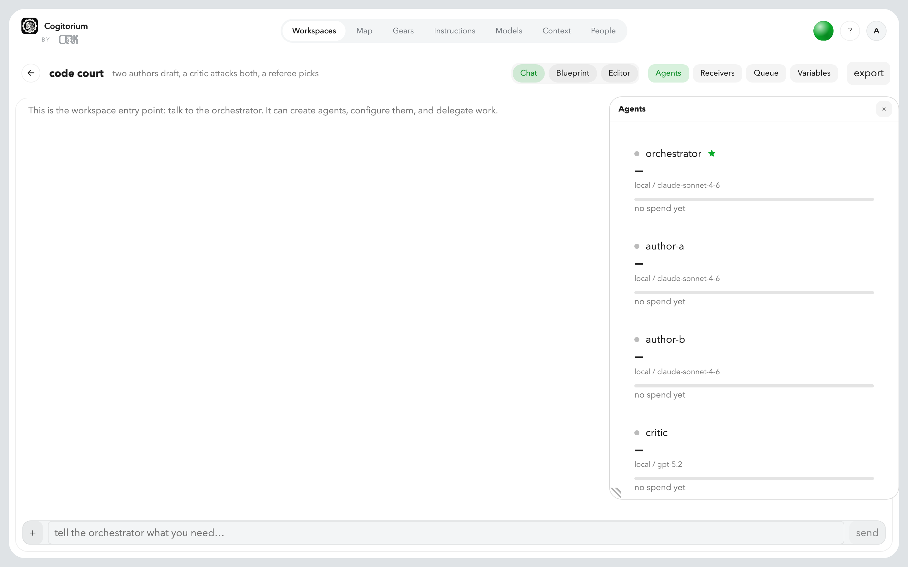

<div align="center">


# Cogitorium

**A workbench for running teams of models — on your machine, in your cluster, or
between departments.**

One Go binary, your own models, no telemetry, ever.

[Documentation](https://orkcom-tech.github.io/cogitorium/) ·
[Guide](https://orkcom-tech.github.io/cogitorium/guide/) ·
[Install](#install) ·
[Licence](#licence)

</div>

---

You describe a team: who thinks, who checks, who is allowed to run code, and
what each of them may reach. Cogitorium runs it and shows you what happened —
every wire a capability somebody granted, every gear a piece of code you read
before it was allowed to run, every token spent attributed to the agent that
spent it.



## Three ways people run it

The same binary, at three sizes. Nothing is bolted on for the larger ones —
they are the same workspaces, gears and receivers, addressed differently.

### 1. As your own companion, in front of a model you already pay for

Run it on your laptop, point it at Anthropic or a model on your own machine, and
it becomes the thing that *remembers* between sessions. Context lives in
[Contextverse](https://github.com/orkcom-tech/contextverse) and is versioned;
each agent has memory you can read and delete; and code your assistant writes
becomes a **gear** — reviewed once, approved once, then reused instead of
rewritten from scratch every conversation.

It also works the other way round. `cogitorium mcp` serves this install's
approved gears and receivers to Claude Desktop, Cursor or anything else that
speaks MCP, so your existing assistant gains the tools you have already checked
— and nothing else. Creating agents, drawing wires and approving gears stay with
you.

```sh
cogitorium mcp --server http://127.0.0.1:8688 --token $COGITORIUM_TOKEN
```


### 2. As the engine under a service, in a cluster

A **receiver** is an HTTP door into one workspace: a caller posts a task with a
key, one agent runs it, and the answer comes back on the same response. Add a
schedule and it runs on its own clock. The Helm chart runs gears as Kubernetes
Jobs, each in its own pod with no network unless you granted one.

That is enough to put small, sharply-scoped agents behind an API — a classifier,
a summariser, a triage step — with the scenario prepared in advance rather than
improvised per request, and a queue that refuses rather than melting when the
work arrives faster than the models answer.

```sh
helm install cogitorium ./deploy/helm/cogitorium \
  --namespace cogitorium --create-namespace \
  --set auth.adminToken="$(openssl rand -hex 24)"
```

### 3. As one install per department, talking to each other

Every install is a server. A receiver on one is an address another can post to,
and a completion callback tells the caller when the work finished — to hosts you
listed, and no others. Support's install files a ticket into Engineering's;
Engineering's release workspace tells Ops when a build is signed. Each keeps its
own models, its own context and its own audit trail; what crosses the boundary
is a task and an answer.


## What is in it

**Agents on a canvas.** Drag between two of them to draw a wire, and the wire IS
the permission — not a picture of one. Delete it and the delegation stops.


**Gears: code, in a box, that you approved.** An agent can write one; nobody can
run it until you have read the source and said so. Approving names exactly what
it grants — which credentials, which addresses — and a new version returns to
pending and hands both back.


**A map of the whole install.** People and teams at the centre, workspaces
around them, and — when you open one — its agents and their memory. Everyone
gets the map; what is in it is filtered on the server, so an administrator sees
the install and everybody else sees only what they could already reach.


**Files, an editor and a shell**, in the workspace the agents are working in.


**Who can reach what, drawn rather than inferred** from three settings screens.


**Eleven looks, light and dark.** Appearance is two choices — a look and a mode
— and nothing else. Air is the default and a fresh install opens light.


## Install

Every route installs the same binary. Context and memory are stored by
[Contextverse](https://github.com/orkcom-tech/contextverse), so the channels
that can bring it do.

**macOS and Linux — Homebrew** (brings `contextd` with it):

```sh
brew install orkcom-tech/tap/cogitorium
cogitorium serve
```

**Windows — Scoop** (brings `contextd` with it):

```sh
scoop bucket add contextverse https://github.com/orkcom-tech/scoop-bucket
scoop install cogitorium
```

**Anywhere — the binary**, from [releases](https://github.com/orkcom-tech/cogitorium/releases).
Install `contextd` separately; Cogitorium refuses to store context without it.

Then open `http://127.0.0.1:8688`. On loopback the first run needs no login: a
single-operator install never sees a sign-in screen.

## No telemetry

Nothing is sent anywhere. There is no analytics endpoint, no crash reporter and
no update ping; the interface fetches no fonts and no scripts from the network.
The only outbound requests are to the model providers you configured, and to
addresses you granted a gear or an agent by name.

## Where to go next

- **[The guide](https://orkcom-tech.github.io/cogitorium/guide/)** — one section
  per screen, with worked examples: a panel of models judging each other's code,
  a receiver behind an API, a scheduled run.
- **[The reference](https://orkcom-tech.github.io/cogitorium/)** — every setting,
  every endpoint, and what each one refuses to do.
- **[Contextverse](https://github.com/orkcom-tech/contextverse)** — where the
  context and the memory actually live.

## Licence

Apache 2.0. See [LICENSE](LICENSE).
