<div align="center">

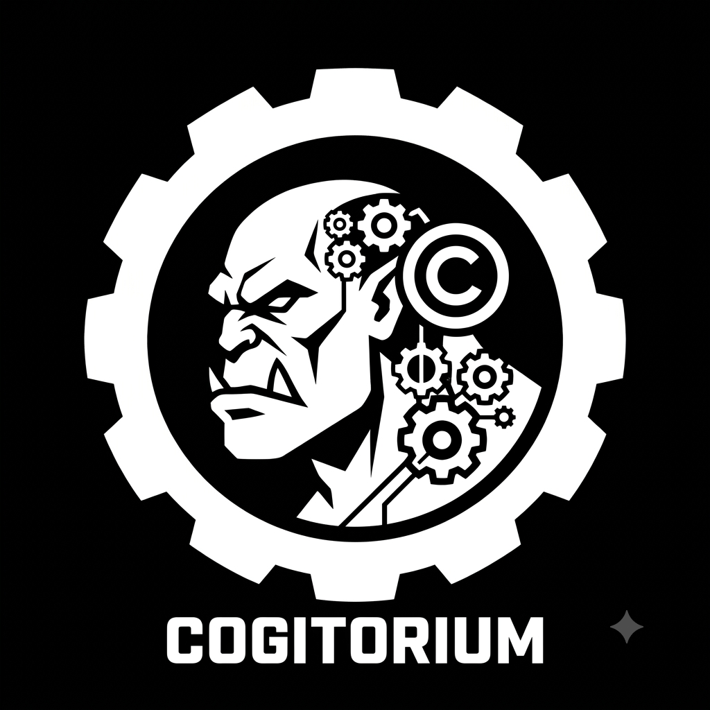

# Cogitorium

**A workbench for agentic development.**

One binary. Your models, your machine, your rules — and no telemetry, ever.

[Documentation](https://orkcom-tech.github.io/cogitorium/) ·
[Install](#install) ·
[What it does](#what-it-does) ·
[Licence](#licence)

</div>

---

Most agent tooling asks you to accept a black box: one model, one vendor, a
conversation that wanders, and a bill you cannot attribute. Cogitorium is the
other shape. You define the agents, you choose a model **per agent**, you draw
who may hand work to whom, and the workbench shows you what each one cost.

It runs as a single Go binary with the interface embedded in it. Point it at a
frontier API, at Ollama on your laptop, at a box in your homelab, or at all
three at once — it does not care and it does not phone home.

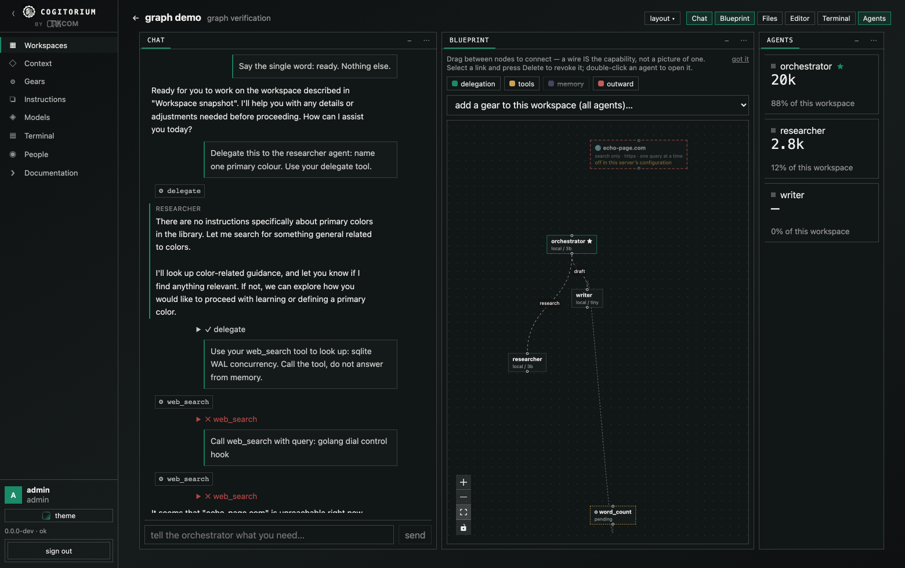

> **Status: early development.** The commands, the API and the on-disk layout
> are not stable yet.

---

## What it does

**A workspace is a group of agents behind one orchestrator chat.** You talk to
the orchestrator. It creates the other agents, gives them roles and models,
wires them together, and hands them work — and everything it does is a visible
step on the timeline rather than something that happened inside a black box.

**Every agent gets its own model.** That is what makes the economics
expressible: an expensive frontier model does the reasoning while free local
models write the docs and run the checks, all inside one topology. The token
spend is shown per agent, so a cheap arrangement can be told apart from an
expensive one that merely feels cheap.

**The wiring is the capability, not a picture of one.** An agent can delegate
only along an edge you drew. Change the canvas and you have changed what is
possible, not just what is documented.

**Agents build tools that outlive the conversation.** When an agent needs a
capability that does not exist it can forge one — a script, a small program —
which is registered in a catalog, versioned, and callable afterwards by other
agents and by you. Nothing runs until you approve it, and it runs inside a
container with no network and none of the server's files.

**Context is a managed resource.** It is stored and versioned by
[Contextverse](https://github.com/orkcom-tech/contextverse), with a branch per
workspace and per agent. You can read exactly what reaches an agent's prompt,
and edit or delete it — including the things it remembered that you would
rather it forgot.

**An agent can be told what it must never do.** Prohibitions are the last thing
in its prompt, and an agent the orchestrator creates inherits them — otherwise
a standing rule would be one tool call from being routed around by hiring
someone without it.

**A workspace is portable.** It exports as one JSON document — the arrangement,
not a database dump — with its gears and its context as separate opt-ins.
Wires and models are referenced by name because ids from another install mean
nothing, nothing private is in the document, and an imported gear always
arrives unapproved: it is somebody else's executable code, and approval does
not travel.

---

## Install

Every route installs the same binary. Context and memory are stored by
[Contextverse](https://github.com/orkcom-tech/contextverse), so the channels
that can bring it do.

**macOS and Linux — Homebrew** (brings `contextd` with it):

```sh
brew install orkcom-tech/tap/cogitorium
cogitorium serve
```

**Windows — Scoop** (brings `contextd` with it):

```sh
scoop bucket add contextverse https://github.com/orkcom-tech/scoop-bucket
scoop install cogitorium
```

**Docker** — the image carries `contextd` and sets up its space on first start:

```sh
docker compose up --build
```

**Linux packages** — `.deb` and `.rpm` on the
[releases page](https://github.com/orkcom-tech/cogitorium/releases), with a
systemd unit. They recommend `contextd` rather than requiring it, because it
ships from GitHub rather than a distribution repository; the postinstall says
what to run.

**Desktop application** — attached to each release for macOS, Windows and
Linux. The same server and interface in a native window; it picks a free port
rather than 8688, so it and `cogitorium serve` can run at the same time. Not
signed with a platform identity, so the first launch needs one extra click —
[the documentation says exactly which](https://orkcom-tech.github.io/cogitorium/#install).

**From source** — Go ≥1.25 and Node ≥22; Docker if you want gears and the
terminal sandboxed:

```sh
git clone https://github.com/orkcom-tech/cogitorium
cd cogitorium
make build
./bin/cogitorium serve
```

Archives on the releases page are signed. `checksums.txt` carries a cosign
signature and certificate, so a download can be traced to the workflow that
built it rather than merely proven uncorrupted — the verification command is in
the release notes.

Then open <http://127.0.0.1:8688>. On a local install you are the admin and
there is no login screen; the same binary asks for credentials the moment it
listens on anything but loopback.

Add a model under **Models**, then press **+ New workspace**.

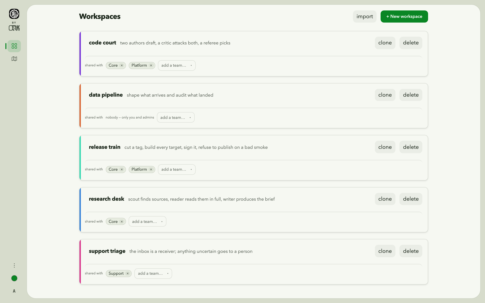

---

## The interface

Panels, not tabs. Chat, blueprint, files, editor, terminal and the agent
inspector are panels on a grid: put one at any edge, slide it out over the
centre, float it, or hide it. Arrangements can be saved, and five are
ready-made.

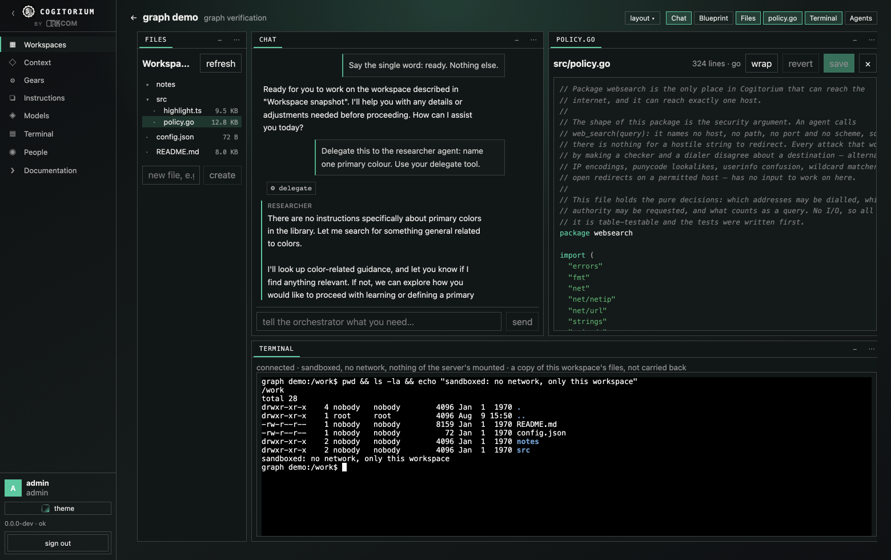

Clicking a file in the tree hands the room to the editor: the blueprint and the
rosters step aside, the conversation and the shell stay. The editor highlights
the dozen languages a workspace actually contains, and shows unsaved edits as a
diff against what is on disk. A gear past its first version diffs against the
previous one — an approval covers exact content, so what you want before
approving is what changed. All of it is written in the product rather than
installed: no highlighter library, no diff library, no editor component.

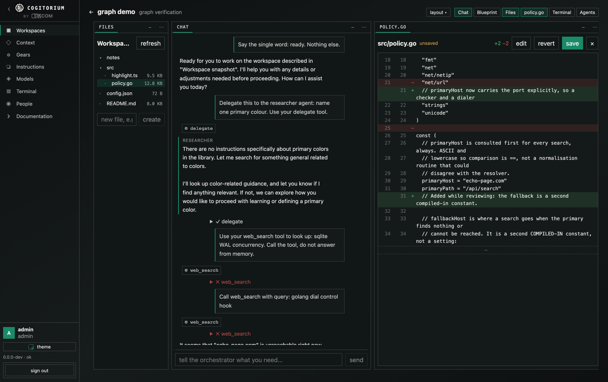

Nothing has to be docked at all. Any panel can be pulled off the grid into a
window you move, resize, roll up or close.

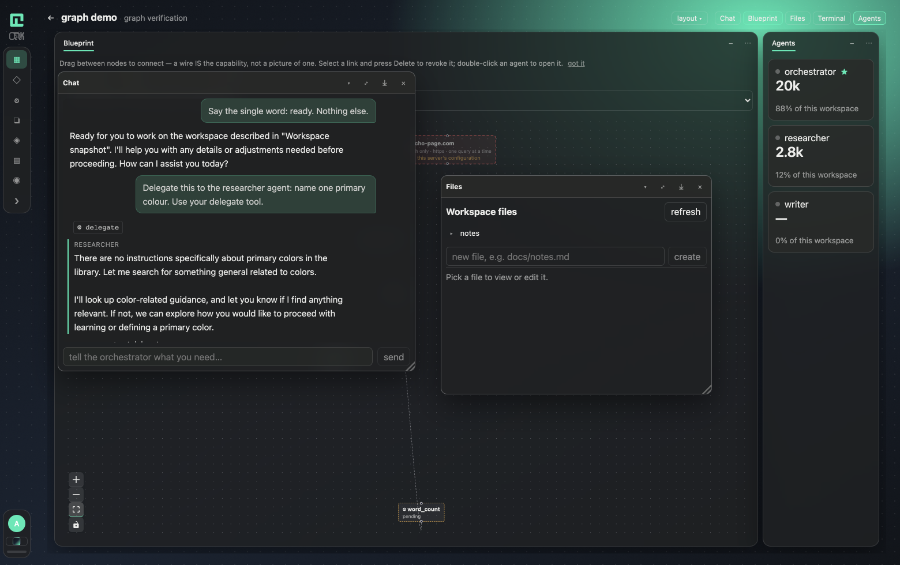

An agent's card shows what it is, what it knows, what it may call, and what it
has spent.

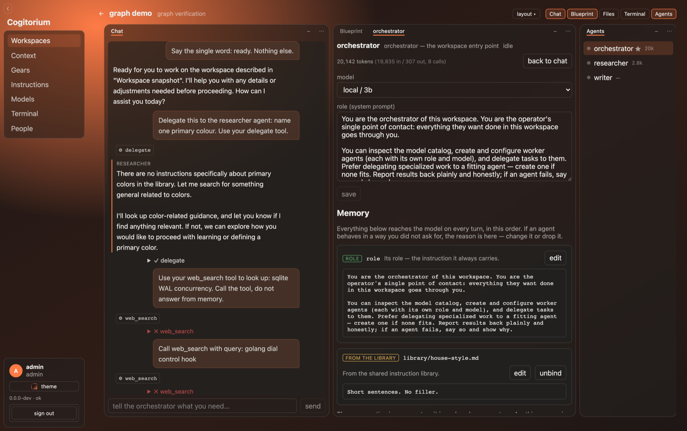

### Two looks, and a palette under them

Pick the room you want to work in. **Instrument** is a bench instrument — no
light at all, hairlines instead of cards, nothing rounded, every figure in monospace so a
column of spends lines up, and the conversation in the centre. Everything above
this line is Instrument.

**Canvas-first** turns it inside out: the wiring graph becomes the application,
the menu shrinks to a rail of glyphs, and the panels float over a drafting grid.
It contradicts the rule that the chat is the way in, which is why it is a choice
and never the default. Choosing a look brings its arrangement with it.

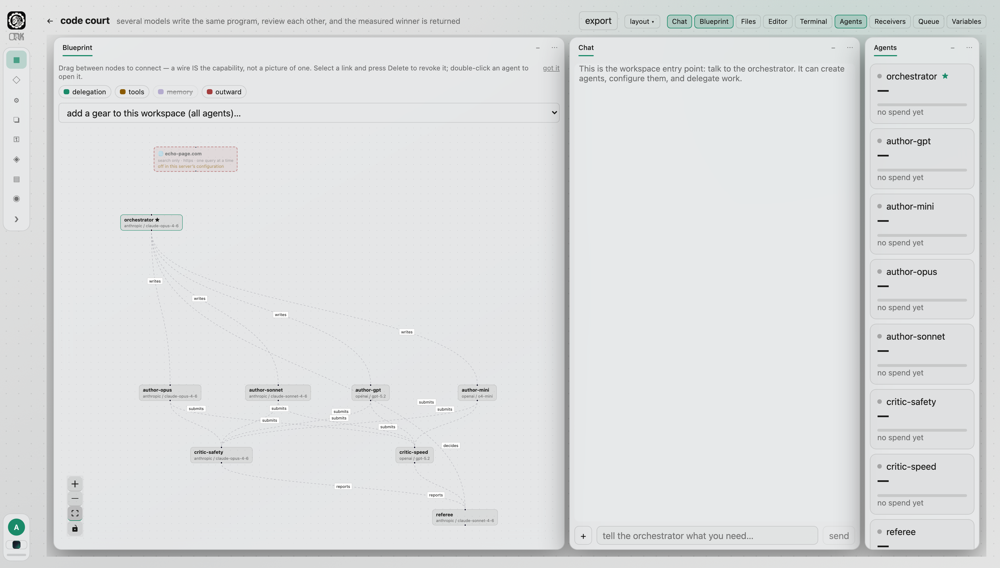

The palette is independent of both. Up to three colours make the gradient — the
third is the accent — with dials for grain, tint, and where the light falls,
plus a drift that walks it slowly around the screen. Panels are frosted glass or
plain solid fill, with the blur and the darkness on sliders. Five palettes ship
ready-made; the picture below is Instrument wearing one of them.

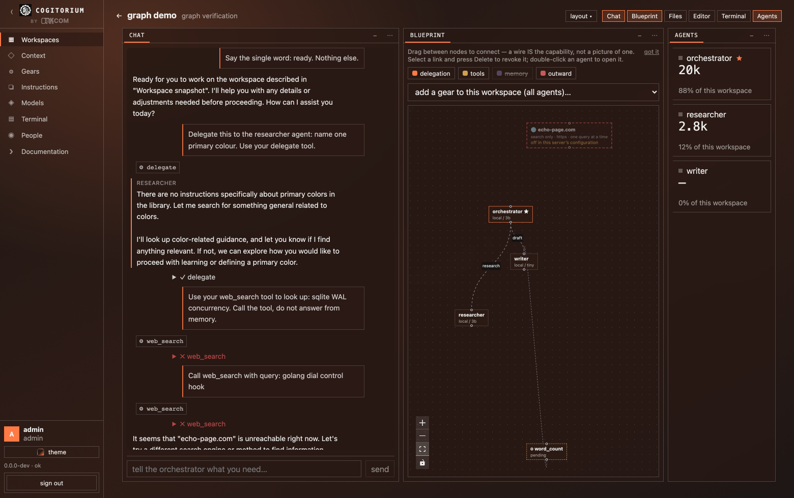

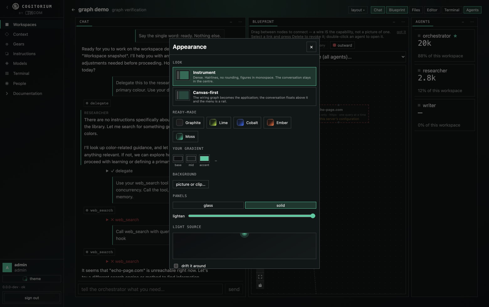

Or put your own picture or looping clip behind the whole thing, with a scrim
dial that buys back as much legibility as it needs.

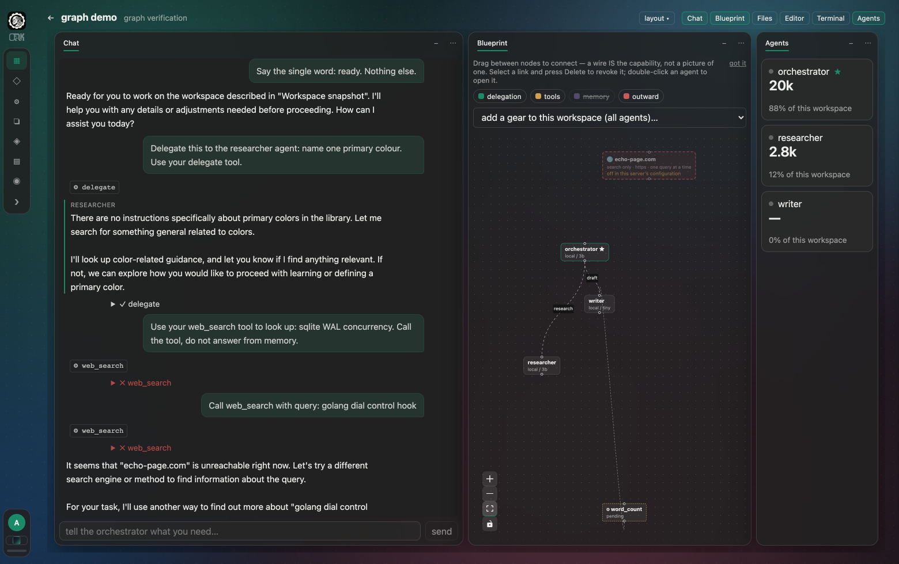

Light and dark both work, and either follows the system by default. Nothing here
is fetched: the grain, the mark and your backdrop are all carried in the page.

Admins get a map of who can reach what — the same relationships the permission
checks use, drawn rather than pieced together from three tables.

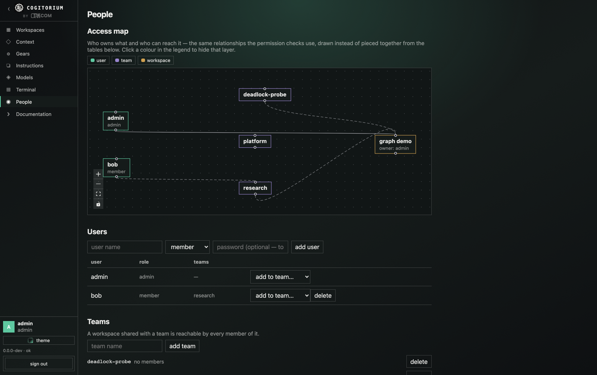

---

## Letting agents reach the web

Off by default, and switching it on is deliberately awkward: a config key plus
a restart. There is no route and no database row behind it, so nothing running
inside Cogitorium — no agent, no tool, no gear — has a code path to enable it.

That switch alone grants nothing. Each agent additionally needs a grant you
draw yourself on the blueprint, and **every single search stops the turn and
asks you** to approve that exact query before it leaves the machine. There is
no "allow for this turn" and no "remember this agent".

Agents never choose a destination — they supply words, nothing else. Searches
go first to [echopage](https://echo-page.com), our own engine built so crawlers
can find what they need faster, more accurately and far more cheaply than
grinding through pages built for human eyes; when it has nothing, the search
falls through to a general engine so the agent is not left stuck.

Worth being straight about: this bounds and records outbound traffic, it does
not prevent exfiltration. Any egress at all is a channel. What you get is a
hard cap, a full record, and a human in the loop for every request — a leak
someone approved rather than a silent one.

---

## Known issues

- **A shell does not survive a reload** — restoring a layout brings the panel
  back, not the session. Deliberate, and listed so it does not look like a
  fault.
- **The shell works on a copy** of the workspace and nothing is carried back
  out. Read and write freely; use the file tree for changes meant to last.

---

## No telemetry

Not "telemetry you can disable". There is no analytics code, no crash
reporting, no update ping, no phone-home of any kind. The binary talks to the
model providers you configured and to nothing else. Your conversations, your
context and your agents stay on your machine.

---

## Documentation

**<https://orkcom-tech.github.io/cogitorium/>** — the reference: every screen,
every setting, the security model, and what is deliberately absent.

**<https://orkcom-tech.github.io/cogitorium/guide/>** — the guide: a walkthrough
from an empty install to agents with tools. Every command in it was run, and
every error message quoted in it is the exact text the software emits.

## Testing end to end

`scripts/e2e.sh` exercises the pipeline against real components — a real local
model, a real `contextd` space, the real binary. There are no mocks or stubs
anywhere in this repository; when something cannot be verified the script says
so and skips, rather than passing on a stand-in.

## Licence

[Business Source License 1.1](LICENSE). Production use is granted, including
commercially and inside a company, provided you are not offering Cogitorium to
third parties on a hosted or embedded basis competitive with our own products.
On **2030-08-08** it converts to Apache 2.0, and each release converts on the
fourth anniversary of its publication regardless.

For other arrangements: `licensing@orkcom.tech`.
