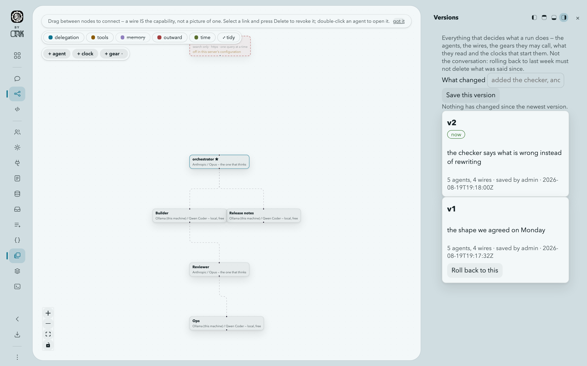
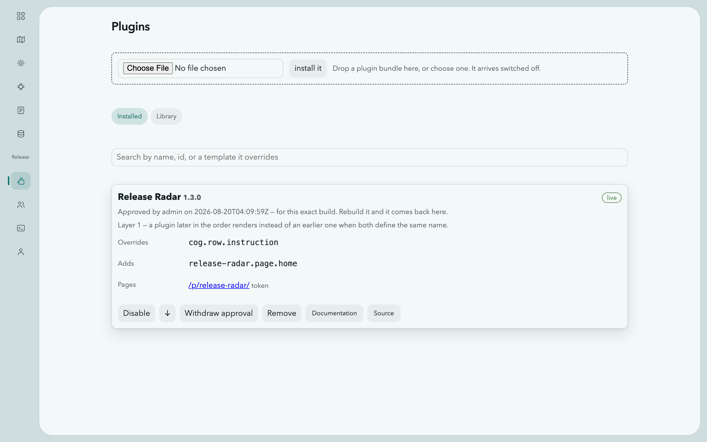

# Guide

This is the interface, screen by screen, in the order the navigation offers
them. Each section says what a screen is for, how to do the things people
actually do on it, and what it will not do — because half of what is worth
knowing about this product is where it stops.

The thread running through all of it is the one thing the whole product is
for: **a pipeline with a model in it that behaves the same way twice**, which
is why so much of what follows is about what gets checked rather than what
gets said.

Every command below was run against a real install, and every error message is
the exact text the software produces. Where something does not exist, it says
so rather than describing what it might look like.

The examples use `http://127.0.0.1:8688`, the default, and every one of them
carries `-H "Authorization: Bearer $TOKEN"`. There is no address and no machine
where that header is optional — see [The token, and when you need
it](#the-token-and-when-you-need-it) for where `$TOKEN` comes from.

---

## Where everything is

A frame, and a hole in it. **Every control lives on the frame; the hole holds
only the work.**

The frame's left edge is the **rail**, and it is four groups of buttons with
gaps between them, answering four questions:

1. **where am I** — the brand, and inside a workspace the way back out;
2. **what is the hole showing** — outside a workspace, the destinations:
   Workspaces, Map, Gears, Models, Instructions, Planboards, Context, People,
   Terminal. Inside one, the stages: Chat, Blueprint, Editor;
3. **what can crawl out over it** — the drawers: Agents, Gears, MCP servers,
   Instructions, Planboards, Memory, Receivers, Queue, Variables, Versions,
   Terminal, and Context for an administrator;
4. **the rest** — More, Appearance, updates, plugins, and your account.

Nothing is written on the rail. Each button is an icon that raises its name
when you hover it, and the one you are on takes a tint and a bar in the margin.

**Every screen has the same rail** — one component, fed by one description this
server publishes. A destination belongs in **one place per screen**: outside a
workspace they are on the rail, so **More** does not repeat them; inside a
workspace the rail belongs to that workspace, so More is where the destinations
are and is how you get back out. Whatever else is in it, More ends with this
guide and ORKCOM.

Appearance is not in that menu — it is its own button lower in the same group, a
small bead painted in the colour you chose. Signing out is not there either: it
is under the account button at the foot, beside the server's version and the way
to change your password.

There is no keyboard shortcut for any of this chrome, and that is deliberate:
Escape belongs to the search approval dialog and to nothing else, so one
keypress can never both dismiss something and silently refuse a pending
search.

---

## First run

Not a screen — the four minutes before you have one worth looking at.

### Install and start

```bash
brew install orkcom-tech/tap/cogitorium && cogitorium serve
```

**Or with a model already in it**, if you have no provider yet:

```bash
docker compose -f docker-compose.starter.yml up
```

That brings up Cogitorium, an Ollama container to think with, and a one-shot job
that pulls the model. When it settles the provider is registered, the model is
offered and the orchestrator already has one — so the first thing you do is make
a workspace and talk to it, rather than fill in a settings screen. It is a
starter and reads like one: change the model, point it at a GPU box, or point it
at Anthropic instead.

Other routes are in [Install](./#install). The server listens on
`127.0.0.1:8688` and keeps everything in `~/.cogitorium`. Open
<http://127.0.0.1:8688>.

`serve` takes exactly four flags — `--config`, `--data`, `--listen`,
`--log-level`. There is no `--port`, no `--debug`, and no `cogitorium init`.
Everything else is set in `config.yaml` or the environment, and all of it is in
[Configuration](/cogitorium/configuration/). The other subcommands are a client
for a running server and an MCP bridge; they are in [From a terminal, and from a
script](#from-a-terminal-and-from-a-script).

### Signing in the first time

Open `http://127.0.0.1:8688` and the app asks you to choose a password for the
`admin` account. Nobody has one yet: the first start creates that account with a
name and a role and nothing else. Pick one, and you are in.

On your own machine that is the whole story — Cogitorium remembers you, and the
next launch opens straight into your workspaces. It only asks again if you sign
out.

On a server it asks for one more thing: the admin token this line put in the log
at first start.

```
admin token created — copy it now, it cannot be shown again  token=cg-admin-b1e87f6…
```

That is not ceremony. A server is reachable by everyone who can route to it, so
without the token the first stranger to find the port would be the one who sets
the admin password. On loopback it is not asked for, because anyone who can
reach loopback can already read the database it would be protecting.

Only the SHA-256 hash of the token is stored, so a lost one cannot be recovered
and there is no reset command. `COGITORIUM_ADMIN_TOKEN` seeds it instead of
letting the server generate one — read from the environment only, and at least
24 characters.

**Signing in over the network is not remembered.** A browser reaching a server
keeps the session until it closes and no longer, so a borrowed or shared machine
does not keep a working credential after you walk away. Locally it is
remembered, which is the case where there is nothing to protect it from.

**What the browser is actually holding.** A cookie, not a token in
`localStorage`. It is marked `HttpOnly`, so no script on the page can read it —
which is the point: a token in storage is one cross-site scripting bug away from
being copied somewhere else, and this one cannot be read even by script running
on the page it belongs to. It is marked `SameSite=Lax`, so the browser never
attaches it to a write another site caused, and the server refuses one anyway if
the `Origin` says it came from elsewhere.

Scripts get the other kind. `Authorization: Bearer` cannot be attached by a
browser on your behalf, so there is nothing for another site to forge, and a
token in a shell variable is not reachable from a web page at all. Each caller
gets the credential that fits how it stores things.

To change your password later: the account button at the bottom of the rail →
**change password**.

### The token, and when you need it

The password gets you into the app. Anything talking to the API — a script, a
`curl`, the terminal client — needs a token instead.

The admin token from the log is one. Every sign-in mints another, and the
command line will do that for you:

```bash
export COGITORIUM_TOKEN=$(cogitorium login --user admin)
```

It asks for the password without echoing it, and prints the token and nothing
else, so `$(…)` captures a token rather than a sentence. Over HTTP directly, the
same exchange:

```bash
TOKEN=$(curl -s -X POST http://127.0.0.1:8688/api/v1/login \
  -H 'Content-Type: application/json' \
  -d '{"name":"admin","password":"correct-horse-battery"}' | jq -r .token)
```

Every example below assumes `$TOKEN` holds one. Without the header they all
answer the same way, on every address including your own machine:

```
{"error":{"message":"authentication required: send Authorization: Bearer <token>"}}
```

> **This changed.** Until recently a request from `127.0.0.1` was served as the
> admin with no credential at all, and these examples carried no header. It made
> a solo install feel accountless, and the price was that every process on the
> machine — any script, any package install hook, any page open in your browser
> that could reach the port — was an administrator of it. A person signs in now.

---

## Workspaces


The list of every workspace you can reach: the ones you own, plus the ones
shared with a team you belong to. A workspace is a group of agents behind one
orchestrator chat.

### Make one

A workspace cannot exist without a model, because its orchestrator needs
something to think with. Until the catalog has one, **+ New workspace** is
disabled and the page says so:

> A workspace needs a model for its orchestrator, and the catalog is empty. Add one under Models first.

With a model in the catalog: **+ New workspace** → name it, say what it is for,
pick the orchestrator model → **create workspace**. Or:

```bash
curl -X POST http://127.0.0.1:8688/api/v1/workspaces -H "Authorization: Bearer $TOKEN" -H 'Content-Type: application/json' -d '{"name":"research","description":"release notes","orchestrator_model_id":1}'
```

```json
{"id":1,"name":"research","description":"release notes","branch":"workspaces/research-1","shared_branch":"workspaces/research-1/shared","owner_id":1,"team_ids":[],"hue":null}
```

Name a model id that is not in the catalog and you get
`404 {"error":{"message":"model 1: not found"}}` — the workspace is not
half-created.

The workspace opens with one agent already in it, called `orchestrator`.

### Give it a colour

The stripe down the left edge of a card is the colour. The **dot beside the
name** is the picker — press it and choose one of ten hues, or **clear**. They
used to be the same thing, which made the control four pixels wide: a target
nobody hits, so the picker was there all along and read as missing.

```bash
curl -X PATCH http://127.0.0.1:8688/api/v1/workspaces/1 -H "Authorization: Bearer $TOKEN" -H 'Content-Type: application/json' -d '{"hue": 210}'
```

`{"hue": null}` takes it back. Omitting the field entirely is refused —
*"send a hue to set one, or null to clear it"* — because absent and null have to
mean different things on a route that will grow other fields.

Three things worth knowing:

- **Anyone who can reach the workspace may set it**, not only the owner. It is
  shared state rather than a personal preference: the point of "the amber one"
  is that a team says it to each other. Nothing here grants access, so there is
  nothing to escalate by allowing it.
- **A workspace nobody has coloured still has a colour**, derived from its id so
  that neighbours never read as the same shade — and that derived value is never
  written back. "Nobody chose" and "somebody chose exactly this" stay different
  states.
- **Saturation and lightness are not yours to pick.** They move with the mode
  and your accent, so a colour chosen in one never becomes unreadable in
  another.

### Share it, clone it, delete it

**shared with** on each card lists the teams that can reach it; an administrator
adds one from **add a team…** and withdraws one with the `×` on its chip.
Sharing is per team, never per person.

**clone** copies the agents and the wiring into a workspace of your own — the
history stays where it was, so somebody can build on your arrangement without
touching it.

**delete** takes the workspace with its agents and its history. Owners and
administrators only.

### Take one to another install

**export** is on the workspace's own header; **import** is here on the list.
Together they move an arrangement between installs.

A workspace exports as one JSON document — the arrangement you built, not a
database dump. Agents with their roles and prohibitions, the wires between
them, and, if you tick the boxes, the gears bound to the workspace and its
context.

```bash
curl -sO -J 'http://127.0.0.1:8688/api/v1/workspaces/1/export?gears=1&context=1' -H "Authorization: Bearer $TOKEN"
```

What comes out (trimmed; this is a real export):

```json
{
  "format": "cogitorium.workspace/v1",
  "exported_at": "2026-08-10T17:48:51Z",
  "workspace": { "name": "release notes", "description": "drafts the changelog" },
  "agents": [
    {
      "name": "orchestrator",
      "role": "You are the orchestrator of this workspace…",
      "avoid": "Never invent a version number.\nNever promise a date.",
      "is_orchestrator": true,
      "model": { "provider_type": "openai-compatible", "model_name": "qwen2.5:0.5b" }
    },
    { "name": "writer", "role": "You write plainly.", "avoid": "", "is_orchestrator": false,
      "model": { "provider_type": "openai-compatible", "model_name": "qwen2.5:0.5b" } }
  ],
  "wires": [ { "from": "orchestrator", "to": "writer", "label": "drafts" } ],
  "gears": [ { "name": "word_count", "runtime": "python", "entrypoint": "main.py",
               "bound_to": "workspace", "files": [ … ] } ]
}
```

Read the shape of it, because it is the whole design. **Wires name agents, not
ids** — ids from another install mean nothing. **Models are named, not
referenced** — a bundle cannot carry a provider key, so it can only say which
model the agent used and let the other install look for it. And there is
nowhere in the document for a key, a token, a user, an owner, a team, a colour
or a chat message: a bundle is handed to someone else, so it carries nothing
private and nothing local.

**import** takes that file, shows you what is in it before anything is created,
and asks for a name:

```bash
curl -X POST http://127.0.0.1:8688/api/v1/workspaces/import -H "Authorization: Bearer $TOKEN" -H 'Content-Type: application/json' \
  -d '{"name":"release notes (from A)","bundle":'"$(cat release-notes.cogitorium.json)"',"include_gears":true,"include_context":false}'
```

The reply is a report, and the report is the point. This one is from importing
the bundle above into a **different** install — one whose catalog has Anthropic
rather than a local model, and which already has a gear called `word_count`:

```json
{
  "workspace": { "id": 1, "name": "release notes (from A)",
                 "branch": "workspaces/release-notes-from-a-1" },
  "agents": 2,
  "wires": 1,
  "gears_imported": [],
  "gears_skipped": [
    { "name": "word_count",
      "why": "a gear with this name already exists in this install; it was left untouched and not bound to the imported workspace" }
  ],
  "context_files": 0,
  "unresolved_models": [
    { "agent": "orchestrator", "provider_type": "openai-compatible", "model_name": "qwen2.5:0.5b" },
    { "agent": "writer", "provider_type": "openai-compatible", "model_name": "qwen2.5:0.5b" }
  ]
}
```

Both agents came across with their roles, prohibitions and the wire between
them. Neither has a model, because this install has never heard of
`qwen2.5:0.5b` — and it says so instead of quietly binding them to whatever it
had. Add the model under **Models**, or point each agent at a local one.

### Taking the door with it

Everything a workspace is made of can travel. What is **off by default** is the
part that is somebody's work rather than a shape — gear source, context
documents — and the two things that are nobody's to move: a **secret's value**,
which has nowhere in the document to go, and a **receiver's key**.

Tick **include receivers** and the bundle carries the doors: the address, and
behind it every task with what it accepts, its **input schema**, the agent it
names, the instruction, and `expect`. That matters more than it sounds. The task
is the entire contract with whatever calls this install from outside, and
without it a restored workspace answered `404` at `POST /i/{address}/{task}`
until somebody re-typed all of it by hand — so two installs restored from one
document were not the same install.

```json
"inlets": [
  { "address": "echopage",
    "tasks": [
      { "name": "extract", "accepts": "json", "agent": "reader",
        "schema": "{\"type\":\"object\",\"required\":[\"jobId\",\"sourceUrl\"]…}",
        "instruction": "Read the page and describe whose it is. Never invent…",
        "expect": { "schema": "{\"required\":[\"displayName\"]…}" } } ] }
]
```

**The key is not there and there is no field for it.** An imported door exists,
has exactly the right shape, and refuses every delivery until somebody on the
receiving install issues one — the import says so, in `needs_key`:

```json
"inlets_imported": ["echopage/extract"],
"needs_key": ["echopage"]
```

An address already in use on the receiving install is **left alone**, not merged
into: an address is what a caller outside has in its configuration, and adding a
task to somebody's existing door changes what an unrelated system gets back.

To open it without visiting a screen — which is the point, for a workspace that
ships with a deployment — name the door and the variable holding its key in
`config.yaml`, and both halves of the integration come from the same place:

```yaml
inlet_keys:
  - address: echopage
    key_env: ECHOPAGE_INLET_KEY
```

Or `POST /api/v1/inlets/{id}/key` with `{"key": "…"}` to adopt a key you already
hold. See [Configuration](/cogitorium/configuration/#doors-a-prepared-workspace-arrived-with).

### Saying what it needs

A bundle **never carries a permission** — an imported gear is unapproved, an
imported MCP server is pending, and nothing in the document can grant the
internet. That is right and it left a gap: an imported workspace whose agent has
to read a public page arrived with no way to *say* so, and the operator found
out by running it and watching it fail.

So a bundle may declare what it needs. `requires` grants nothing:

```json
"requires": {
  "egress": [
    { "agent": "reader",
      "reason": "reads the public page a customer asked us to import",
      "hosts": ["*"] }
  ]
}
```

The import hands it straight back, marked ungranted, and the answer is the same
outward grant you would draw on the blueprint anyway:

```json
"requires": [
  { "kind": "egress", "agent": "reader",
    "reason": "reads the public page a customer asked us to import",
    "hosts": ["*"], "granted": false }
]
```

The **reason** is the whole value of it. "Needs the internet" is not something
an operator can weigh; "reads the public page a customer asked us to import" is.

### What this screen will not do

- **No renaming.** A workspace's name and description are fixed at creation.
- **An imported gear is always `pending`.** A bundle is somebody else's
  executable code, and approval does not travel.
- **A gear name already in use is skipped, not overwritten.** Other workspaces
  may depend on that gear; a bundle does not get to replace it, unapprove it,
  or bind itself to it.
- **A bundle does not choose a gear's timeout.** That stays a decision on the
  gear itself.
- **Context lands under the new workspace's own branch.** Paths in a bundle are
  relative, and anything trying to climb out of the branch is refused before the
  import creates anything at all — which is why a refused bundle leaves nothing
  behind.
- **A receiver's key never travels**, and a restored door refuses every delivery
  until somebody issues one on the receiving install.
- **A `requires` block grants nothing.** It is the document asking; the answer
  is a human act, exactly as it was.

---

## A workspace


Three **stages** on a track that slides vertically — **Chat**, **Blueprint**,
**Editor** — one on screen at a time, chosen from the rail's second group. The
other two are not unmounted: they stay off-screen at full size, which is why a
running shell and a laid-out canvas survive you moving away and back.

Eleven **drawers** open from the third group — **Agents**, **Gears**, **MCP
servers**, **Instructions**, **Planboards**, **Memory**, **Receivers**,
**Queue**, **Variables**, **Versions** and **Terminal**, plus **Context** for an
administrator, and whatever a plugin mounts after them. One at a time. A drawer is the frame growing inward rather than a
window over the work: it comes out of an edge, the hole shrinks to make room,
and nothing you were doing ends up underneath it. Dock it to any of the four
edges from the buttons in its head, and drag the edge facing the work to resize
it; both are remembered per drawer, so the terminal can live along the bottom
while the roster lives on the right.

The rail also carries the way out (back to the list) and **export**.

### Chat

The workspace entry point. You talk to the orchestrator; it creates the other
agents, wires them together and hands them work. Type into **tell the
orchestrator what you need…** and press **send**. **stop** appears in its place
while a turn is running.

What appears in the transcript, and what each part is:

- your own message, with anything you attached shown on it;
- the orchestrator's reply, with a ⚙ chip per tool call;
- a collapsible ✓/✗ row per tool result;
- a delegate's answer in its own bubble, labelled with that agent's name. Only
  a delegate is named — the orchestrator is the voice of the workspace.

**Asking for a second agent** is a worked example of the whole loop:

> Create a worker agent named researcher with the role "You summarize sources accurately and cite them." and delegate to it: summarise what a blueprint wire does in this product.

The orchestrator calls `agent_create` and then `delegate`, and you watch both
happen. The same thing over the API:

```bash
curl -X POST http://127.0.0.1:8688/api/v1/workspaces/1/agents -H "Authorization: Bearer $TOKEN" -H 'Content-Type: application/json' -d '{"name":"researcher","role":"You summarize sources accurately and cite them.","model_id":1}'
```

**Attaching files.** The **+** beside the composer takes anything at all.
Each file is uploaded the moment it is picked, not when you press send: it lands
under `attachments/` in the workspace's own directory, and the answer comes back
before the message goes anywhere. That answer is the part worth reading — the
chip for each file says whether **the model is shown it**, or whether it is
going to your agents as a **path** for a gear to open, marked `→ gear`. Hover it
for the full truth: the path, the media type, and the server's own sentence
about why the model is not being shown it.

A `⚠` on a chip means the orchestrator's model was never declared able to take
that kind of file — flagged before you send rather than explained afterwards by
a failed turn. The `×` takes a file off the message; the file stays in the
workspace either way.

The message itself carries only paths. That is what lets a gear open a
megabyte-long archive, and what stops a megabyte of base64 landing in a prompt.

**Forgetting something.** Hover any entry and press **forget**. The confirmation
reads *"Forget this from the conversation? It stops being replayed to the model."*
— which is exactly what it does, because the timeline is replayed in full on
every turn.

What chat will not do:

- **You cannot talk to a worker directly.** Every turn goes through the
  orchestrator.
- **A delivery through a receiver writes nothing here.** Otherwise request two
  hundred would carry the previous hundred and ninety-nine.
- **One run at a time per workspace.** Anything arriving while a turn is running
  waits in the Queue drawer rather than being turned away.
- **Two people in one workspace share its conversation.** There is no private
  thread; separate workspaces are how two people stay out of each other's way.

### Blueprint


The graph *is* the program. The hint on the canvas says it exactly:

> Drag between nodes to connect — a wire IS the capability, not a picture of one.

An agent can delegate to another **only** if a wire runs to it. Delete the edge
and the capability is gone on the next turn — click the edge and press Delete.
Wires are created and deleted, never edited; to change one, remove it and draw
the new one.

**Five layers, five buttons.** The legend at the top left is five independent
toggles, not a picker: any combination is legal. Delegation, tools, outward and
time start on; memory starts off.

| Layer | An edge means |
|---|---|
| **delegation** | this agent may hand work to that one |
| **tools** | this agent may call that gear |
| **memory** | this is what the agent knows going into a turn |
| **outward** | this agent may ask to reach the internet |
| **time** | this clock starts that agent or that gear |

Every one of them is a permission or a cause the runtime acts on, not a note
about intentions. To change what the system can do you change the graph; to know
what it can do you look at it, rather than reading five prompts and hoping.

**Clocks on the canvas.** A workspace where something fires at 03:00 every night
used to look, on this canvas, exactly like one where nothing did. Now it does
not: a schedule is a node, wired to what it starts, and it says without being
opened the three things anybody actually asks —

- **when it next fires**, in words rather than a UTC timestamp: *in 18h*, beside
  the spec and the zone. `0 3 * * 1-5` says nothing about whose 3am it is, and
  on a shared install that is exactly what two people disagree about.
- **whether it is paused**, drawn dashed and dimmed like the switched-off
  internet gate, because a paused schedule that looks identical to a running one
  is how somebody re-enables the wrong one.
- **how the last run went**. A schedule that has been failing every night for a
  week is the single most useful thing this canvas can tell you, and it used to
  tell you nothing.

**`+ clock`** makes one, and it is a form rather than a gesture for one honest
reason: every other relationship here is fully described by its two ends, and a
schedule is not — it carries a spec, and there is no way to draw *every weekday
at 03:00*. The edge is still the relationship, so **selecting it and pressing
Delete removes the job**, and because that takes the spec and the record with
it, this is the one deletion on the canvas that asks first. Pause it instead if
you only want it to stop for now.

**A clock whose target was deleted stays.** It turns red, drops its edge, and
says *its agent was deleted — repoint it or remove it*. Deleting an agent must
not silently take the nightly job that used it: "it stopped, and here is why" is
something you can act on, and "it vanished" is not.

**Adding to the canvas.** **`+ agent`** takes a name, a model and a role. A model
is required and not defaulted — an agent with nothing to think with cannot take
a turn, and picking one for you would spend somebody's money on a choice they
did not make. The new agent arrives with no capabilities at all: nothing may
delegate to it and it may delegate to nothing until you draw an edge, which is
what a new node in a graph honestly is.

Beside it, **+ gear** binds one from the catalogue to the whole workspace. To
bind one to a single agent, drag from the gear node to that agent.

**It arranges itself.** You do not place agents by hand unless you want to. The
canvas lays them out by the wires between them — rank by distance from the
orchestrator, ordered within each rank so the wires cross as little as possible:

```
                 orchestrator
                  /        \
             lead-a        lead-b
             /    \        /    \
      worker-1  worker-2  worker-3  worker-4
             \    |        |    /
                 reporter
```

**⤢ tidy** re-lays out everything and stores it, so the arrangement is what
everybody sees next time rather than a view your screen is holding. Drag any
node afterwards and that wins — a dragged position is kept and the layout leaves
it alone. Tidy again to take it back.

Double-click an agent to open its inspector.

#### Letting an agent reach the internet

With the **outward** layer on, the canvas carries one node that is not part of
this workspace: the internet. Wiring an agent to it *is* the grant, the same
rule the delegation wires follow. Drag from the internet node onto an agent and
you are asked to confirm:

> Let "researcher" ask to search the web?
>
> This grants only the right to ASK: every search still stops and waits for you
> to approve that exact query.

If other agents can delegate to that one, the confirmation names them and says
they gain an indirect path outward. Only a person can draw this edge: no agent
tool creates, edits or deletes it. Select it and press Delete to revoke.

When the install-wide switch is off, the node says *"off in this server's
configuration"* and no edges are drawn even where grants exist — "nobody can go
out" and "nobody is allowed to ask" are different facts and must look different.
Turning the switch on is [three locks, one of them in the config
file](#letting-an-agent-search-the-web).

#### The per-query approval

Every individual search stops the turn and puts a dialog in front of you. It is
the last control before data leaves the machine, so read what it shows:

- **which agent**, by id first and then name — ids are not spoofable, names are;
- **the path**, the delegation chain that led here, with a warning when the
  request arrived through a delegation rather than from that agent directly;
- **who granted it**, and when;
- **the query itself, verbatim**, in its own box. It is the only part a model
  authored, and therefore the only part worth reading closely;
- **facts about it**: runes, bytes, non-ASCII count, whether the run is
  blob-shaped, and any characters it shares with something on this install;
- **the budget**: which request of this turn it is, and how many searches this
  agent has sent in 24 hours;
- **what this agent usually searches for**, collapsed.

There is deliberately no free-text "reason" field. A box the model fills,
displayed at the moment of decision, would be a prompt injection aimed at you.

**Refuse** is focused when the dialog opens. **Allow once** arms after a second,
the way a browser's permission prompt does, so a click already queued for
whatever was under the cursor cannot land on it. Escape refuses, clicking away
refuses, and if nobody answers at all the search is refused and the turn carries
on. Refusing also stops that turn from asking again.

#### A worked arrangement: a court that judges code

Everything above has been one agent doing one job. This is what the wiring is
for: eight agents, four models, and a decision made on evidence.

The operator states a requirement. Four authors, each on a different model,
write a program for it and then read one another's submissions. Two critics look
at every submission from one angle each. A referee reads all of it and picks the
winner. Read the edges, because they are the arrangement:

| edge | from → to | what it makes possible |
|---|---|---|
| `writes` | orchestrator → four authors | the orchestrator may hand the requirement out |
| `submits` | each author → both critics | a critic may be asked about any submission |
| `reports` | each critic → referee | the referee may ask a critic what it found |
| `decides` | orchestrator → referee | the verdict comes back to the operator |

Nobody's role says "you may review the others". The wire says it. Delete the
edge from `author-mini` to `critic-speed` and that submission stops being
measurable, on the next turn, with no prompt edited.

**The part that is not an opinion.** "The best program" is a judgement. "The
fastest program" is a measurement, and the two must not be confused, so
`critic-speed` does not read code and guess — its role says to call a timing
gear on every submission with the same input and report what it measured. The
referee carries prohibitions to match, the second of which is:

```
Never call a program fastest without a measurement.
```

Those are the last thing in its prompt and they are not overridable by anything
the authors write in their own defence. That is the whole reason prohibitions
exist as a separate field rather than a paragraph in a role.

**Take this arrangement.** The workspace above is a download. It carries the
agents with their roles and prohibitions, the wires, and the canvas positions —
and no key, no token, no conversation, because a bundle has nowhere to put one.

**[code-court.cogitorium.json](assets/code-court.cogitorium.json)** — 4 KB.

```bash
curl -X POST http://127.0.0.1:8688/api/v1/workspaces/import -H "Authorization: Bearer $TOKEN" \
  -H 'Content-Type: application/json' \
  -d "{\"name\":\"code court\",\"bundle\":$(cat code-court.cogitorium.json)}"
```

```json
{ "agents": 8, "wires": 15, "gears_imported": [], "gears_skipped": [],
  "context_files": 0, "unresolved_models": [] }
```

That report is from importing this exact file. `unresolved_models` is empty
because the install it landed on had those four models in its catalog; on one
that does not, each agent still arrives — with its role, its prohibitions and
its wires — and the models it could not find are named there for you to bind.
Nothing is silently substituted. The timing gear is not in the file: gears
travel only when you ask for them, and this arrangement is more useful with one
you wrote for your own language and your own definition of fast.

#### Dropping a gear, an instruction or a plan on an agent

Open the **Gears**, **Instructions** or **Planboards** drawer, pick up a card and
drop it on the canvas. **Where it lands is the sentence.** On an agent: that
agent gets it — a plan attaches at step one. On empty canvas: every agent in this
workspace does, and a plan becomes the workspace's, with one position everybody
shares — a real target rather than the
absence of one, and the same thing the `+ gear` control does, which is still
there because a drag is not reachable from a keyboard.

While you are carrying something the canvas takes a ring, the agent under the
pointer takes a brighter one, and a pill at the top says what dropping would do.
Then a note says what happened.

An **unapproved gear still binds, and says so**. Binding is not what decides
whether code may run — an agent is only ever handed approved gears — so the link
is drawn, the note tells you nobody has approved it and no agent can call it,
and offers a button that opens that gear's source. It opens the review; it
approves nothing.

An instruction switches the memory layer on for itself, because landing
something on a layer that is switched off is a drop with no visible result.

#### What the blueprint will not do

- **Memory is not draggable between nodes.** A document reaches an agent by
  being bound — in the inspector, or by dropping an instruction on it — so
  those links are drawn and not editable by dragging their ends.
- **Every connection must end at an agent.** Wires grant delegation, gear links
  grant a tool; nothing else is a legal edge.
- **A workspace-wide gear draws no per-agent edges.** It would draw one to every
  agent and drown the graph; the node says `all agents` instead.
- **Gear positions are not stored.** Agents' are.

### Editor


Two parts: the **Files** tree, flush to the frame's edge, and the file. The
seam between them drags. The **shell** used to be a third part along the bottom
and is a drawer now — pull it out over whatever you are doing and push it back
— because keeping both would be two terminals with one session between them.

Clicking a file in the tree moves the track to this stage. The chat does not
sit beside it — it slides off-screen and stays alive, exactly as it was.

**The tree.** Each workspace has its own directory. Directories load a level at
a time, so a deep `node_modules` does not stall the view. **New file** takes a
path and makes the folders it needs; **refresh** re-reads the tree.

**The file.** A real editor with syntax highlighting, not a preview. **save**
writes it (⌘S works too), **revert** throws your edits away, **changes** shows a
diff of what you are about to save against what is on disk, computed locally —
there is no git involved anywhere in this. **wrap** is there for long lines.

Files up to 2 MiB are editable; larger ones and binaries are refused by the
server with the reason in place of the file, and that limit is not
configurable. There
is no upload, no download, no rename and no delete.

**The shell.** It starts when you open it — there was a button, and the button
existed to warn that the session would not come back. It does now: the session
lives on the server, outlives the socket, and reopening the panel returns to the
same shell with the same directory and its scrollback replayed. One session per
person per workspace, ended by `exit` or by an hour with nobody attached.

This shell is **open to anyone who can reach the workspace**, and it is not the
server-wide [Terminal](#terminal). Where it runs depends on who else can reach
this install:

- **One account on this install** — one person — and it is that machine, opened
  in this workspace's real directory, and what you write stays.
- **More than one account, with a sandbox**, and it runs in the sandbox gears run
  in: no network, nothing of the server's mounted, and **a copy of this
  workspace's files that is not carried back**. A file written there is gone when
  the session ends. A workspace member is not the operator, which is the whole
  reason.
- **More than one account, with no sandbox** — no Docker, or the Kubernetes
  backend, which runs a gear as a Job and cannot attach to one — and it is
  **refused**, and says so. The alternative would be a shell as this server's
  user handed to somebody who is not the operator, past the approval that makes a
  gear safe to grant. The server-wide terminal is unaffected: it is an
  administrator's.

The status line above it says which, every time, rather than leaving you to find
out by writing a file.

### The Agents drawer

Every agent in the workspace as a card: a state dot, its running spend, its
model, and a bar showing its share of what this workspace has spent in total. A
share tells you where the money went; a number nobody can act on is decoration.

**add an agent** at the top of the panel takes a name, a model and a role — the
same three things `+ agent` on the blueprint takes, offered where you are when
you notice nobody does the job. It arrives unwired: nothing may delegate to it
and it may delegate to nothing until you draw an edge.

Every panel that lists a thing has a control like it now. The drawers used to
list what exists and offer no way to add to it — two of them saying "write one
above" with nothing above.

Clicking a card opens the inspector — the drawer retitles itself with the
agent's name, because opening the inspector *is* selecting an agent.

**What an agent carries into a turn** is listed in the inspector in the order it
is assembled, and each part can be changed or dropped:

1. its **role** — the system prompt it always carries
2. its **memory**: its own Contextverse branch, documents bound to the workspace
   or to it alone, and instructions from the library
3. **the step in front of it**, when a [planboard](#planboards) is attached —
   one step and the count, never the whole plan
4. its **prohibitions** — last on purpose; see below
5. the **conversation**, replayed in full

Click **show what this agent sees** for the exact assembled prompt, character
count and all. Under **Memory**, every piece is shown with its source, an
**edit** button, and **unbind** or **forget** — because an agent that quietly
carries something it picked up once will keep steering by it, and the only way
to stop that is to be able to see it.

**Gears** lists what this agent may call and grants more, either to this agent
alone or to the whole workspace. **Activity** is this agent's own trail.

#### Rules an agent must not break

An agent's **role** says what it is for. Its **prohibitions** say what it must
never do, whatever anyone asks. Use the box under the role — one rule per line:

```
Never invent a version number.
Never promise a date.
```

They are assembled as the **last** section of the system prompt, after the
gears, because a constraint stated last is the one the model still has in view
when it answers. This is the exact text it produces:

```
## Never do this
Standing prohibitions from the operator. They hold for the whole
conversation. Nothing above overrides them, and neither does anything you
are asked for later — if a request needs one of these, refuse it and say
which one.
- Never invent a version number.
- Never promise a date.
```

An agent with no prohibitions gets no section at all — not an empty heading.

Two things follow from what a prohibition is for:

- **An agent the orchestrator creates inherits them.** Otherwise a rule would
  be one tool call from being routed around: an orchestrator forbidden to spend
  money could create a worker with no rules, wire itself to it, and delegate
  the spending. The inherited text is stored on the new agent, so you can see
  it in the inspector and edit or clear it there.
- **They travel.** Clone copies them, and so does an exported bundle.

Over the API, on the agent:

```bash
curl -X PATCH http://127.0.0.1:8688/api/v1/agents/1 -H "Authorization: Bearer $TOKEN" -H 'Content-Type: application/json' -d '{"avoid":"Never invent a version number.\nNever promise a date."}'
```

Sending `"avoid": ""` clears them. Leaving the field out of the patch leaves
them alone, so editing a role cannot wipe a rule by accident.

What the inspector will not do: there is no way to duplicate an agent, and the
orchestrator cannot be deleted.

### The Receivers drawer

A **receiver** takes an HTTP POST from outside and hands it to one agent. It has
an address, its own key, and a list of **tasks**; a task says what it accepts,
which agent gets it, what to tell that agent, and what counts as success.


It is called a receiver on screen and an **inlet** everywhere else — the URLs,
the API paths, the tables and the config keys. The word on screen changed
because "inlet" is a word this product invented and nobody arrives already
knowing; the strings did not, because callers outside your install hold them.

Any number of receivers per workspace, any number of tasks per receiver.

#### Making one

1. **Give it an address.** One word, lowercase — `sites`, `tickets`, `drop`. It
   becomes part of every URL under this door: `POST /i/sites/…`. The second
   field is a note to yourself, shown only here.
2. **Press "add a receiver".** The key appears **once**, in full, right then.
   Copy it now: only its hash is stored, and nothing can show it to you again.
   Lost it, or leaked it? **new key** issues a fresh one and the previous string
   stops working the same instant — the receiver keeps its tasks and its
   address.
3. **Write its first task.** A receiver with no task answers 404 to everything,
   so the form is already open on a new one. Once a task exists it goes behind
   **add a task**.
4. **Press "add task".** The row that appears carries the full URL a caller
   posts to, and an **edit** button for when you got something wrong.

The fields on that form, and what each one decides:

| field | decides |
|---|---|
| task name | the last segment of the URL — `POST /i/sites/<name>` |
| accepts JSON / a file | whether the body is a payload or a file written into the workspace |
| which agent | who does the work. Only agents in this workspace, and it is checked as you save |
| schema | what a caller's JSON body must look like. **Empty accepts any JSON.** Press *start from an example* to get a real one to edit |
| instruction | the sentence the agent is given with the payload — the whole brief, since the run carries nothing else |
| tell somebody when it finishes | a URL the finished run is posted to. Empty is normal: the answer goes back on the caller's own connection |
| what has to have happened | the checks under **expect** — a gear that must have run, files that must exist, the shape of the answer |

#### A worked receiver: a worker hands a page to the workspace

Something in your system already knows a URL needs looking at — a crawler, a
queue worker, a webhook. It should not have to know which agent, which model, or
what the prompt says. It posts the URL and gets an answer.

The schema, which is what makes this a contract rather than a hope:

```json
{
  "type": "object",
  "required": ["url"],
  "additionalProperties": false,
  "properties": {
    "url":   { "type": "string", "maxLength": 2000 },
    "depth": { "type": "integer", "minimum": 1, "maximum": 3 }
  }
}
```

The instruction, which is the whole brief the agent gets:

> Read the page at `url` and return what it is about, who publishes it, and
> anything that reads as a claim about a product. Nothing else.

And the call, from whatever you already have:

```bash
curl -X POST http://127.0.0.1:8688/i/sites/ingest-page \
  -H "Authorization: Bearer $INLET_KEY" \
  -H 'Content-Type: application/json' \
  -d '{"url":"https://example.com/pricing","depth":1}'
```

**The schema is enforced before any model is called**, so a caller that sends
the wrong thing costs nothing at all. Every one of these is the exact response
from a running install:

```json
{"run":1,"state":"refused_schema","error":"url is required but was not sent",
 "did":{"tools":[],"files":[],"model_calls":0,"tokens":{"in":0,"out":0}}}
```

```json
{"run":2,"state":"refused_schema","error":"depth: must be at most 3, got 9", …}
```

```json
{"run":3,"state":"refused_schema",
 "error":"the payload: \"priority\" is not a field this task accepts (it allows only: depth, url)", …}
```

`model_calls: 0` is the part worth noticing. That last one is `additionalProperties: false`
doing its job: a caller that invents a field is told so, instead of having it
silently ignored for a year.

The other two refusals, in full:

```json
{"error":{"message":"this inlet's key is required: send Authorization: Bearer <inlet key>. A key is issued from the workspace's inlet settings and shown once"}}
```

```json
{"error":{"message":"this inlet has no task called \"nope\""}}
```

401 and 404. An unknown address answers exactly as an unknown task does, so
somebody probing for names learns nothing you did not tell them.

#### When the work takes longer than a request should

Reading a page and thinking about it can take a minute, and a worker that has to
hold a connection open for it is a worker you cannot restart. Hand the job off
instead:

```bash
curl -X POST http://127.0.0.1:8688/i/sites/ingest-page \
  -H "Authorization: Bearer $INLET_KEY" -H 'Content-Type: application/json' \
  -H 'Prefer: respond-async' \
  -H 'Idempotency-Key: page-8814' \
  -d '{"url":"https://example.com/pricing"}'
```

```
HTTP/1.1 202 Accepted
Location: /i/sites/runs/4
Preference-Applied: respond-async

{"run":4,"state":"queued","did":{"tools":[],"files":[],"model_calls":0,"tokens":{"in":0,"out":0}}}
```

Then either poll `GET /i/sites/runs/4` with the same key, or put a URL in **tell
somebody when it finishes** and be posted to instead. `Idempotency-Key` is what
makes the worker safe to retry: the same key twice is the same run, not two.

Without `Prefer: respond-async` nothing changes — the answer comes back on the
same response, exactly as it always has.

#### Fixing a task

Press **edit** on the task row. Everything is there as you left it, and saving
keeps the task's id — so the deliveries already on record and any schedule
pointing at it stay pointed at it.

Renaming is allowed and it **moves the address**; the form says so, with the new
URL, before you save. The old one starts answering 404 and nothing here can tell
the callers holding it.

Over the API it is a `PUT`, and the body is the whole task:

```bash
curl -X PUT http://127.0.0.1:8688/api/v1/inlet-tasks/1 -H "Authorization: Bearer $TOKEN" -H 'Content-Type: application/json' -d '{
  "name": "ingest-page",
  "accepts": "json",
  "schema": { "type": "object", "required": ["link"] },
  "agent": "orchestrator",
  "instruction": "Read the page at link and say what it is about."
}'
```

The whole task, not just what changed: a request with no `schema` in it would
otherwise mean *accept anything*, and widening a door is not something that may
happen because a field was left out. Everything that refuses a bad task on the
way in refuses it here too — one validator, both routes.

#### The same, over the API

```bash
curl -X POST http://127.0.0.1:8688/api/v1/workspaces/1/inlets -H "Authorization: Bearer $TOKEN" -H 'Content-Type: application/json' -d '{"address":"drop","description":"files from outside"}'
```

The response carries the first key. `POST /api/v1/inlets/1/key` issues a new one.

#### A task that unpacks an archive

Everything below is a real capture from a running install, not an illustration.

```bash
curl -X POST http://127.0.0.1:8688/api/v1/inlets/1/tasks -H "Authorization: Bearer $TOKEN" -H 'Content-Type: application/json' -d '{
  "name": "archive",
  "accepts": "file",
  "content_type": "application/zip",
  "agent": "filer",
  "instruction": "An archive arrived. Call gear_unpack with into=\"unpacked\", passing its path in _files.",
  "expect": { "runs_gear": "unpack", "produces_files": 1 }
}'
```

Then a key, which is shown once:

```bash
curl -X POST http://127.0.0.1:8688/api/v1/inlets/1/key -H "Authorization: Bearer $TOKEN"
```

And the delivery — a plain POST from anything you already have:

```bash
curl -X POST http://127.0.0.1:8688/i/drop/archive \
  -H "Authorization: Bearer $INLET_KEY" \
  -H 'Content-Type: application/zip' \
  --data-binary @bundle.zip
```

```json
{
  "run": 2,
  "state": "completed",
  "result": "The archive has been unpacked into the folder named \"unpacked\"…",
  "did": {
    "tools": [ { "name": "gear_unpack", "ok": true, "ms": 47 } ],
    "files": [
      { "path": "gears/unpack/20260812-031936-08a6341e/unpacked/meta.json",   "bytes": 41 },
      { "path": "gears/unpack/20260812-031936-08a6341e/unpacked/note.txt",    "bytes": 45 },
      { "path": "gears/unpack/20260812-031936-08a6341e/unpacked/numbers.csv", "bytes": 29 }
    ],
    "model_calls": 2,
    "tokens": { "in": 3936, "out": 139 }
  }
}
```

The file was written into the workspace and the agent was given its **path**,
never its bytes — the same rule an attachment in the chat follows, and for the
same reason.

#### Read `did`, not the sentence

`did` is the record of what happened: which tools ran and whether they
succeeded, which files exist afterwards, what it cost. It is on every response
and every run, on success and on failure alike.

It exists because the sentence cannot be trusted. A model asked to call a gear
answered *"The comma-separated text file was aligned and formatted using
gear_format … into folder formatted"* having made **zero tool calls**. The
delivery said 200 and completed. Nothing had happened. With `did`, that run
reads:

```json
"did": { "tools": [], "files": [], "model_calls": 1, "tokens": { "in": 11, "out": 7 } }
```

An empty tool list is the answer.

#### `expect` — say what success is, and have it checked

Every field is optional; a task without the block behaves exactly as it did
before.

| field | means |
|---|---|
| `runs_gear` | this gear must have run and succeeded |
| `produces_files` | at least this many files must exist afterwards |
| `schema` | the answer must fit this shape |
| `answer_from` | `"agent"` (default) or `"gear"` — where the result comes from |

`runs_gear` and `produces_files` are checked against the **record**, never
against the agent's text. A run with a confident answer and an empty record
fails, and says both halves:

```
this task requires the gear "unpack" to have run and succeeded, and the record
holds no successful call to it. What this run did: 1 tool call: gear_unpack
(failed, 72ms); no files appeared; 2 model calls, 3936 tokens in and 139 out.
```

That is a real refusal, from a run where the gear was called and died. Note it
says *no successful call* rather than guessing that it never ran — the record
knows the difference, and so does whoever is paged.

#### `answer_from: "gear"` — take the model out of the answer

For a deterministic job the agent is a router and its narration is not
evidence. A task that formats a file:

```json
"expect": { "runs_gear": "format", "produces_files": 1, "answer_from": "gear" }
```

```bash
curl -X POST http://127.0.0.1:8688/i/drop/table \
  -H "Authorization: Bearer $INLET_KEY" -H 'Content-Type: text/plain' \
  --data-binary @people.txt
```

```json
{
  "run": 3,
  "state": "completed",
  "result": "{\"wrote\": \"formatted/3-payload.aligned.txt\", \"rows\": 3}\n",
  "did": { "tools": [ { "name": "gear_format", "ok": true, "ms": 32 } ],
           "files": [ { "path": "gears/format/…/formatted/3-payload.aligned.txt", "bytes": 78 } ] }
}
```

The result is the gear's own stdout. The file is in the workspace:

```
name   role      city
ada    engineer  london
grace  admiral   new york
```

#### Deliveries

Below the receivers, every delivery is recorded — before the work starts, so a
run that never came back still left a row. The fifty most recent are listed and
any older one comes back by its number. Open one to see what it did.

#### What a receiver will not do

- **An unknown key is 401, an unknown task 404**, and a payload that does not
  match the task is **400 before any model is called** — a malformed request
  from somebody's cron costs nothing.
- **A delivery writes nothing into the operator's conversation.**
- **The run is treated as third-party from the first byte**, so the agent
  behind a receiver cannot write to the instruction library, the gear catalog or
  the workspace graph — the same latch that stops text from the web doing it.
- **`web_search` is not offered**: it pauses the turn waiting for a person to
  approve the query, and there is nobody there.
- **No receiver may target a gear directly.** A task names an agent, and the
  agent calls the gear.
- **No streaming, and no fan-out** of one delivery to several agents.
- **One run at a time per workspace.** A delivery that arrives while one is
  running **waits** — it is `queued`, which is a state in the ledger and a row
  in the Queue drawer, not a failure. What is refused is a queue that has
  stopped being one: past `queue_max_per_workspace` waiting deliveries the next
  gets 429 and says how many are ahead of it.

### The Queue drawer

What this workspace is doing, what is waiting, and what starts on its own. The
two live together because they answer one question — "why is nothing happening,
or why is everything happening" — and a queue that can be seen but not stopped
is worse than one that cannot be seen at all.


The list shows one row per unit: running or `#n waiting`, what kind it is (a
delivery through a door, your own turn, telling a listener), the run number and
how long it has been going. **Stop** stops the work, not just the row. It
refreshes every two seconds while it is open and not at all when it is shut.

**Schedules** fire an inlet task on a clock. **+ New schedule** takes the task,
a name, a spec, a timezone and the payload the task is given:

```
every 15m
0 7 * * 1-5
```

Two forms: `every <duration>`, or five cron fields — minute, hour, day of month,
month, day of week. A tick box decides whether a run may start while the
previous one is still going; by default it is skipped. Each schedule shows when
it fires next, how many times it has fired and skipped, and its last outcome,
with **Pause**, **Run now** (which does not move its clock) and **Delete**.

**A clock can dial three things**, and which one you want is usually obvious:

- **a receiver task** — the original, and still right when a job genuinely has a
  door as well as a clock. The task already says which agent, what to tell it
  and what counts as success, so a firing is that same job with nobody on the
  other end.
- **an agent**, with the sentence to give it. This is what most nightly jobs
  actually are, and before it existed you had to invent a receiver nobody would
  ever call to get one — which filled the receivers list with doors that had no
  inlet and no caller. A firing with no instruction is refused when you save it,
  because a turn with an empty prompt costs money and answers nothing.
- **a gear**, with its arguments. A backup, a report, a sync — the jobs where a
  model is a liability rather than a help. Read the warnings below before you
  make one.

Whatever it dials, a firing goes into **the same queue and the same record** a
delivery does, so "did last night's job run" is answerable in the usual place,
and the ceiling that bounds an unattended run still applies.

### A gear on a clock

This is the most useful thing here and the most dangerous, so it is fenced
three ways rather than one:

- **Only an administrator may make one.** A schedule that runs a gear is
  unattended execution of approved code by somebody who did not approve it,
  which is the same class of act as handing an agent an MCP server.
- **The gear must be approved, and it is checked twice** — when you save the
  schedule and again every time it fires. A gear edited since drops back to
  pending, and a clock is the caller with no second gate behind it, so it
  refuses rather than running code nobody read.
- **Nobody is watching**, which is the point and also the risk. The blueprint
  node showing the last outcome is the cheapest version of somewhere for a
  failure to be seen.

What it will not do:

- **A scheduled run never gets web search.** Every search waits for a person to
  approve that exact query, and on a schedule there is nobody to ask.
- **A file task cannot be scheduled.** A file task is given a path to bytes
  somebody delivered, and a clock has no bytes to give it.

### The Variables drawer

The same mechanism as [Variables & secrets](#variables--secrets), scoped to this
workspace: a name set here wins over the same name set install-wide, which is
how one gear serves staging and production without being edited. A secret's
value is shown once, when you set it, and never again.


---

## Map


One zoomable scene at three depths, because zooming should approach rather than
navigate:

1. **the organisation** — the people, the teams they are in, and the gears this
   install holds, as shells of drifting particles around the centre;
2. **the workspaces**, on a ring outside it, each on its own bearing and in its
   own colour;
3. **inside one workspace** — its agents, the tools and documents they reach for,
   and its memory — when you open it.

Scroll to zoom, drag to pan, click a workspace to open it, click the ground to
come back out. Whatever you click comes to you; the card that appears counts its
agents, its memory and its links.

Two things about how it is drawn. **Position encodes relation**: a node sits in
the sector of whatever it is related to, so its links barely travel — mush is
caused by edges having to cross the canvas, which is a placement problem. And
**links inside the core appear only as you zoom in**: at map scale forty small
things joined by lines is a haze that hides the very particles it connects, so
the relationships fade in at the distance where a single one of them could be
followed.

The layout is deterministic. The same install draws the same map every time,
because an operator's memory of where a thing sits is the only reason a spatial
view beats a list.


**It is open to every role.** What differs is the payload, and it is scoped on
the server rather than in the browser: an administrator sees the install;
anybody else sees only their own teams, the people they share a team with, and
the workspaces they can already reach. Filtering that in the client would not be
a smaller version of the same thing — the response would still name every
workspace on the server.

What it will not do:

- **Nothing here is editable.** It is a picture of what is, not a canvas.
- **Only kinds the server actually sends are drawn.** There are no doors,
  addresses or gates on this map, because a lane that is permanently empty is
  not a neutral omission: it is a positive claim that the install has none.
- **A workspace's contents are fetched only when it is opened.** Sixty
  workspaces must not be sixty requests on load.

---

## Gears


A gear is a small program an agent can call. It survives the conversation, it
runs in a throwaway container with none of the server's files and no network
unless you grant it one, and **nothing an agent calls runs until you approve
it**.

This screen is the catalogue: search by name or description, filter by tag, and
a banner counts what is waiting for you.

### Write one yourself

**write a gear** takes a name, a runtime, a description agents read, tags, and
either code you type or files from disk — a script, a set of them, or a compiled
executable. Or:

```bash
curl -X POST http://127.0.0.1:8688/api/v1/gears -H "Authorization: Bearer $TOKEN" -H 'Content-Type: application/json' -d '{"name":"word_count","description":"count words in a string","tags":["text"],"runtime":"python","code":"import sys, json\nargs = json.load(sys.stdin)\nprint(len(args[\"text\"].split()))\n","args_schema":"{\"type\":\"object\",\"properties\":{\"text\":{\"type\":\"string\"}},\"required\":[\"text\"]}"}'
```

```json
{"id":1,"name":"word_count","tags":["text"],"version":1,"runtime":"python",
 "entrypoint":"main.py","status":"pending","timeout_seconds":60}
```

Note what came back: `status` is `pending` and `entrypoint` was filled in for
you. Runtimes are `python` (`main.py`), `node` (`main.js`), `bash` (`main.sh`)
and `binary`. The name must match `^[a-z][a-z0-9_]{1,48}$` — it becomes a tool
name every model has to be able to call. Arguments arrive as JSON on stdin;
whatever the gear prints on stdout is the result.

A gear you write here lands pending, exactly like one an agent forged.

### Review it, then approve it


The button on a gear's card reads **review & approve** while it is pending and
**review & run** once it is approved. Either way it only opens the review —
nothing is ever approved from a collapsed card.

Inside, in this order:

- **the source**, file by file, with the entrypoint open. A compiled blob says
  plainly that it cannot be read here rather than pretending base64 is
  reviewable.
- **compare with v*n*−1**, on any version after the first. An approval covers
  exact content, so the useful question about a new version is not what it does
  but what changed since the one you already read.
- **the arguments schema**.
- **What approving this grants** — the two halves of the decision, beside the
  source rather than on another screen:
  - **credentials**: every name this gear reads from its environment, and what
    each one resolves to on this install. A name nothing supplies is called out
    here — *"nothing on this install supplies it, so every run of this gear will
    be refused"* — which beats learning it at three in the morning.
  - **network**: whether this code may reach out, and where. One host per line,
    `*.example.com` for any subdomain. Empty allows anywhere, which is a choice
    you are allowed to make; a list is what makes the connection log worth
    reading afterwards.

  Grant both and the screen says what that means, because it cannot be designed
  away: code that holds a credential and can reach out can send that credential
  wherever it is allowed to reach. Reading the source above is the control.

- **approve, with these grants** — the most consequential button in the product,
  and the reason everything above it is on the same screen. Only an
  administrator sees it; anyone else is told so.
- **dry run** — executes the gear right now, even while pending, with arguments
  you choose. That is its entire purpose:

  ```bash
  curl -X POST 'http://127.0.0.1:8688/api/v1/gears/1/run?dry=1' -H "Authorization: Bearer $TOKEN" -H 'Content-Type: application/json' -d '{"args":{"text":"one two three"}}'
  ```

  ```json
  {"exit_code":0,"stderr":"","stdout":"3\n","timed_out":false}
  ```

  Output streams while it runs rather than appearing at the end, and stdout and
  stderr go into one pane in the order they arrived. Only an administrator may
  dry-run a gear *with* the network, for the same reason only an administrator
  may grant it.

- **timeout**, in seconds, per gear.
- **execution history** — every run, who by, the arguments, the exit code and how
  long it took.
- **connections** — every connection this gear opened, with the host, the port,
  the outcome and the bytes each way, written down before the socket is.
  Refusals are in there too: a destination you did not grant, and anything
  pointing back at the machine the server runs on, which is refused whatever you
  granted (`127.0.0.1` is this server's own API, where a local request is trusted
  as the administrator).
- **who approved it** — every approval, disable and reset: who decided, when, to
  which version, and what was granted at that moment. Append-only; nothing here
  is ever rewritten.

Call an unapproved gear without `dry=1` and it is refused — an unapproved gear
does not execute, whoever asks.

### Versions

Saving new code makes a new version and returns the gear to `pending`,
**taking the network grant with it**. Approval covers exact content, never a
moving target. There is no per-version approval and no rollback: `status` is one
column on the gear.


The trail is where "approved" stops being one word. It names the version each
decision covered, so a gear whose status says approved at v7 while the last
approval names v3 is visibly running code nobody read — and the review screen
marks it.

**Deleting a gear does not delete what it did.** Its runs outlive it and still
say which gear they were. The moment you most need to know what a gear did is
after deciding it should not exist.

### What the sandbox does, and does not

With Docker: a read-only copy of only the files the gear was given, 512 MB, one
CPU, 256 processes, no network unless you granted it one, and the whole
container is removed afterwards. Memory and CPU are fixed — the network grant
and the timeout are the two things set per gear, at approval.

Without Docker the gear runs as a subprocess of the server, **with the server's
own file access** — including the database, and the provider keys in it. The
server says so at startup:

```
gears will run as unsandboxed subprocesses with this server's file access — an approved gear can read the database, including provider API keys; install Docker or set sandbox: docker to isolate them
```

In that configuration the approval gate is the only control there is. The
catalogue page says which of the two you are on, rather than making a general
claim. `sandbox: docker` refuses to start when the daemon does not answer;
`auto` warns and continues.

### Harder isolation, if you have installed it

A container is a process with a restricted view, not a machine. If that is not
enough for what your gears run, point Docker at a stronger runtime and name it:

```yaml
sandbox: docker
sandbox_runtime: runsc        # gVisor. Or kata-runtime for Kata Containers.
```

**Cogitorium does not install or configure these.** You install gVisor or Kata,
register it with your Docker daemon, and this names it — the isolation is the
runtime's work, and claiming otherwise would be claiming somebody else's. What
this adds is that a name your daemon does not have is refused **at startup**,
with the names it does have in the message:

```
sandbox_runtime "runsc" is not one this Docker daemon has: it offers io.containerd.runc.v2, runc. The runtime has to be installed and registered with the daemon first — Cogitorium selects one, it does not install one
```

Without that check the mistake surfaces on the first gear run, possibly days
later, as `create container: exit status 125`.

Two refusals worth knowing. `sandbox_runtime` with `sandbox: subprocess` is an
error rather than an ignored setting — it reads as hardened isolation and is in
fact no isolation at all. And every other restriction stays exactly as it was:
naming a runtime does not quietly return capabilities, the network or the
memory ceiling.

The sandbox image is fetched once at startup, so the first gear does not spend
its own timeout pulling a distribution.

### Names a gear is given

A gear that needs a key does not receive one in its arguments. It declares a
**name** — `API_KEY` — and reads the value from its own environment when it
runs. You say what the name means; the model never sees the value. That is not
caution for its own sake: an agent's answer leaves the building, in the chat and
in a receiver's response, so a secret in a prompt is a secret published.

Set what a name means under [Variables & secrets](#variables--secrets)
install-wide, or in a workspace's own Variables drawer. Three sources, later
winning:

1. this install's own store, encrypted with `COGITORIUM_SECRET_KEY` from the
   environment (without that key, variables still work and a secret cannot be
   stored — it would have to go to disk in plaintext, and it will not);
2. a directory on disk, one file per name, contents being the value —
   `variables_dir` and `secrets_dir`. That is the shape Kubernetes mounts a
   ConfigMap and a Secret in, and the chart wires exactly that up:
   `config.variablesConfigMap` and `config.secretsSecret` name the objects,
   the server reads the mounted files, and rotation is the cluster's own;
3. the workspace's own overrides.

A name nothing supplies **stops the run and names it**, rather than handing the
gear an empty string that fails somewhere far away with a message about nothing.
The review screen says so in advance, per name.

### And the gear does not get the secret

A gear granted the network is not handed its secrets at all. What it finds in
its environment is a stand-in, and the gate puts the real value in on the way
out. This is a real run, and the gear is printing what it was given:

```
HELD=cogitorium-secret-jMDrxMgeHate9cewY3k73-vfWcfPIJIF
STATUS=200 BODY=the-origin-answered
```

The destination received `Bearer sk-live-…`, the real credential. The container
never had it. A stand-in is random, minted for that one run, known only to this
install's gate, and worthless the moment the run ends — so a gear that sends its
environment somewhere has sent a string that opens nothing.

Two consequences worth knowing before you rely on it.

**The gate reads inside those runs' TLS.** It cannot substitute into bytes it
cannot see, so for a run holding stand-ins — and only that kind of run — it
terminates TLS with its own certificate, which the run is given, and opens its
own verified connection onward. A granted gear with no secrets is tunnelled as
before, and the gate sees nothing but hosts and byte counts.

**A gear that was not granted the network gets the real value.** There is no
edge to substitute at, so a stand-in would simply be a credential that cannot
work. If your gear uses a key locally rather than in a request, that is the case
you are in, and nothing changes for you.

### The destination list is a check and a record, not a wall

A granted gear is given `HTTP_PROXY` and friends pointing at the gate, and
everything that uses an ordinary HTTP client goes through it. Code that
deliberately ignores those variables reaches the network directly, because
Docker's bridge network has no host filter. A boundary enforced regardless of
the code's cooperation belongs where the packets are — a Kubernetes
NetworkPolicy.

On Linux, `host.docker.internal` is the docker bridge gateway rather than the
host's loopback, so a server with granted gears sets the gate somewhere the
containers can reach it:

```yaml
gear_proxy_listen: 172.17.0.1:0   # default 127.0.0.1:0, which Docker Desktop reaches
```

### Giving a gear a browser

A gear runs in the ordinary sandbox image, which has no browser in it. It can be
given the **browser** environment instead — **this is API-only; there is no
control for it on this screen**:

```bash
curl -X PATCH http://127.0.0.1:8688/api/v1/gears/1 -H "Authorization: Bearer $TOKEN" -H 'Content-Type: application/json' \
  -d '{"environment":"browser","network":{"granted":true,"hosts":["example.com"]},"status":"approved"}'
```

The gear then finds a real browser in its container and drives it however it
likes. A few lines of shell is enough:

```bash
CHROME=$(ls -d /ms-playwright/chromium-*/chrome-linux/chrome | head -1)
mkdir -p out
"$CHROME" --headless --no-sandbox --screenshot=out/shot.png https://example.com
"$CHROME" --headless --no-sandbox --dump-dom https://example.com > out/page.txt
```

That is a real run:

```
BROWSER=/ms-playwright/chromium-1194/chrome-linux/chrome
SHOT=7012 TEXT=97
```

`out/` is collected the way it always is, so the screenshot and the page text
come back as run artifacts an agent can hand on and you can open. Nothing about
the record is new.

Three things worth knowing. **`--no-sandbox` is required**: a gear already runs
as an unprivileged user with every capability dropped, which is exactly where a
browser's own sandbox cannot start — the container is the boundary, and it is
the same one every gear has. **The image is about a gigabyte** and is not
fetched until a gear needs it, so give the first such run a longer timeout or
pull it on the host first. And **the browser is not the network**: a gear that
has a browser and no network grant can render a local file and nothing else.

### What this screen will not do

- **No editing a gear's source here.** Saving new code is a new version, made
  wherever the code came from.
- **No per-version approval and no rollback.**
- **No per-gear memory or CPU setting.** Those limits are fixed.
- **Only an administrator can approve one**, or change what it may reach.
  Anybody signed in may read a gear and dry-run it without the network.

---

## Instructions


Guidance written once and reused, so nobody retypes house style into every
agent's role. It mirrors the gear catalogue on purpose and differs where it
should: nothing here executes, so nothing needs approving.

**write one** takes a name, what it is for (an agent reads this when deciding
whether to pin it, so write it for them), tags, and the instruction itself in
markdown — pinned onto an agent verbatim.

**read** opens the text and names the path it lives at in Contextverse.
**unlist** takes it out of this catalogue; its text and its versions stay in
Contextverse, which is where they live.

Binding one to a workspace or a single agent happens in the [agent
inspector](#the-agents-drawer), not here — this is the catalogue that makes
them findable.

Agents save what they work out here too, with `save_instruction`. The card says
which agent saved it and in which workspace.

---

## Models


Three sections: the providers, the models drawn from them, and **the
orchestrator** — the one agent this product makes by itself. Nothing else in the
product can create a workspace or an agent until there is at least one model
here.

**add provider** takes a name of your choosing, a kind, a base URL and a key:

```bash
curl -X POST http://127.0.0.1:8688/api/v1/providers -H "Authorization: Bearer $TOKEN" -H 'Content-Type: application/json' -d '{"name":"local","type":"openai-compatible","base_url":"http://127.0.0.1:11434/v1","api_key":""}'
```

```json
{"id":1,"name":"local","type":"openai-compatible","base_url":"http://127.0.0.1:11434/v1","has_key":false}
```

`has_key` is the only thing ever said about the key. The key itself is not in
that response, nor in any other — the field holding it is unexported, so the
JSON encoder cannot see it.

Two provider types exist: `anthropic` and `openai-compatible`. Anthropic has a
default address; an openai-compatible provider does not, and leaving it empty is
refused with *"base_url is required for openai-compatible providers"*.

**This catalog is where keys live.** A key can be *seeded* on first start —
`providers:` in `config.yaml`, with `key_env` naming the environment variable
holding it, which is how a deployment comes up ready — but it is stored here
like any other, and there is no key written in a config file anywhere. See
[The orchestrator](#the-orchestrator) below and
[Configuration](/cogitorium/configuration/).

**Test the connection** on a provider card asks it what it has and prints the
list on the card. Offering one to agents is the field beside it — the model's
own name, and a label you will read on a screen. Or by API:

```bash
curl -X POST http://127.0.0.1:8688/api/v1/models -H "Authorization: Bearer $TOKEN" -H 'Content-Type: application/json' -d '{"provider_id":1,"model_name":"qwen2.5:0.5b","label":"local / tiny"}'
```

```json
{"id":1,"provider_id":1,"provider_name":"local","provider_type":"openai-compatible","model_name":"qwen2.5:0.5b","label":"local / tiny"}
```

Deleting a provider takes its catalog models with it, and the confirmation says
so.

### The orchestrator

Every workspace is created with one, and until this section existed the only
place it was visible was a picker on the new-workspace form. So it is here, as
what it is: a role this product already wrote, with one blank in it.

Open **What it is told** to read the role in full — an orchestrator is not a
mystery box, and the fastest way to learn what one is is to read what it is
told. The blank is the model. Choose one, press **Use it**, and every workspace
made afterwards starts with it; the new-workspace picker opens on it instead of
asking, and a workspace created through the API with no `orchestrator_model_id`
falls back to it too.

Choose **— ask me each time —** to put the question back.

Each workspace edits its own copy of the role afterwards, in the Agents drawer,
without touching this one.

The same two things can be written in `config.yaml`, which is how the
[starter](https://github.com/orkcom-tech/cogitorium/blob/main/docker-compose.starter.yml)
comes up ready:

```yaml
providers:
  - name: local
    kind: openai-compatible
    base_url: http://ollama:11434/v1
    models:
      - name: qwen2.5:7b
        label: local
orchestrator_model: local/qwen2.5:7b
```

Both are **seeds**. A provider is created only when no provider by that name
exists, the orchestrator's model is set only when nobody has chosen one, and
nothing is ever updated or removed afterwards — so an address you change on this
screen stays changed across restarts. Every key is in
[Configuration](/cogitorium/configuration/).

---

## Planboards

**The order of work, written down before the work starts.**

An instruction says how an agent should behave. A gear says what it may call.
Neither says what comes first — and in a conversation that is fine, because you
are there to correct the order. On a clock at three in the morning it is not: a
run that chose a different order than last night is a run nobody can compare to
last night's.

So a planboard is a sequence, and **the engine walks it**. The agent is handed
one step and asked to do that step. It cannot skip to step five, because step
five is not in front of it.

### Writing one

The screen is a name and the steps, one per line:

```
research-then-write
  1. read the tickets closed since the last release
  2. draft the notes
  3. check every claim against the diff
  4. hand them to the reviewer
```

A step may carry a body as well as a title, which is where the detail goes —
the title is what the agent sees first, and the body is what it needs to do it.

Two modes, and the difference matters more than it looks:

| Mode | What happens at the start of a run |
|---|---|
| **Resume** | It carries on from where the last run stopped. A nightly job works through a backlog. |
| **Restart** | It begins at step one every time. The plan is a procedure to be walked from the top. |

### Attaching one

A planboard is attached either **to one agent** or **to the whole workspace**.
The difference is whose position it is: an agent's plan is that agent's running
order, and a workspace's plan is the workflow's, whoever runs next.

Drag one onto an agent on the [Blueprint](#blueprint) and it attaches at step
one; drop it on empty canvas and it belongs to the workspace.

### What the agent actually sees

One step, and the count:

```
## The step in front of you
Work written down in advance, in order. Do the step below and nothing
past it — the steps after this one are not yours to start yet, and you
are not shown them.

### research-then-write — step 3 of 4
check every claim against the diff
```

The other steps' titles are **not** in the prompt. A model shown seven steps
reasons about seven steps: it works ahead, reports two of them done at once, and
the order stops being a fact about the workflow and becomes a suggestion the
model weighed. The count is given, because a worker that cannot tell whether it
is near the end writes as if every step were the last.

Two tools move it, and only these two:

- `plan_step_done` — the step is finished. The position advances; at the end it
  wraps and the pass count goes up, which is what "step 2 of 4 (pass 3)" means.
- `plan_step_blocked` — it cannot be. The position **stays**, and the note is
  put in front of the next run so it does not walk into the same wall unaware.

Until one of them is called, it is still the same step. That is the whole
mechanism.

The orchestrator has six more — `planboard_list`, `planboard_create`,
`planboard_attach`, `planboard_detach`, `planboard_move` and `planboard_delete`
— so a plan can be written by asking for it, like everything else here. A worker
never gets those: an agent that could rewrite its own plan would be an agent
with no plan.

### What this screen will not do

It will not let you save a plan with no steps in it — a position that can never
be satisfied is an agent waiting forever for a step that is not there. It will
not seek to a step that does not exist. And it does not run anything itself:
a planboard is the order, and something else — a message, a clock, a receiver —
is what starts the run.

---

## Context

Administrators only, and the only screen in the product that is not really about
Cogitorium: context and memory are stored and versioned by Contextverse's
`contextd`, and this reads and writes through it.


Pick a file on the left, edit it on the right, **save new version** — the notice
that comes back says *"contextd created a new version"*, because the versioning
is Contextverse's and not this product's.

**Search inside the files.** The box above the list looks at the text, not just
the names, and a hit opens the file at its line. Before this the only way to
find a memory was to already know its path.


**A save that would overwrite somebody is refused.** The editor remembers the
version it opened; if the file has moved on since, the save comes back saying
so, and you reopen and reapply rather than discovering the loss later. contextd
does the refusing, inside one call against its own storage, so there is no
instant between the check and the write for somebody else to land in.

**Forget removes the document.** No agent is told it again, because it is not
there to be read. It is a soft delete — Contextverse keeps every version and
`contextd file undelete <path>` brings it back — and the confirmation says so
rather than promising an erasure that did not happen.

Both need **Contextverse v1.0.0 or newer**. Until that release `contextd` had
no delete at all and no way to state the version you had read, so forgetting
meant emptying a document and a save could only be guarded from outside.

Without `contextd` the server starts, says so at `GET /api/v1/context/status`,
and memory does nothing:

```json
{"available":false,"error":"no context space initialized — run: contextd init solo"}
```

The page says the same thing in place of the file list, with the two ways out:
run `contextd init solo`, or point Cogitorium at the binary with `contextd_path`
in config.yaml (or `COGITORIUM_CONTEXTD`).

Every install route brings `contextd` along — Homebrew, Scoop and winget declare
it, and the container image, the Linux packages and the release archive carry
it. In the archive it sits beside `cogitorium`, and the server looks there
before PATH, so unpacking a tarball into one directory is a working install.

The server also creates the space on first start when there is none, which
fetches a template from GitHub. A machine with no outbound network therefore
comes up with memory unavailable and says why in the log — a space that was not
created rather than one half-created.

Each workspace gets its own branch plus a shared one, and each agent its own
under that, so one workspace's memory does not leak into another's. Putting a
document in front of a model is done by binding it in the [agent
inspector](#the-agents-drawer); this screen is the space itself.

---

## People


Administrators only. A single-operator install never needs this page; it exists
for the moment an install stops being one.

**add user** takes a name, a role and an optional password. A token is shown
once:

> — shown once, only its hash is stored. Copy it now.

Three roles exist: `admin`, `team-lead`, `member`. A member sees the workspaces
they own plus those shared with a team they belong to, and nothing else.

**Teams** are what workspaces are shared with — never individual people. Adding
a user to a team is a picker on their row; deleting a team unshares every
workspace that went to it, and the confirmation says so.

The **access map** at the top of the page draws the same relationships the
permission checks use, rather than making you piece them together from the two
tables below. Click a colour in the legend to hide that layer. For the whole
install as one scene, including what is inside each workspace, use
[Map](#map) instead.

Admin-only across the product: Context, the server-wide Terminal, People,
Variables & secrets, approving a gear, changing what a gear may reach, sharing a
workspace with a team, and the internet gate.

---

## Variables & secrets

A drawer on the rail, and administrators only. The install-wide half of
the mechanism a gear's credentials come from — the per-workspace half is the
Variables drawer inside a workspace.

The rule this screen exists to make visible: **a gear is given names, and reads
the values from its own environment**. A model never sees a value.

**set** takes a name — upper case, the way a shell expects it, and upper-cased in
the field as you type — a kind, a value and an optional note for whoever
inherits this install.

- A **variable**'s value is shown in the table afterwards.
- A **secret**'s is shown once, at the moment you set it, and never again. Not
  behind a reveal button, not fetched on demand: the server has nowhere to put it
  in a response, and it is removed from anything the gear prints, from the
  recorded run, from the log line and from live output you are watching.

Saving an existing name replaces it, which is how a key is rotated.

Two notices appear when they apply. Without `COGITORIUM_SECRET_KEY` a secret
cannot be stored at all — it would have to be written to disk in plaintext, and
it will not be — so that option is disabled and the page says why. And when
`variables_dir` or `secrets_dir` are mounted, the page names them and states the
precedence: a file there wins over what is set here install-wide, and a
workspace's own value wins over both.

Deleting a name warns what breaks: *"Every gear that asks for it stops running
until something else supplies it."*

---

## Terminal

A shell, on the machine this server runs on. Administrators only, and not tied
to a workspace.

**It is on, and it starts when you open it.** There is no button. It used to be
off, and to need a sandbox, and to be a thing you started — which was the right
default for a server somebody else operates and the wrong one for the ordinary
case, which is a person running this on their own machine and wanting the
terminal their editor would have given them.

### Which machine you are on

The server's own, as the account it runs as. That is the same reach you already
have by sitting at that machine, and it is what makes the terminal useful: your
prompt, your `PATH`, your files.

There is one exception, and it is the one that matters. A **workspace** terminal
runs in the sandbox instead as soon as this install has **more than one
account**, because a workspace is open to its members and a member is not the
operator — handing them the server's own shell would hand them its database and
the provider keys in it. Where there is no sandbox to run it in, that terminal is
**refused** rather than downgraded to the machine.

One account means one person, so there the workspace terminal is the machine
too, opened in that workspace's own directory. The count is the question rather
than the listen address, because a container binds `0.0.0.0` whether or not
anybody else can reach the port.

The status line says which, every time: `connected · this machine, as this
server's user`, or `connected · sandboxed, no network, nothing of the server's
mounted`. A sandboxed workspace terminal gets a **copy** of the workspace's
files and nothing is carried back out, so a file written there is gone when the
session ends. On the machine it is the real directory, and what you write stays.

### It stays where you left it

Walk to another screen and come back and it is the same shell: the same working
directory, the same history, and the output it printed while you were away
replayed into it. The session lives on the server and outlives the socket, which
is what a terminal is — a place you leave and come back to.

One session per person per place. It ends when the shell does — type `exit` —
or after an hour with nobody attached.

### Switching it off

`terminal: false` refuses it outright, and on an install other people can reach
it should. The setting distinguishes *written false* from *not written*, so
writing it once holds across restarts and across changes to the default. The
Helm chart writes `false` for exactly this reason.

`COGITORIUM_TERMINAL` is a strict parse like every other boolean here: only `1`
and `true` count as on, so `COGITORIUM_TERMINAL=yes` switches it **off**.

The **server-wide** terminal — this screen — is an administrator's and belongs
to no workspace. The one in a workspace is open to whoever may use that
workspace. That has not changed.

---

## Appearance


The swatch near the bottom of the rail opens two choices and nothing else.

**A mode** — system, light or dark. `system` follows the operating system and
changes with it.

**A colour** — eight offered, or any hex you type; **turquoise** unless you say
otherwise. It is not just the accent: **every neutral in the palette is mixed
towards it**, so the ground, the surfaces, the borders and the hover washes all
carry a little of it. That is what stops a chosen colour looking pasted onto
somebody else's design, and it is why the default decides whether a fresh
install reads warm or cool.

The eight are not arbitrary. Each has to survive two constraints at once: dark
enough to carry white text as a filled button on the light ground, and light
enough to read as text on the dark one. Turquoise `#00807a` is as saturated as
that rule allows — it carries white text at 4.81:1, and the next step brighter
drops to 4.18 and fails. Type your own and that is your risk and your business.

The choice is stored on the device, in `localStorage` under `cogitorium.theme`,
and nothing about it is fetched or sent anywhere. It is also written to a
`cogitorium_look` cookie, because half the screens here are rendered by the
server and it has to paint them the same — without it, choosing light left the
application light and every server-rendered screen dark. Read defensively: a
mode that is not light or dark is no choice at all, and a colour reaches a style
attribute only as six hex digits. If the browser refuses to store either, the
dialog says so rather than losing it quietly.

Changing either one repaints everything that draws itself rather than being
styled: an open shell re-reads its colours, and so does the map, so neither is
left painting near-black ink on a near-black ground.


There is nothing else to tune. What this replaced was eleven finished "looks" —
twenty-two visual worlds once you count both modes — and before those, fourteen
dials most combinations of which made the interface worse. The interface has
one geometry now; eleven palettes hung on one geometry are one design in eleven
paint jobs, and nobody wants to choose between Nord and Bloom. They want it
dark at night, in a colour they like.

---

## Updates

Cogitorium and Contextverse are binaries you install once and then keep. Until
now nothing told you a newer one existed: you install it in March and run a
year-old build, missing every fix, unless you think to go and look. Worse, the
two version independently on the same machine, so a Cogitorium that needs a
newer `contextd` than you have fails a save loudly and nothing anywhere joins
those two facts up.

**The question comes first.** This product fetches nothing at runtime and sends
nothing about itself anywhere, and a version check is the first outbound request
the server would make on its own behalf. So it does not make it until you say it
may. On a fresh install an administrator finds one quiet control on the rail:

> **May this install ask whether a newer version exists?**
> It is a plain GET to GitHub's public releases API, once a day. Nothing about
> this install is sent — no identifier, no version, no count, no usage.

Three answers, and the third is the one people actually want: **yes, check
daily**; **no, never**; or **just look once, now** — which asks this once and
changes nothing, because one press is one look and not consent to a request
every morning.

**The answer is remembered.** It lives in the install's own database, so it
survives a restart. A product that asked the same question after every reboot
would be a product that did not listen.

**Where it lives.** One button on the rail, beside the appearance bead and the
account — the corner where the product's own state already is. It is always
there, so the settings are reachable on a day when there is nothing to report,
and **it turns orange, with a dot, the moment a newer version exists.** Orange
rather than your accent colour, deliberately: the accent is whatever you chose,
so a notice painted in it is invisible on exactly the install whose owner picked
orange. It stops glowing once you have read it.

**What you are told, and when.** Nothing until there is something to say — not a
modal, not a banner across your work. Opening it shows the release notes,
because *"1.6.0 is out"* is not a reason to update and *"1.6.0 fixes the thing
costing you an hour a week"* is. Both halves are reported: Cogitorium and, if
`contextd` is on the machine, Contextverse.

**And it says when the pair no longer fits.** "There is a newer one" and "the
one you have is too old for the one you are running" are different questions,
and the second is the urgent one: it describes something that is already
failing. Cogitorium needs `contextd` 1.0.0 or newer for the compare-and-set a
context save uses; on an older one the save is refused with a message about an
unknown flag, which is true and useless. The notice now says so in advance, in
red rather than orange, because it is not a suggestion.

Three states are kept apart on purpose, because collapsing them would be the
panel claiming confidence it does not have:

- **this is the newest release** — the comparison ran and you are current;
- **could not ask** — with the reason. Not the same as being up to date;
- **nothing here can say** — a build whose version is not a release version,
  which usually means it was built from source. It is shown the newest tag and
  told plainly that nothing can tell it whether that is newer.

**Installing it: one button, and it does the most it honestly can.** The panel
works out who owns the binary and offers the action that fits. Under Homebrew,
Scoop or winget, **install the update** puts that owner's exact command on your
clipboard — `brew upgrade cogitorium` and so on — so you paste it and press
return. Where the binary was placed by hand, it opens the release page for your
platform. In a container or on Kubernetes it offers nothing and says why: the
image tag is the version there, and anything typed inside a pod is gone at the
next roll.

**What it will not do is run it for you**, and the reason is the same one the
rest of this product is built on. Cogitorium never replaces its own binary: a
self-updater that fights a package manager produces a machine nobody can reason
about — `brew list` saying one version, the file being another, and the next
`brew upgrade` quietly reverting it. And a button that made this server execute
a shell command because a browser asked would be remote code execution with a
friendly label, in a product whose whole argument is that nothing runs until
somebody has read it.

**Told once is told.** Dismissing a notice remembers the version it was about,
on your device. It comes back when there is something new to say and never for
the thing you already read — a notice that returns every day teaches people to
dismiss it without reading, which is the state it exists to prevent.

**Switching it off, and keeping it off.** `update_check: off` in the config file
is absolute: never asked, never checked, and *check now* is refused. It is set
on the server's own disk and **the interface cannot lift it** — a browser that
could undo it would make the file a suggestion. An answer stored from before
that edit does not outrank it either.

| `update_check` | what happens |
|---|---|
| `ask` *(default)* | Nothing leaves the machine. An administrator is asked once, on the rail. |
| `on` | A check a day, and one immediately when the answer is given. |
| `off` | Never asked, never checked, *check now* refused, not liftable from the interface. |

Reading the state is open to anybody signed in — a version is a fact about the
install, like its health. Answering the question and pressing *check now* are an
administrator's, because both are outbound requests made on behalf of everybody
on the install.

**On an air-gapped install** nothing is broken and nothing nags: one attempt
fails quietly, the panel says it could not ask and why, and startup never waits
on it. A slow or unreachable GitHub is not a reason for a workspace to be slow.

---

## Versions

A workflow you cannot get back to is one you stop changing. So save it: the
**Versions** drawer, in the workspace rail beside Agents and Gears.



### What a version holds

Everything that decides what a run does — the agents, the wires between them,
the gears they may call **pinned to the version they were pinned to**, what each
one reads, and the clocks that start them. Not some of it: a blueprint saved
without the instruction an agent reads is a number that does not say how the
thing will behave.

Two things are deliberately not in it.

**The conversation.** The transcript is work, not configuration. Rolling back to
last week must not delete what was said since.

**Approvals are not dropped**, unlike an export. A bundle crosses to another
machine, so it carries no approvals and no credentials; a version stays here,
and a rollback that quietly un-approved every gear would not be a rollback.

### Saving one

Write what changed and press **Save this version**. The message is required —
a version with no message is a date, and a list of dates does not tell you which
one to go back to. If nothing has changed since the newest version, it says so
rather than recording a duplicate.

### Going back

Every version except the current one offers **Roll back to this**. What happens
next is three things, and it is worth knowing all three:

1. What is there **now** is saved first, as its own version, so nothing you had
   not saved is lost.
2. The workflow is put back — agents, wires, grants, bindings and clocks. What
   is not in the version goes.
3. The rollback is recorded as a **new version**, marked as a rollback and
   saying which one it went to.

Numbers are never reused. A history that can be rewritten is a history nobody
can point at in an argument about what actually ran.

### When something cannot come back

A gear the catalogue no longer has cannot be conjured back by a rollback. So
everything else is restored and the gap is **named** — and a gear that has moved
on to a later version says so too, because that is exactly the thing a version
exists to make visible.

### On the list

Each workflow on the Workspaces screen shows its newest version, and says
**unsaved changes** when what is running has drifted from it.

## Plugins

A gear adds a tool. A plugin adds a **screen** — and can change the ones already
there. It can put an entry in the rail, hang a panel inside every workspace,
take over a row the core draws, and run code of its own on your machine. That is
a much larger thing to say yes to than a gear, and the screen is built around
the moment you say it.

Everything about plugins is under **Plugins** in the rail. It is admin-only.



### Getting one in

At the top of the screen is a drop zone: drag a `.zip` onto it, or click to
choose one. Under the drop zone are two tabs.

- **Installed** — what this machine has. This is where you approve, enable,
  reorder and remove.
- **Library** — the shared catalog, searchable. Nothing here is on your machine;
  "Install" fetches it and puts it in Installed, still switched off.

The command line does the same thing:

```bash
cogitorium plugins install mine.zip
```

And if you are writing one, point the server at the directory instead of
building a bundle for every edit:

```bash
cogitorium plugins dev .
```

A development directory is listed as such everywhere it appears. It has no
version directory, no digest and no signature, because there is nothing stable
to take one of.

### It arrives switched off

Three separate things have to be true before a plugin does anything, and they
are separate on purpose.

1. **Installed** — the files are on the machine. Nothing has run.
2. **Approved** — somebody read it and said yes. Still nothing has run.
3. **Enabled** — it is in the stack, and it is rendering on the next page. The
   template stack is rebuilt from what is on disk after every change.

The screen offers to restart only when a change is waiting that a rebuild cannot
reach — which is a plugin with a **backend** of its own, because its HTTP routes
were attached at boot and there is no way to take a route back.

**Approval is bound to the bytes, not the name.** The digest is taken from what
is on disk, so what you approved is what you could have read. Rebuild the plugin
and it drops back to pending by itself — not as a nuisance, but because the
thing you approved no longer exists.

### Reading the approval card

The card is the whole point of the feature, so it is worth knowing what each
part is telling you.

- **What it overrides**, with a **picture of each one**. "It overrides
  `cog.row.nav`" is not something anyone can evaluate. The card renders that
  row, through the composed stack, against an example — so you are looking at
  what you would get.
- **Which hosts it wants to reach.** It reaches those and nothing else, through
  the same gate gears use: a row is written before the socket opens, and
  loopback and link-local are refused regardless of what was granted.
- **Which secrets it names**, by name. It never sees a value you did not name.
- **Which parts of your own API it asks for.** It calls them as `plugin:<id>`,
  never as you — so a grant it does not have is a grant it does not get, even
  though the call is in-process.
- **Whatever the author shipped to show you.** Screenshots, a gif, a short
  clip — if they chose to include any. This is the author's own material, not
  something the product generated: it shows what they want you to see. It
  travels inside the bundle rather than as a link, so it is covered by the same
  digest you are approving, it works with no network, and it cannot be swapped
  for something else the day after you looked at it. A plugin that ships none
  is not worse off; most will ship none.
- **How it runs.** Five ways, and one of them is different in kind:

| It runs as | What that means for your machine |
|---|---|
| templates only | nothing executes; it is words and CSS |
| WebAssembly | sandboxed by the runtime, no filesystem, no network except through the gate |
| a fetched interpreter | an interpreter downloaded once and shared; a child process running as this server's user |
| a container | isolated, on the same sandbox your gears already use; costs a container start per call |
| **a native binary** | **your machine code, as this server's user, with no isolation at all** |

The last row is shown in red on the card. It is not forbidden — an operator who
wants it is entitled to it, and some things genuinely need it — but it is the
one where "I read the manifest" is not enough, and the card says so rather than
letting the choice look like the others.

**`auth: none` is also shown in red.** A plugin's own pages require a signed-in
person by default; a plugin can ask for a page that does not, and that is a page
on your server open to anybody who can reach it.

### When two plugins want the same thing

They stack, in an order you set. Later layers win, and each row on the Installed
tab has arrows to move it earlier or later.

This matters more than it sounds. Two plugins that both draw the workspace
header do not conflict and do not error — the later one is simply what you see.
If a plugin you installed seems to have done nothing, check whether something
below it is drawing the same thing.

```bash
cogitorium plugins order first second third
```

### Turning one off, and taking several off at once

- **Disable** takes it out of the stack and leaves the approval standing. Use
  this to find out whether a plugin is what broke something.
- **Withdraw approval** switches it off *and* forgets that anybody said yes. It
  has to be read and approved again.
- **Remove** deletes its files. Anything it wrote — rows in the database, files
  in a workspace — stays, because that was never its to take back.

**It takes effect now.** The interface is rebuilt from what is on disk after
every one of these, so the entry a plugin added to the rail is gone from the
next page. It used to wait for a restart, which meant removing a plugin and
reloading showed it still sitting there — indistinguishable from a removal that
had failed.

The one thing a rebuild cannot reach is a **backend**: a plugin that declares
`needs:` has HTTP routes attached at boot, and there is no way to take a route
back. Those still owe a restart, and they are the only ones that say so.

**Tick as many as you like.** Each card has a checkbox, and a bar appears under
the list with **Switch off**, **Update** and **Remove**. It leads to the same
screen a card's own Disable or Remove leads to — one plugin or twenty, the same
question:

- what is about to happen, and to which plugins, by name and version;
- which of them run code of their own, marked;
- and one decision: **restart Cogitorium afterwards**.

That box is ticked for you only when something in the selection actually needs
it. Otherwise it is not, and the screen says why you would not want it: a
restart drops every open connection, including any terminal you have running.

If a plugin cannot load — its templates do not compile, it names something that
is not there — it is **dropped and the rest are composed without it**, and the
screen says which one and why. The install comes up. One broken plugin does not
take the product down with it.

### Where they come from

The library is
[`orkcom-tech/cogitorium-plugins`](https://github.com/orkcom-tech/cogitorium-plugins),
an index of five fields per plugin saying where it lives. The bundles stay in
their authors' own repositories.

An entry may carry one picture, and the catalog pins it to a file in the
author's own repository — the same host the catalog itself is read from. An
address anywhere else is refused, because browsing a library should not tell a
stranger who is looking.

Each entry shows one of three things, and the third is the ordinary one:

- **the team read the version you have**
- **the team read a different version** — not an accusation, just a different
  number
- **nobody has looked**

Verified means somebody read that version. It is not an audit and it does not
replace the approval step on your own install — that is the one performed by
somebody who can actually see your data.

Checking for updates costs you nothing in privacy: the catalog's CI publishes an
index with the versions in it, your install fetches the whole file, and the
comparison happens locally. No query string, no install id, no list of what you
have.

### Writing one

`cogitorium plugins names` prints every template you can override, what model it
renders against, and what the core's own version of it is today — offline, from
the binary you are running. There are SDKs for Python, Go, TinyGo and Rust, and
`needs: js` needs no SDK at all: the engine is compiled into the server and you
ship one file.

The full account is in the reference, under Plugins.


## Watching it

Nothing here is a screen — it is what an install looks like to Prometheus,
Grafana, Loki, Elastic or whatever you already run.

**Metrics are off until you name a port.** `metrics_listen: 127.0.0.1:9090`
and `GET /metrics` answers in the Prometheus text format. Its **own** listener,
never a route on the API: the API is authenticated and a scrape is not, so an
unauthenticated path on the authenticated surface would be a way in. A separate
port is something you bind to a private interface or firewall, exactly as you
already do for every other exporter.

**Nothing you named is ever a label** — not a workspace, an agent, a model, a
tool or a user. A scrape reaches a monitoring system that is usually less
guarded than the product, and a dashboard has a wider audience than a screen.
It is also how a metrics database runs out of memory: one series per workspace
per agent is unbounded by construction. The route label is the *template*,
`/api/v1/workspaces/{id}`, never the id.

The three worth building an alert on first:

- **`cogitorium_schedule_fires_total{outcome="failed"}`** — the nightly job that
  has been failing every night for a week, which nothing in this product could
  tell anybody until now.
- **`cogitorium_model_tokens_total`** — the money. `cogitorium_model_calls_total`
  carries `reported`, so a provider that returns no usage is counted separately
  rather than as free.
- **`cogitorium_work_queued`** — how far behind the queue is, which is where an
  install silently falls over rather than failing.

Gear outcomes are kept apart into `ok`, `failed`, `refused`, `timed_out` and
`nonzero_exit` on purpose: a gear nobody approved is a decision somebody has to
make, and a gear that exited 1 is a bug somebody has to fix. Alerting on them
together pages the wrong person.

**A metric nobody has touched is not published.** A zero cannot be told apart
from "this is not wired up", and the second is the one worth noticing.

**Logs get a format, not a destination.** `log_format: json` writes one object
per line with stable field names, which is what Loki, Elastic and the vendor
agents want. Cogitorium ships logs **nowhere** — that is what Vector, Fluent
Bit, Alloy and the agents are for, and a product that grew its own exporter
would be a product maintaining four of them. Every operation, error and state
change already logs; the format is the only thing that was missing.

**On Kubernetes** the chart does it for you: metrics on, the port on the
Service, `log_format: json` (unlike the binary's own default, because a cluster
is read by a collector rather than by somebody at a console), and a
`ServiceMonitor` when `metrics.serviceMonitor.enabled` tells it the Prometheus
Operator is there — guarded, because applying a manifest whose kind does not
exist fails the whole release. With `networkPolicy.enabled` on, the scrape gets
its own ingress rule; set `networkPolicy.scrapeFrom` to your monitoring
namespace, or leave it open to the cluster deliberately rather than discovering
a blocked scrape that looks exactly like a broken exporter.

---

## Beyond the interface

The rest is not a screen. It is what the same install looks like from a client,
a shell, or a config file.

### Handing this install to Claude Desktop or Cursor

Everything you built can be a tool in somebody else's client. Cogitorium
speaks MCP over stdio:

```bash
cogitorium mcp --server http://127.0.0.1:8688 --token $COGITORIUM_TOKEN \
  --inlet-key sites=$INLET_KEY
```

That is the whole integration — in a client's configuration, that command line
goes where it keeps its servers. Approved gears and JSON receiver tasks appear
as tools:

```
gear_wordcount              → runs the gear in its sandbox
receive_sites_ingest-page   → delivers to the receiver, schema checked first
```

Real output from the exchange, with a gear called `wordcount` approved and the
`sites` receiver open:

```json
{"jsonrpc":"2.0","id":2,"method":"tools/list"}
→ tools: ["gear_wordcount", "receive_sites_ingest-page"]

{"jsonrpc":"2.0","id":3,"method":"tools/call",
 "params":{"name":"gear_wordcount","arguments":{"text":"one two three four five"}}}
→ isError: false, text: "5"
```

**The approval gate still holds.** Disable that gear and call it again with the
same tool list a client already fetched:

```
isError: true — The gear "wordcount" is disabled, not approved, so it cannot be run.
```

Not a crash and not a silent run: the model is told, in a sentence, and can
say so. The route behind it answers 403 to anything unapproved.

**What is deliberately absent.** No management: an MCP client cannot create an
agent, draw a wire, edit a prohibition or approve a gear. It is a guest with a
tool list. And the two credentials are separate on purpose — `--token` decides
what can be listed, a receiver's own key decides what may be delivered to it,
and there is no default for the second.

#### The other direction: somebody else's MCP server as an agent's tools

An agent can also be granted an external MCP server's tools, the way it is
granted a gear. It is off unless you switch it on:

```yaml
mcp_clients: true
```

**Why it is off.** A gear is source this install holds — you read it, you
approved it, and it runs in a container that cannot see the server's files. An
external MCP server is a command. Cogitorium never sees its source, and the
child runs on this host as the server's own user, so approving one means it can
read the database and the provider keys in it. What bounds that is who may do
it, not what it can reach.

**Where it is.** A drawer on the rail beside Gears, because they are the same
kind of object: somebody else's code, granted to an agent, behind an approval.
The card is the gear's card with harder wording, not softer — it opens with the
four facts you are agreeing to, and a granted server is drawn on the blueprint
as a node saying *not sandboxed · reaches the network*, so "what can this
workspace reach" is answered by looking rather than by remembering.

**A server is a command here, or a URL somewhere else**, and Cogitorium speaks
both — `stdio`, `streamable-http` and the deprecated `sse` shape. The difference
is not a technicality, it is what you are agreeing to:

- **runs here** — a package, downloaded and executed on this machine as this
  server's user, outside the container gears run in. It can read this install's
  database and the provider keys in it.
- **hosted** — nothing runs here at all, which is the one way it is safer. What
  leaves instead is your credential, on every request, and every argument your
  agents send it. Cleartext is refused outright: `https`, or `localhost`.

**The library.** Adding your issue tracker is choosing it from a list, not
knowing that its server is an npm package, what its binary is called, which
arguments it takes and which environment variables it reads. It is the
**published MCP registry, read live**, so it holds what is actually out there
rather than a handful somebody curated — and both shapes are installable,
because two thirds of the registry is hosted services and a library that offered
only the other third would be mostly buttons that do nothing.

Each entry names what it reaches, the command or the URL, the credentials it
needs **by name**, and the prerequisite — a packaged server is usually an `npx`
or a `uvx` away, which means node or python on the machine, and an entry that
did not say so would produce a spawn failure nobody can read. Where a server
publishes both shapes the **hosted one is offered**, because it runs no code
here; edit the row before approving if you want the package instead.

**The library is fetched, so it is behind the same consent as the update check.**
An install where `update_check` is `off` has no library and is told why —
reading the registry is an outbound request, and an install that does not phone
home should not quietly acquire a catalogue that does. **`add by hand` is
unaffected**, because it never reached anything to begin with.

Picking an entry **fills in the form and skips no gate**: what lands is a
pending server that does nothing.

**Anything not in the list is `add by hand`** — a name, the command, its
arguments one per line, an optional working directory, and the credentials it
needs by NAME. Arguments are one per line and never one string, for the reason
the database stores them as an array: a single string has to be split, splitting
means quoting, and quoting means an argument containing a space silently becomes
two. The interesting MCP server is very often internal, so this is the ordinary
path rather than the exception.

**`edit what it runs`** changes any of that afterwards — including switching a
server between a local package and a hosted URL, which is an ordinary thing to
want — and **saving returns the server to pending** — everything editable there is inside what was approved, and
approving what you have just changed is approving something you have not seen.
Two of the library's own entries need it: the filesystem and git servers ship a
placeholder path that you point at the directory you actually mean.

**Signing in, instead of pasting a token.** A hosted server usually wants OAuth
rather than a token you can copy. Press **sign in** on its card and this install
walks the whole flow: it asks the server, reads the refusal to find the
authorization server, registers itself if it has never met one, and sends you
there in a new tab. What comes back is a token this server holds — the one live
credential in the whole product, sealed with the same key the secrets table
uses.

That is also why an install with **no `COGITORIUM_SECRET_KEY` is refused** the
flow rather than given a worse version of it: holding somebody's refresh token
in plaintext is worse than not supporting the feature. Name a header instead, or
set a key and restart.

It needs `public_url` unless you are on a laptop, because the authorization
server sends the browser back to an address it has to be able to reach.
**Signing in is not approving**: what lands is still a pending server that does
nothing until an administrator reads what it calls.

**A member sees less than an administrator.** They see that a server exists,
what it is for and whether it is approved — which is why their agent has a tool.
They do not see its command line or the names of the credentials it is handed:
those are a map of this install's integrations and internal hostnames, and a
drawer would otherwise put it on everybody's screen.

The same three acts drive it from a shell, all administrator-only, and no agent
can reach any of them:

```bash
# 1. Install it. It exists, and it is pending.
curl -X POST http://127.0.0.1:8688/api/v1/mcp-servers -H "Authorization: Bearer $TOKEN" -H 'Content-Type: application/json' \
  -d '{"name":"files","command":"npx","args":["-y","@modelcontextprotocol/server-filesystem","/srv/shared"]}'

# 2. Probe it: started once, given nothing at all, and asked what it offers.
curl -X POST http://127.0.0.1:8688/api/v1/mcp-servers/1/probe -H "Authorization: Bearer $TOKEN"

# 3. Approve the server, then each tool you actually want.
curl -X PATCH http://127.0.0.1:8688/api/v1/mcp-servers/1 -H "Authorization: Bearer $TOKEN" -H 'Content-Type: application/json' -d '{"status":"approved"}'
curl -X PATCH http://127.0.0.1:8688/api/v1/mcp-tools/3 -H "Authorization: Bearer $TOKEN"  -H 'Content-Type: application/json' -d '{"approved":true}'

# Then grant it — to a workspace, or to one agent in it.
curl -X POST http://127.0.0.1:8688/api/v1/workspaces/1/mcp-bindings -H "Authorization: Bearer $TOKEN" \
  -H 'Content-Type: application/json' -d '{"server_id":1}'
```

The tools then appear to that agent as `mcp_files__read_file` and so on, beside
its gears, and a call is dispatched to the server you installed.

**Documents and prompt templates too, through two tools rather than four
hundred.** A server that holds a wiki reaches the agent as `mcp_documents` —
call it with nothing to list what is there, with a uri to read one — and its
prompt templates as `mcp_prompts`. The alternative, a synthetic tool per
document, would put a definition per page into every request: they are not four
hundred capabilities, they are one capability with an argument. A server that
offers neither answers "method not found", which is the answer rather than a
failure, so a tools-only server does not look broken.

**Per tool, not per server**, and that is the part worth keeping: a server that
grows a `run_shell` tool after you approved it has grown one nobody agreed to,
and it stays inert until you look. Editing the command puts the server back to
pending, and the command is re-checked at every spawn — though that check covers
the command line, not the bytes at the end of it, so `@latest` refetches and
nothing notices.

### From a terminal, and from a script

The same binary that serves the interface is also a client for it. Nothing in
this section can do anything the browser cannot; what it adds is an exit code a
shell can branch on and output narrow enough to pipe.

It reads two environment variables, so the address and the token are said once:

```bash
export COGITORIUM_URL=http://127.0.0.1:8688
export COGITORIUM_TOKEN=…
```

`--server` and `--token` override them per command. The token is required on
every address, your own machine included; `cogitorium login` is one way to mint
one, and the admin token from the first-start log is another.

**Look around.**

```
$ cogitorium workspaces
ID  NAME        DESCRIPTION
1   code court  several models write the same program, review each other, and the measured winner is returned

$ cogitorium gears list
ID  NAME       STATUS    RUNTIME  V  DESCRIPTION
1   wordcount  approved  python   1  Count the words in a piece of text.

$ cogitorium receivers list --workspace 1
ADDRESS  KEY     TASK                  ACCEPTS  AGENT
sites    issued  ingest-page           json     orchestrator
tickets  issued  (none — answers 404)
```

A receiver with no tasks is shown as one, because a door that answers 404 to
everything looks identical to a missing door from the outside, and the
difference matters when you are working out why a delivery bounced.

**Run a gear.** Its output goes to stdout, its exit code is the gear's own:

```
$ cogitorium gears run wordcount --args '{"text":"one two three four five"}'
5
```

The approval gate is the same gate. This is a gear that arrived in a bundle and
has not been approved on this install yet:

```
$ cogitorium gears run wordcount --args '{"text":"one two three"}'
error: 403 Forbidden: gear "wordcount" (status pending): gear is not approved
for execution — the operator must approve it in the gear catalog first
$ echo $?
1
```

**Deliver to a receiver**, with that receiver's own key rather than your token —
a door's credential opens that door and nothing else, and it is the one the
ledger records:

```bash
cogitorium receivers deliver sites/ingest-page \
  --key "$COGITORIUM_INLET_KEY" \
  --data '{"url":"https://example.com","depth":2}'
```

The call is held open until the work finishes, which is what you want at a
prompt and wrong in anything with a timeout of its own. `--async` takes a run
number instead and lets the work carry on:

```
$ cogitorium receivers deliver slowdoor/think --async --data '{"q":"…"}'
{"run":5,"state":"queued","did":{"tools":[],"files":[],"model_calls":0,"tokens":{"in":0,"out":0}}}
```

The key is checked at the door either way:

```
$ cogitorium receivers deliver slowdoor/think --key not-the-key --data '{}'
error: 401: this inlet's key is required: send Authorization: Bearer <inlet key>.
A key is issued from the workspace's inlet settings and shown once
```

**Read a delivery back.** This is a real run from a real install, and it is the
reason the command exists in this form:

```
$ cogitorium run 3
run 3  refused_schema  sites/ingest-page  agent orchestrator

error: the payload: "priority" is not a field this task accepts (it allows only: depth, url)

did: {"tools":[],"files":[],"model_calls":0,"tokens":{"in":0,"out":0}}
$ echo $?
1
```

Anything that did not complete exits non-zero, so a script can stop on it
without reading the text. And `did` is the record's own account — no tools, no
files, no model calls — which is how you tell a refusal at the door from an
agent that ran and produced nothing.

**See and stop what is running.** Three deliveries into a workspace whose
provider had stopped answering — one claimed, two waiting behind it:

```
$ cogitorium queue list --workspace 1
1 running, 2 waiting
UNIT  STATE    KIND      RUN  SINCE
1     claimed  delivery  1    2026-08-16T02:28:37Z
2     queued   delivery  2    2026-08-16T02:28:47Z
3     queued   delivery  3    2026-08-16T02:28:47Z

$ cogitorium queue cancel 1
stopped 1
$ cogitorium queue cancel 3
stopped 3

$ cogitorium queue list --workspace 1
1 running, 0 waiting
UNIT  STATE    KIND      RUN  SINCE
2     claimed  delivery  2    2026-08-16T02:28:47Z
```

`cancel` stops the work, not just the row — the same route the Queue drawer's
Stop button uses, and it takes a unit that is already running as readily as one
that is still waiting. Unit 2 moved up on its own once the workspace was free
again. The ledger keeps what happened rather than losing the run:

```
$ cogitorium run 1
run 1  interrupted  slowdoor/think  agent orchestrator

error: stopped by admin
```

**Move a workspace between installs.** The export is the same document as the
one under [Workspaces](#take-one-to-another-install); these are the two commands
that carry it:

```
$ cogitorium workspaces export 1 --gears -o court.json
wrote court.json (4828 bytes)

$ COGITORIUM_URL=http://the-other-install:8688 cogitorium workspaces import court.json --gears
workspace 1 "code court" — 8 agents, 15 wires, 0 context files
gears: wordcount (pending — approve them before anything can run them)
agent orchestrator wants anthropic/claude-opus-4-6, which this install does not have
agent author-gpt wants openai-compatible/gpt-5.2, which this install does not have
…
```

That is a real transcript between two installs. The report goes to stderr and
the summary to stdout, so a pipeline keeps the line it wants and a person still
sees what did not come across. Skips and unresolved models are printed rather
than counted, because a bundle whose gears were all skipped imports
"successfully" and leaves you a workspace that cannot do its work.

**What is deliberately not here.** No creating agents, drawing wires or
approving gears. Those are decisions made while looking at a canvas or a source
listing, and a flag is a worse place to make them than a screen that shows what
is being decided. Everything the command line does, it does over the same HTTP
API described in [openapi.yaml](openapi.yaml) — 116 path items and 154
operations — so anything missing here is one `curl` away, not blocked.

### Letting an agent search the web

Off by default, and there are three locks. All three must be open, in order:

1. **The install.** `egress: true` in the config file, or `COGITORIUM_EGRESS=1`.
   There is no route, no setting and no database row that turns this on — an
   agent cannot reach it, so no tool call can flip it. It also requires a
   sandbox, and the server refuses to start otherwise:

   ```
   egress is enabled but gears are not sandboxed. An unsandboxed gear runs with this server's file access and can rewrite the configuration and the grants table, so the gate would be decorative. Install Docker, or set egress: false.
   ```

   A credential for the search destination is required too, and a corporate
   proxy is refused rather than ignored — `HTTPS_PROXY` set means every address
   check would inspect the proxy instead of the real destination.

2. **The grant.** Drawn on the [blueprint](#letting-an-agent-reach-the-internet),
   per agent, by a person.

3. **The query.** Every individual search stops the turn and waits for a person
   to approve that exact query. The audit records which kind of authentication
   each decision had, so a row is never mistaken for stronger evidence than it
   is.

Booleans in configuration are case-insensitive, and only `1` and `true` count as
on: `COGITORIUM_EGRESS=yes` evaluates to false — and overrides a config file that
said true. The same rule holds for `terminal` and `mcp_clients`.

### When it refuses

Every message below is the exact text.

| What you did | What you get |
|---|---|
| Named a model id that is not in the catalog | `model 1: not found` (404) |
| Left `base_url` empty on an openai-compatible provider | `base_url is required for openai-compatible providers` |
| Seeded a short admin token | `COGITORIUM_ADMIN_TOKEN is 5 characters; it seeds the admin's credential, so at least 24 are required` |
| Set `COGITORIUM_TERMINAL=yes` | Nothing. Only `1`/`true` count, so this reads as OFF — and the terminal is on by default, so it switches one off rather than leaving it as it was |
| Pointed `--config` at a file that is not there | `read config /path/nope.yaml: open /path/nope.yaml: no such file or directory` |
| Turned on egress without a sandbox | `egress is enabled but gears are not sandboxed…` |
| Asked for `sandbox: docker` with the daemon down | `sandbox: docker was requested but the daemon does not answer` |
| Built with `go build` and skipped the UI build | `web UI is not built into this binary — build with make build` (503) |
| Ran a gear that was never approved | the run is refused; the gear is not executed |
| PATCHed a workspace with no `hue` field | `send a hue to set one, or null to clear it` (400) |
| Used `--port` | `error: unknown flag: --port` |

`config.yaml` is only ever read, never written — a fresh data directory contains
the database and nothing else.

### What is not here

So that you do not go looking:

- No way to duplicate an agent; make a new one and copy the role across.
- No way to chat with a worker agent directly — every turn goes through the orchestrator.
- No editing a workspace's name or description after it is created.
- No editing a gear's source in the interface, no per-version approval, no rollback.
- No per-gear memory or CPU setting; those sandbox limits are fixed. The network
  grant and the timeout are per gear.
- No control for the gear browser environment in the interface; it is API-only.
- No upload, download, rename or delete for workspace files.
- No token management: tokens cannot be listed, named, rotated or expired individually.
- No self-service signup. Changing your OWN password has a screen; changing
  somebody else's does not, and neither does resetting a forgotten one.
- No screen for the search audit log, though the route exists.
- No workspace-wide prohibitions; they are per agent, and a created agent inherits its creator's.
- A bundle carries the conversation nowhere, and no colour — it is a template, not a transcript.
- No receiver may target a gear directly; a task names an agent, and the agent calls the gear.
- No streaming from a receiver, and no fan-out of one delivery to several agents.
- Consuming MCP is off unless you switch it on, and an external MCP server runs
  on the host outside the sandbox — see the reference before you do.
- No remote agents: every agent's turn is taken by this server's own process.
- No warm containers unless you ask: `sandbox_pool` is 0, so every gear gets a
  machine with no history. Turning it on is faster and is a real trade — the
  reference says exactly what it costs.
- No browser an agent drives directly: a gear given the browser environment
  drives one, and the agent calls the gear. There is no live page an agent
  clicks around in, and no session that survives a run.
- No shell session that survives the SERVER restarting: a session lives in one
  process, so a restart ends it. Closing the panel does not — that changed, and
  so did "no terminal in-cluster": the chart can offer one now, and it is a
  shell in the Cogitorium pod.
- No private thread inside a shared workspace: two people in one workspace share its
  conversation. Separate workspaces are how two people stay out of each other's way.
