# Cogitorium

**A modular workbench for agentic development.** One binary, your models, your
machine. No telemetry.

**What it is for:** building workflows and pipelines that have models in them
and still behave like workflows — as deterministic as the parts allow, the same
from one run to the next, and flexible enough to be reshaped without being
rebuilt.

Every part of it is a part you can move — the agents, the wires between them,
the context each one carries, the tools they forge, the receivers your own
systems deliver through, the clock that starts work without you. And each is
configurable twice over: by hand in the interface, or by telling the orchestrator.
Both write to the same objects, so nothing has to be redone in the other place.

Everything below describes what the software does today. Where something is
absent or unfinished, it says so.

---

## Install

Every route installs the same binary — one Go program with the interface
embedded. What differs is who fetches it, and whether the channel can bring
Contextverse along.

**Contextverse comes with it.** Context and memory are stored and versioned by
its `contextd`, and installing Cogitorium installs that too — by declaring it
where a package manager can act on the declaration, and by carrying the binary
where nothing can. Nothing to fetch, nothing to run afterwards.

The server also creates the context SPACE on first start when there is none. A
binary is not a space: before that, an install with contextd present still
answered "no context space initialized" on every context screen.

Source is the one route that brings nothing, because a checkout is not an
install: `scripts/ci/install-contextd.sh` fetches the matching one.

| Route | Command | Brings contextd |
|---|---|---|
| Homebrew | `brew install orkcom-tech/tap/cogitorium` | yes |
| Scoop | `scoop bucket add contextverse https://github.com/orkcom-tech/scoop-bucket` then `scoop install cogitorium` | yes |
| Docker | `docker compose up --build` | yes, in the image |
| deb / rpm | from the [releases page](https://github.com/orkcom-tech/cogitorium/releases) | yes, in the package |
| winget | `winget install OrkcomTech.Cogitorium` | declared; winget records dependencies without installing them |
| Desktop app | attached to each release | yes, beside the app |
| Archive | download and unpack | yes, beside the binary |
| Kubernetes | `helm install` from `deploy/helm/cogitorium`; the image is public on ghcr.io | yes, in the image |
| Source | `make build`, or `make desktop` for the window | no — run `scripts/ci/install-contextd.sh` |

**Start here if you have never run it:** the [Guide](guide/) is a walkthrough
from an empty install to agents with tools, with every command and every error
message taken from a real run.

**Desktop application.** Attached to each release for macOS (Apple silicon and
Intel), Windows and Linux — the same server and the same interface in a native
window instead of a browser tab. It is not a second application: it imports the
same code, serves the same bundle and reads the same data directory, so there is
nothing in it that can fall out of step with the web shell.

It listens on a port the kernel picks rather than 8688, so a desktop window and
a `cogitorium serve` can run side by side without either one deciding whether
the other may start. Closing the window ends the session — a server still
running with no window is a process nobody asked to keep.

None of the builds are signed with a platform identity. There is no Apple
Developer account and no Windows code-signing certificate for this project, so
the first launch is refused by Gatekeeper on macOS and warned about by
SmartScreen on Windows. Saying so is better than a signature that is not one:

- **macOS** — the app is ad-hoc signed so it is not reported as damaged, but it
  is not notarised. Open it once with a right-click → **Open**, or run
  `xattr -dr com.apple.quarantine /Applications/Cogitorium.app`.
- **Windows** — SmartScreen shows **More info → Run anyway** on first launch.
  WebView2 supplies the window; it is part of Windows 11 and installed on most
  Windows 10 machines, and Microsoft's Evergreen installer covers the rest.
- **Linux** — unpack the tarball and run `./install.sh` for a per-user install
  under `~/.local`, or `./install.sh --system` for everyone. The window needs
  WebKitGTK (`libwebkit2gtk-4.1-0` on Debian and Ubuntu).

**Kubernetes.** A Helm chart is in `deploy/helm/cogitorium`, and the image it
defaults to is published: `ghcr.io/orkcom-tech/cogitorium`, built for amd64 and
arm64 on every release, public and pullable without credentials. The chart's
`appVersion` tracks the release, so nothing needs pointing anywhere:

```sh
helm install cogitorium ./deploy/helm/cogitorium \
  --namespace cogitorium --create-namespace \
  --set auth.adminToken="$(openssl rand -hex 24)"
```

To run your own build instead, push it and name it:

```sh
docker build -t <your-registry>/cogitorium:1.0.1 .
docker push <your-registry>/cogitorium:1.0.1

helm install cogitorium ./deploy/helm/cogitorium \
  --namespace cogitorium --create-namespace \
  --set image.repository=<your-registry>/cogitorium \
  --set image.tag=1.0.1 \
  --set auth.adminToken="$(openssl rand -hex 24)"
```

**One replica** is a consequence rather than a preference, and the chart
enforces it: SQLite has a single writer, so two pods on one volume corrupt it —
there is no `replicaCount` value and the strategy is `Recreate`.

**Gears run as Kubernetes Jobs** (`sandbox: kubernetes`, the chart's default).
Each run is a Job mounting the release's own data claim with `subPath` set to
that run's directory, so the gear sees its payload at `/work` and nothing else
on the volume — not the database, not the provider keys in it. Its pod mounts no
service account token. The chart adds a Role letting the server create Jobs in
its own namespace, and takes the node name from the downward API: the claim is
ReadWriteOnce, so a Job scheduled elsewhere would wait forever on a volume it
cannot attach.

Two caveats the chart states rather than hides. "No network unless granted" is a
NetworkPolicy in-cluster, and a NetworkPolicy is enforced by the CNI plugin
rather than by Kubernetes — on kindnet or plain flannel it is accepted and
enforces nothing. And the **terminal is not available in-cluster**: it is an
interactive attachment, and a Job is run-to-completion. `sandbox: subprocess` is
still there for a cluster whose policy forbids the Role, with the same warning
it always carried — and the image ships no `python3`, `node` or `bash`, so on
that setting only a `binary` gear runs at all.
`deploy/helm/cogitorium/README.md` has the rest.

**From source.** Go 1.25 and Node (the UI is built by Vite 7). Docker is
optional but strongly recommended — without it, gears run with the server's own
file access and the terminal refuses to open at all.

```sh
git clone https://github.com/orkcom-tech/cogitorium
cd cogitorium
make build
./bin/cogitorium serve
```

**Verifying a download.** `checksums.txt` on each release is signed with cosign
keylessly, so what can be checked is not merely that the file is uncorrupted
but that it came from this repository's release workflow:

```sh
cosign verify-blob --signature checksums.txt.sig \
  --certificate checksums.txt.pem \
  --certificate-identity-regexp 'https://github.com/orkcom-tech/cogitorium/.*' \
  --certificate-oidc-issuer https://token.actions.githubusercontent.com \
  checksums.txt
```

The server listens on `127.0.0.1:8688` and keeps its data in `~/.cogitorium`.
Open <http://127.0.0.1:8688>.

On first start it creates an `admin` user with no password and prints a token,
and the app asks you to choose that password. On your own machine that is all it
asks; on a server it also asks for the printed token, so that whoever finds the
port first is not the one who claims the install. After that you are signed in,
and on a local install you stay signed in across restarts.

**Add a model first.** A workspace cannot exist without one, because its
orchestrator needs something to think with. Go to **Models**, add a provider,
then a model from it.

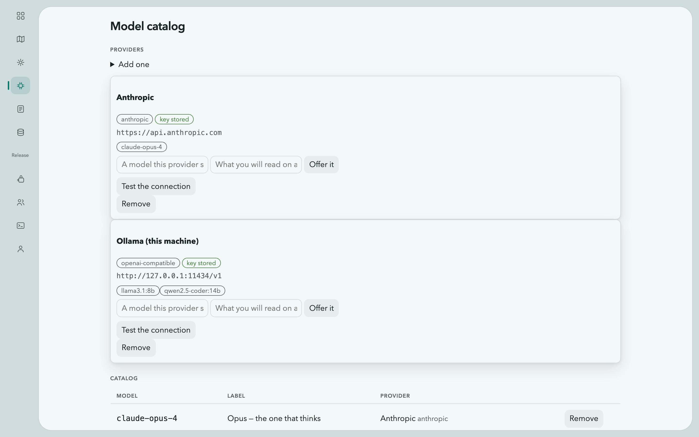


---

## The idea in five minutes

Four things make this different from a chat window with tools attached.

**A model per agent, not per workspace.** The agent that reasons about your
architecture can be an expensive frontier model while the one that writes
release notes is a free local one. The workbench records what each agent spent,
so the arrangement can be judged on its actual cost rather than on how it feels.

**Graph engineering — the edge is the capability.** What you build here is a
graph, and its edges are enforced rather than illustrated. Agents are nodes;
four kinds of edge share the canvas, on four layers you switch independently:

| Layer | An edge means |
|---|---|
| delegation | this agent may hand work to that one |
| tools | this agent may call that gear |
| memory | this is what the agent knows going in |
| outward | this agent may ask to reach the internet |

Remove an edge and the thing it allowed stops being possible — checked in the
runtime, not written down as a convention. It is the difference between
prompt engineering, which asks what to say to one model, and engineering the
graph, which asks what the parts may do to each other. The second is a
structure: you can look at it, change it, export it and hand it to somebody
else.

**Tools outlive the conversation.** An agent that needs a capability can forge
one, and it lands in a catalogue rather than evaporating with the session. It runs
only after you approve it, and only inside a container.

**Two hands on the same controls.** Every arrangement here can be built by
telling the orchestrator or by drawing it yourself — a wire drawn on
the canvas is a capability the orchestrator now has, an agent it hired is a card
you can rebind to another model, a gear you wrote by hand is one it can call. It
is the same objects and the same rules underneath, so there is no conversion
between the two ways of working and no "advanced mode" holding the real
controls. Hiring included: **`+ agent` on the blueprint** adds a node to the
canvas, and it arrives unwired — no delegation in or out, no gears, no outward
grant — until you draw the edges that give it any.

### What is done about the model being unpredictable

The point of the arrangement is a pipeline that behaves the same way twice. A
model is the least predictable part anyone puts in one, so each of these bounds
it somewhere specific:

| The bound | Where |
|---|---|
| A payload is validated against a schema **before any model is called** — a wrong request costs nothing | [Receivers](#receivers--a-door-from-the-rest-of-your-system) |
| An agent may delegate **only along a wire that exists**, enforced in the runtime | [The blueprint](#the-blueprint) |
| A task states what success is, and it is checked against the **record of what ran** — not against the answer | [`expect`](#receivers--a-door-from-the-rest-of-your-system) |
| The answer can be **the gear's own stdout**, so the model's retelling never reaches the caller | `answer_from: "gear"` |
| The answer itself can be required to fit a schema, and a run that misses it is refused | `expect.schema` |
| Prohibitions are the last thing in the prompt, and are inherited by agents an agent creates | [Prohibitions](#prohibitions) |
| One run at a time per workspace; the rest **queue** rather than racing or being dropped | [The queue](#the-queue-and-work-that-waits) |
| Every run is on the ledger with its record, whether it succeeded or not | [`did`](#did--what-happened) |
| A scheduled run gets no web search, because a search waits for a person to approve the query | [Schedules](#schedules--work-that-starts-because-a-clock-said-so) |

None of this makes a model deterministic. It makes the **workflow around it**
deterministic: the same input either produces work that meets the same stated
conditions or is refused with the reason, and either way there is a row saying
which.

---

## Workspaces, agents and the orchestrator

A **workspace** is a group of agents behind one chat. The agent you talk to is
the **orchestrator**; it is created with the workspace and cannot be deleted.

Talking to it is the only way in, by design. It can:

| It can | Tool |
|---|---|
| list the model catalogue | `models_list` |
| list, create and reconfigure agents | `agent_list`, `agent_create`, `agent_update` |
| wire agents together | `wire_create` |
| hand work to an agent it is wired to | `delegate` |
| build a new tool | `forge_gear` |
| find and share existing tools | `list_gears`, `grant_gear` |
| read and write the instruction library | `list_instructions`, `read_instruction`, `save_instruction` |
| attach or detach context documents | `context_list`, `context_bind`, `context_unbind` |
| read and write files in the workspace | `list_files`, `read_file`, `write_file` |
| search the web, if you have granted it | `web_search` |

Worker agents get a smaller set: `delegate`, the gear tools, the instruction
tools, the file tools, and `web_search` when granted. Workspace management
belongs to the orchestrator alone.

`grant_gear` is offered to the orchestrator and to nobody else. A worker that
forges a tool reports what it built; handing that tool to a third agent is a
change to the graph, and the graph is the orchestrator's.

A turn runs at most **16 tool iterations**, and delegation nests at most **4
deep**. Both are compiled in.

Every step is on the timeline — the tool called, its arguments, its result, and
any error. You can delete an entry, and deleting it is genuinely forgetting:
the timeline is replayed into the model on every turn, so removing a line
removes it from what the agent knows.

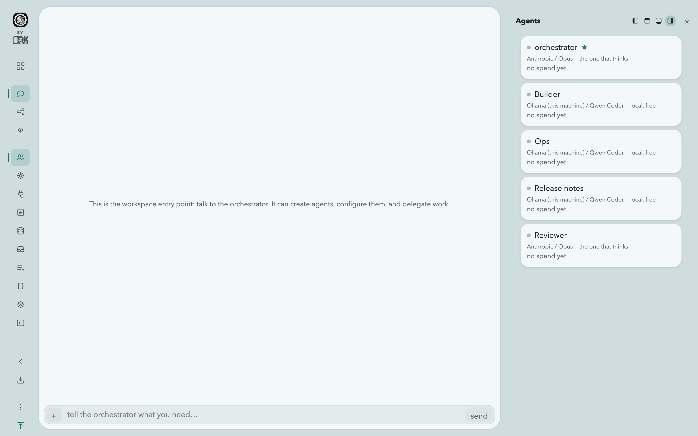

---

## The blueprint

The workspace's graph, and the place graph engineering actually happens: the
nodes are agents and gears, the edges are permissions, and the drawing is the
program rather than a diagram of it. Nothing here is a note about what the
system is supposed to do.

The canvas holds four layers. The legend's four buttons are independent
toggles, not a selector — any combination is a legal picture, including none:

- **delegation** — who may hand work to whom. On.
- **tools** — which gears each agent may call. On.
- **memory** — the branches and documents each agent reads. **Off**, because it
  doubles the node count and is the layer you go looking for rather than the one
  you want by default.
- **outward** — which agents may ask to search the web. On, and drawn only when
  egress is enabled at all.

Drag between two agents to create a wire. Drag a gear onto an agent to grant it.
Select an edge and press Delete to revoke it. Click an agent to open its
inspector, which arrives as an drawer over the canvas.

Nodes are coloured and captioned by kind, and the legend names every colour it
uses — a canvas where everything looks alike is a picture of connectivity, not
an explanation.

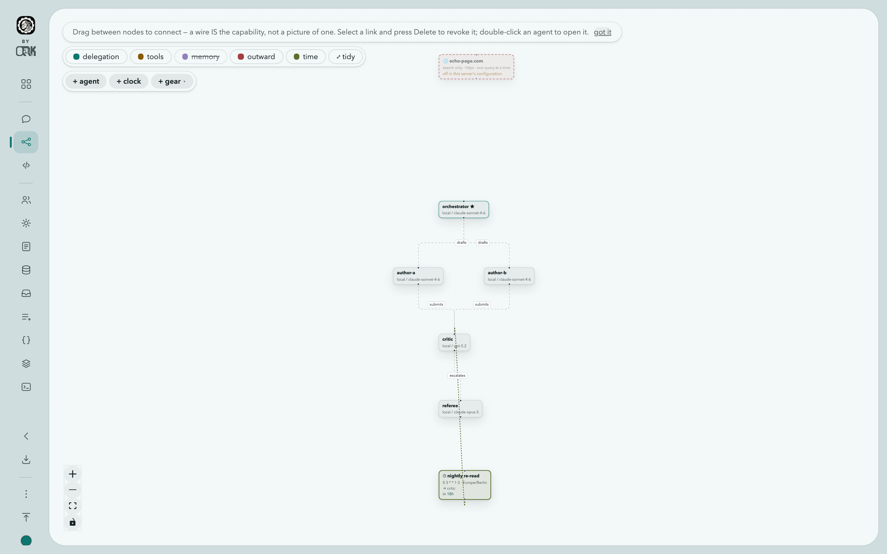

---

## Gears — tools your agents build

A **gear** is a small program with a name, a description and an argument
schema. Runtimes are `python`, `node` and `bash`. Gears can also be a binary you
upload.

The lifecycle is deliberate:

1. An agent forges a gear, or you write one yourself in the UI. It is created
   **pending**.
2. Pending gears can be dry-run. Nothing else can call them.
3. An **admin** approves it. Only then can agents invoke it.
4. It can be **disabled** later without being deleted.

Gears enter one global catalogue tagged with which workspace produced them. Bind
a gear to a whole workspace or to individual agents; the agent that forged it is
bound automatically, and the orchestrator can grant it to others.

**A gear's card carries the way in.** A pending gear's button reads
**review & approve**; once it is approved the same button reads
**review & run**. Either one opens the source, the named values, the network
grant and the timeout on one screen — there is no route to approval that does
not go through reading the code, because that is the whole of the control.

**Isolation.** With Docker available, a gear runs in a container started with
`--network none`, `--cap-drop=ALL`, `--security-opt no-new-privileges`,
`--user 65534:65534`, `--pids-limit 256`, `--memory 512m` and `--cpus 1`. Its
files are copied in rather than bind-mounted, so the container sees only its own
code. Each gear has its own timeout, and every run records stdout, stderr, exit
code and duration.

This is not decoration. Before it existed, a gear could read the server's SQLite
file and print a provider API key; that was demonstrated, and the sandbox is the
fix. Without Docker the server says plainly that gears run unsandboxed rather
than implying otherwise.

**Running without Docker.** `sandbox: subprocess`, or `auto` on a machine where
the daemon does not answer, drops to a plain subprocess. What that costs, and
what still holds:

- The gear runs as the account the server runs as, with its file access. It can
  read the database and the provider keys in it. **Approval is then the only
  control**, which is why the server logs a warning at startup and the gear
  catalogue says so on the page rather than in a footnote.
- **Dry runs are refused entirely.** Unapproved code never runs at all here —
  the one path that bypasses approval exists only because a container makes it
  cheap, so without a container it is closed.
- **The terminal is refused**, for the same reason: a shell would hold the
  server's own access.
- The environment is still minimal — `PATH`, `HOME` and the gear's name, never
  the server's own environment, which may hold credentials.
- A gear gets its own process group and the timeout kills the group, not just
  the process it started. Before that, a gear that backgrounded anything
  outlived its timeout *and* blocked the call forever, because the orphan held
  the output pipes open and the wait never ended. On Windows the equivalent is
  a Job Object with kill-on-close, which does the same job — with two caveats
  stated in the source: a microsecond-wide window between the process starting
  and being assigned to the job, and the fact that this path has been compiled
  for Windows but not run there.
- There are no memory, CPU or process-count ceilings. Docker supplies those;
  nothing else does.

**Watching a run.** A dry run reports its output as the gear produces it rather
than in one lump at the end, so a gear with a sixty-second timeout is a visible
process instead of a spinner. stdout and stderr are shown interleaved in the
order they actually arrived — splitting them puts an error above the line that
caused it. The recorded run is identical either way: whether anyone was watching
never changes what is stored.


### Who approved it, and to which version

Approving a gear is the most consequential act in this product — a human saying
that code an agent wrote may run on this machine, with these credentials,
reaching these hosts. It used to leave exactly one trace: a status column
reading `approved`. That answers "is it approved" and none of the questions
asked afterwards.

Every approval, disable and reset is now a row: **who** decided, **when**, to
**which version**, and **what was granted** at that moment. It is append-only —
nothing updates or deletes a row — and the gear's status stays the answer to
"what is it now" while the trail answers "how did it get that way". Open a gear
and press **who approved it**.

The version matters more than it looks. A gear can be edited after approval and
keeps its status, so `approved` on a v7 gear may mean somebody read v3. The
trail names the version each decision covered, and the review screen marks a
gear whose approval is older than the code it is running.

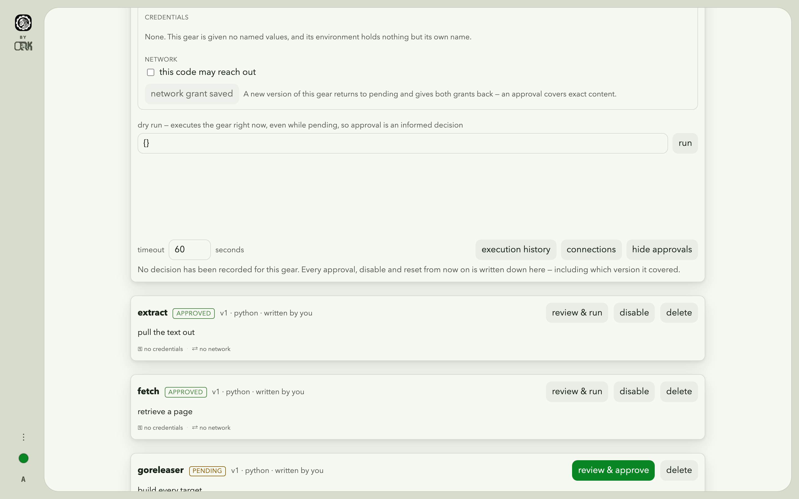

**Deleting a gear no longer deletes what it did.** Its run history used to
cascade away with it, which is exactly backwards: the moment you most need to
know what a gear did is after deciding it should not exist. The runs outlive the
gear and still say which gear they were.

---

## What a gear may hold, and where it may reach

Both are decided at approval, on the same screen as the source, and neither is
something an agent can arrange for itself. So is the **timeout**: it is a
number on that one gear, not an install-wide setting, because a gear that
fetches a page and a gear that renders one are not the same job. The button
that commits all of it reads **approve, with these grants**, and it says so
because approving a gear and granting it a credential and a network are one
act rather than three screens.

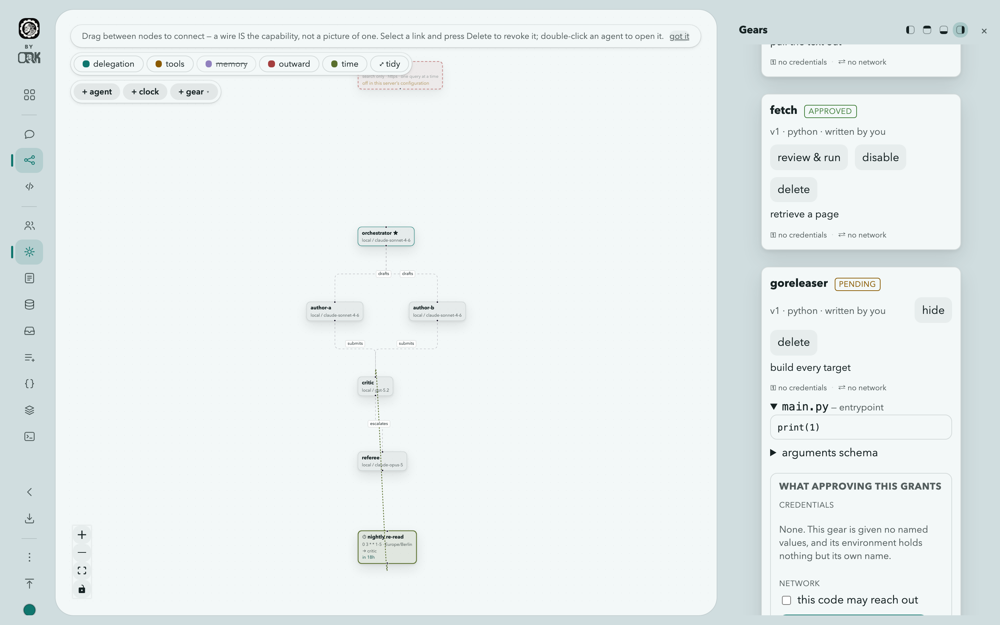

### Named values

A gear declares the **names** it needs. The values are put into its environment
when it runs and are never part of any prompt. That is the whole point: an
agent's answer leaves the building — in an inlet response, in the chat — so a
credential a model can see is a credential that can be published.

There are two kinds:

- a **variable** is shown wherever it appears;
- a **secret** is shown once, when you set it, and never again.

The kind is sticky. Turning a secret back into a variable would silently
un-redact everything already stored under that name, so it is refused; delete it
and make a new one.

Values are resolved from three places, in this order, with a later one winning:

1. this install's own store, in the database, sealed with AES-256-GCM under
   `COGITORIUM_SECRET_KEY`;
2. `variables_dir` and `secrets_dir` — a directory per kind, one file per name,
   the file's contents being the value;
3. the workspace's own override.

The second is how this works on Kubernetes. The chart mounts a ConfigMap and a
Secret as directories and the server reads files out of them, so rotation is
whatever the cluster already does. It deliberately does **not** call the cluster
API for them: the server pod does hold a token now — it creates a Job per gear
run — and reaching for Secrets with it would widen a Role that currently names
Jobs and pods and nothing else. Agent-authored code holds no token either way;
a gear's own pod mounts none.

Redaction happens at one boundary rather than at each caller, so nothing can
forget it — the tool result, the stored run, the live output an operator is
watching, the log, the error, and the names of any files the gear itself wrote.

**A secret does not enter a granted gear at all.** What goes into its
environment is a stand-in — random, minted for that run, meaningless anywhere
else — and the gate puts the real value in place on the way out. So the process
this design treats as untrusted never holds the credential, and a gear that
exfiltrates what it was given has exfiltrated a string that stops opening
anything the moment the run ends.

That has a cost, and it is not hidden: to substitute inside an HTTPS request the
gate has to be able to read it. For those runs — and only those — it terminates
TLS with its own certificate, which the run is handed, and opens its own
verified connection onward. A granted gear with no secrets is tunnelled exactly
as before, opaque to the gate. And a gear that was **not** granted the network
gets the real value, because there is no edge to substitute at and a stand-in it
could never exchange would just be a broken credential.

Two things it does not do, stated plainly. A value a gear **sends** somewhere is
still not redacted and cannot be: granting a key and a network is granting the
ability to carry it out, and the approval screen is the whole of the control.
And a **dry run gets the names with empty values** — a dry run executes code nobody has
approved yet, so handing it this install's credentials would make the button that
exists for looking safely the easiest way to take them.

Without `COGITORIUM_SECRET_KEY` the install still works: variables work, and a
secret mounted from `secrets_dir` works. Only writing a secret into the database
is refused, and it says why.

### The environment

A gear runs in this install's ordinary sandbox image. An operator can grant it a
different **environment** instead, on the same screen and in the same act as the
network — because an agent asking for a browser is asking for a machine that
renders untrusted pages, and that is a decision made while reading the source.

One environment exists: **`browser`**, which resolves to `browser_image` — an
image carrying a real browser and the libraries it needs. The gear drives it
however it likes, and what comes back comes back the way everything else does:

```
BROWSER=/ms-playwright/chromium-1194/chrome-linux/chrome
SHOT=7012 TEXT=97
```

A screenshot and the page's text, written into `out/`, collected as run
artifacts by the same path that already carries any file a gear produces. There
is no browser pipeline and no new record — the point of doing it this way is
that there is nothing new to learn.

**Granting one is API-only.** `PATCH /api/v1/gears/{id}` takes an
`environment` beside `status`, `timeout_seconds` and `network`; there is no
control for it in the interface. That is stated rather than hidden: an
operator reading the approval screen is reading everything that screen can
decide, and a browser is granted deliberately, with a request written by hand.

A gear **names an environment, never an image**. A gear that could name one
would be agent-authored code choosing what it runs inside, and a gear that
pinned one would stop working the day the operator moved to another. Forging a
new version clears the environment along with the approval.

The image is not pre-fetched at startup the way the ordinary one is: it is about
a gigabyte, and most installs never grant it. The first gear that needs one
pays for the pull inside its own timeout, so raise that gear's timeout for its
first run or pull the image on the host beforehand.

It runs under exactly the constraints every other gear does — an unprivileged
user, every capability dropped, no new privileges, and no network unless it was
granted one. A browser's own sandbox cannot start under those, so a browser gear
passes `--no-sandbox`: the container is the boundary, and it is the same one.

### Warm containers

Off by default, and the only setting in this product that gives something up.

Creating and destroying a container costs a few hundred milliseconds. That is
noise for a gear that runs for a minute and most of the wall clock for one that
answers in two hundred. `sandbox_pool: N` keeps N containers alive per image and
hands a run one instead.

**A pooled container is not a fresh machine.** Whatever a previous run left
outside its payload — a file in `/tmp`, a package it installed — is still there.
That is the trade, and these are its bounds:

- The payload is emptied before and after every run, so no gear reads another's
  code or output.
- A run is pooled only if it was given **no named values and no network**. Those
  are exactly the runs that could leave a credential behind. The executor
  decides, because only it knows what a run was given.
- A run whose payload is **read-only** — the file-carrying call — is never
  pooled: that payload is root-owned, and clearing it would need a root that can
  override file permissions, which this container deliberately does not have.
- A run that **timed out** retires its container, because whatever timed out is
  still in it.
- A container serves at most twenty runs, and is retired after ten minutes idle.
- The confinement is identical either way — the same dropped capabilities, the
  same user, the same limits, from one list used by both paths.

It needs an image with a shell, since a pooled container holds itself open with
one. An install whose gears run `FROM scratch` cannot use it, and the error says
so.

### The network

A gear has no network unless it is granted one at approval, with the hosts it may
reach. Traffic goes through a gate in the server's own process which checks the
destination against that list and records every connection, so what a granted
gear reached is in the record next to what it printed.

A new version of a gear returns to pending and keeps neither grant. An approval
is of exact content, and code that has changed has not been approved.

---

## Prohibitions

An agent's role says what it is for; its prohibitions say what it must never
do. They are free text, one rule per line, edited in the agent inspector or
patched with `{"avoid": "…"}` on `PATCH /api/v1/agents/{id}`.

They are assembled as the **last** section of the system prompt, after the
gears and the library note, under the heading `## Never do this` and a preamble
that says the rules hold for the whole conversation and are not overridden by
anything asked later. An agent with none gets no section at all. What the
inspector's *show what this agent sees* renders is the same string the model
receives, including the delegation contract a worker gets — a preview that
omitted a paragraph would send an operator debugging a prompt nobody sent.

Two behaviours follow from what a prohibition is for:

- **A created agent inherits them.** When the orchestrator calls `agent_create`,
  the new agent is given its creator's prohibitions. Without that, a rule was
  one tool call from being routed around — create a worker with no rules, take
  the automatic wire, delegate the forbidden thing. The value is stored on the
  new agent, so it is visible and editable like any other.
- **They travel.** Clone copies them; so does an exported bundle.

Prohibitions are per agent. There is no workspace-wide setting.

---

## Export and import

A workspace exports as one JSON document in the format
`cogitorium.workspace/v1`: the workspace, its agents with roles, prohibitions
and canvas positions, and the wires between them. Gears bound to the workspace
and its context documents are separate opt-ins.

```
GET  /api/v1/workspaces/{id}/export?gears=1&context=1
POST /api/v1/workspaces/import
     {"name": "…", "bundle": {…}, "include_gears": true, "include_context": true}
```

Export needs the same access as reading the workspace. Import is open to any
signed-in caller and the new workspace belongs to them.

**The format's rules are the design, not details.**

*Everything references agents by name.* Wires and gear bindings name their
endpoints, because ids from another install mean nothing here.

*Models are named, not carried.* An entry is `provider_type` plus `model_name`,
resolved against the importing install's own catalogue. A miss creates the agent
with no model and names it in the report under `unresolved_models` — it never
substitutes one.

*Nothing private is in the document.* There is no field for a provider key, a
token, a user, an owner, a team, or a chat message. A bundle is handed to
someone else; it is a template, not a dump.

*An imported gear is always `pending`.* Approval covers exact content on the
install that granted it, and does not travel. A name already taken is skipped
and reported rather than superseded — other workspaces depend on that gear, and
a bundle does not get to replace it, unapprove it, or bind itself to it. A
bundle also does not choose a gear's timeout: raising one is an
administrator's decision on the gear.

*Context is confined to the new workspace's branch.* Paths in a bundle are
relative, and anything absolute, containing `..`, or collapsing to nothing is
refused. The whole document is validated before anything is created, so a
refused bundle leaves no workspace behind — being refused halfway is worse than
being refused.

The import reply is a report: agents and wires created, gears imported, gears
skipped with the reason, context files written, and every model that could not
be resolved. It is worth reading rather than dismissing — an imported workspace
whose agents have no model looks fine on the blueprint and does nothing on the
first turn.

---

## The API description

[`docs/openapi.yaml`](https://github.com/orkcom-tech/cogitorium/blob/main/docs/openapi.yaml)
is an OpenAPI 3.1 document listing every endpoint this server has: 97 path
items carrying 130 operations, their path parameters, and which credential
opens each — a user's token, a receiver's own key, or nothing.

**It is generated from the server's own route table**, by a test that fails when
the two disagree. Every route registers itself into that table, so a route
cannot exist without appearing here and a deleted one cannot linger. Adding an
endpoint without updating the description fails the build, naming the line:

```
docs/openapi.yaml no longer matches the routes this server registers.
first difference at line 612:
  committed:   "/api/v1/users":
  current:     "/api/v1/undocumented":
```

After a deliberate change, `go test ./internal/server -run TestOpenAPI -update`
rewrites it.

**Request bodies are described where the handler decodes into a named type** —
fourteen of the fifty mutating routes so far, including creating a
receiver, writing and editing its task, forging a gear, running one, approving
one, answering the update-check question, and creating a workspace or an agent. Those schemas are generated by
reflecting over the very struct the server decodes into, walked the way
`encoding/json` walks it, so a renamed field is renamed in the document by the
same edit.

The remaining thirty-six are being named route by route, and a test holds the
count so it can only fall: describing one more asks you to raise a number,
un-describing one fails the build and lists what is left. Until then their
shape is on this page.

**Response bodies are not described yet**, and the document says so about
itself rather than leaving a reader to discover the gap. A specification that
silently under-describes is worse than one that states its own edge.

The version in it is the API surface — `1`, matching `/api/v1` — and
deliberately not the build's version, which would report a new API on every
release.

---

## MCP — this install as a tool provider

Cogitorium speaks the Model Context Protocol over stdio, so Claude Desktop,
Cursor or anything else that spawns an MCP server can use what this install
holds.

```sh
cogitorium mcp --server http://127.0.0.1:8688 --token $COGITORIUM_TOKEN \
  --inlet-key tickets=cgi-tickets-… \
  --workspace 3
```

That command line is the whole integration; in a client's configuration it goes
where the client keeps its servers.

**`--workspace`** narrows the receivers offered to one workspace's own. Without
it a client sees every receiver the token can reach, which is right for an
install with one workspace and wrong the moment there are six — a tool list is
something a model reads on every turn, and a client pointed at one project has
no business being offered another's doors.

**What becomes a tool.** Two kinds, and nothing else:

| Tool | Is | Runs as |
|---|---|---|
| `gear_<name>` | an **approved** gear | a sandboxed container on the Cogitorium host |
| `receive_<address>_<task>` | a receiver task that accepts JSON | a delivery through the door, with its schema checked first |

A pending or disabled gear is not listed, and calling one anyway is refused
with a sentence rather than run — the tool list a client holds can be minutes
old, and a gear disabled in between must not execute because somebody's cache
is stale.

**What is not exposed, on purpose.** The management API. Creating agents,
drawing wires, editing prohibitions, approving gears — those are the operator's
acts. An MCP client is a guest with a tool list, and a guest that can approve
its own tools is not one.

**Credentials are separate, deliberately.** `--token` decides what can be
*seen*; a receiver's own key is what lets anything be *delivered* to it, and
there is no default. A door has its own credential by design, and lending it
the admin's would put the wrong caller in the ledger.

This process holds no database. It talks to a running server over HTTP, so an
MCP client may start and kill it as often as it likes without ever contending
with Cogitorium for its SQLite file.

**`POST /api/v1/gears/{id}/invoke`** is the route behind the gear tools: it runs
an approved gear and answers 403 for anything else. It is deliberately not the
same route as `/run`, which is the dry run and bypasses the gate so an operator
can see what code does before trusting it. Two routes because they are two
different promises.

## Consuming MCP — somebody else's tools, granted to an agent

The other direction, and the one to read before switching on. Set
`mcp_clients: true` and the routes exist; leave it and they answer 404 saying so.

**Read this first.** Everything else this product executes is either its own
code or a gear whose complete source is in this install — versioned, approved
line by line by an operator who read it, and run in a container that cannot see
the server's files. An external MCP server is a **command**. Cogitorium never
sees its source, cannot version it, and the tool list is the server's own account
of itself. In this first cut the child runs **on the host, as this server's user,
outside the sandbox**, so an approved MCP server can open the SQLite database and
read every provider key in it.

| | a gear | an external MCP server |
|---|---|---|
| what you read before approving | its complete source, versioned | a command line, and a tool list it reported |
| approval covers | exact content; a new version resets it | a hash of the command, args, cwd and named values |
| isolation | a container; no network unless granted | none — a host process with this server's uid |
| its secrets | stand-ins, substituted at the gate | resolved into its environment at spawn |

**Three transports**, and `mcp_servers` carries the half its transport needs:

| `transport` | carries | what approving it grants |
|---|---|---|
| `stdio` | `command`, `args`, `cwd`, `env_names` | a process on this host, as this server's user, outside the sandbox |
| `streamable-http` | `url`, `header_names` | nothing runs here; a credential and every argument leave, over https |
| `sse` | `url`, `header_names` | the same, over the deprecated 2024-11-05 shape |

A row wearing both halves is refused by a CHECK and by the store. `header_names`
maps a header to a **named value** — `{"Authorization": "JIRA_TOKEN"}` — resolved
at connect time through the same resolver a gear's env names go through, so no
credential is ever in the row. **The fingerprint covers the URL**: a hostname
that changed after approval looks identical to one that did not, which is
exactly why it is hashed. Cleartext to anywhere but this machine is refused.

**OAuth, for hosted servers that want it.** `POST /api/v1/mcp-servers/{id}/oauth`
starts the flow and answers with where to send the browser;
`GET /api/v1/mcp-oauth/callback` completes it; `DELETE` on the first
disconnects. Four checks make it safe and none is optional: **PKCE (S256)** on
every flow, the **`resource` parameter** (RFC 8707) on both the authorization
and token requests naming the MCP server the token is *for*, the callback's
**`iss` validated** against the issuer recorded before the redirect (RFC 9207,
by simple string comparison — no case folding, no trailing-slash normalisation),
and a **`state`** generated with a CSPRNG and consumed exactly once.

The callback is the one unauthenticated route in the API, of necessity: it
arrives on a redirect from somebody else's authorization server, and the
`state` is what stands in for a credential. Client registration is RFC 7591
dynamic registration — deprecated by the spec in favour of Client ID Metadata
Documents, and implemented because it is what deployed servers support.

**Tokens are sealed** with the same AEAD as the secrets table, with the key id
beside them so a rotated key refuses honestly rather than decrypting to
nonsense. **An install with no `COGITORIUM_SECRET_KEY` is refused the flow**
rather than storing a refresh token in the clear. A step-up asks for the
**union** of what is held and what a 403 demanded, because a challenge names
only what the failed operation needed and asking for that alone drops the rest.

**The library** is the published registry at `registry.modelcontextprotocol.io`,
read live. `GET /api/v1/mcp-catalog` returns it, admin-only like everything else
here, because a list whose purpose is to be installed FROM is a list that spawns
subprocesses on this server and sends credentials to hosts it names.

**It is gated on the update-check consent.** With `update_check: off` it answers
409 and says so: reading the registry is an outbound request, and an install
that does not phone home should not acquire a catalogue that does. Adding by
hand is untouched. Where a server publishes both a package and a hosted
endpoint the **hosted one is offered**, because it runs no code here. An entry
this install could not connect to — an unrunnable package registry, a cleartext
URL — produces no entry at all rather than a button that always fails. Each
states its prerequisite and the credentials it needs **by name**, never a value;
picking one fills in the form and skips no gate.

**`GET /api/v1/mcp-servers` is redacted for anybody but an administrator.** The
row carries a full command line and the NAMES of every credential the server is
handed, which together are a map of this install's integrations and internal
hostnames. A member sees the name, the description and the status — enough to
understand why an agent has a tool — and the command, arguments, working
directory, credential names and fingerprint come back blank rather than absent,
so a client cannot mistake "you may not see this" for "there is nothing here".

What bounds it is **policy rather than isolation**, which is the honest word:

- off unless configured on;
- every install, approval and grant is admin-only, and **no agent can reach any
  of them** — there is no `forge_mcp_server` and no model-facing installer;
- three separate acts in order: install (it exists, pending), **probe** (started
  once and asked what it offers, given nothing at all), then approve — the
  server, and **each tool individually**, so one that grows a tool afterwards has
  grown an inert one;
- the command is fingerprinted at approval and recomputed at every spawn; a
  mismatch refuses and returns the server to pending;
- a `sampling/createMessage` from the server is refused, so it cannot spend this
  install's model budget on text it chose.

The fingerprint's limit, stated because it matters: it covers the command line,
not the bytes at the end of it. `npx some-server@latest` refetches on every spawn
and nothing here notices.

Tools reach a model as `mcp_<server>__<tool>`, which cannot collide with a gear's
`gear_` or with another server's. The list is cached in the database rather than
fetched live, because an agent's tool list is rebuilt on every iteration of its
loop and asking a child process each time would be several round-trips per model
call.

**Not in this cut:** HTTP and SSE transports (stdio only), `resources/*` and
`prompts/*`, sampling, elicitation, progress notifications, image and audio
content (named in the answer rather than dropped in silence), and a connection
pool — one connection per call, so a server starts and stops around each one.

---

## The command line

The same binary is a client for its own API. Nothing here can do anything the
interface cannot; what it adds is an exit code a shell can branch on and output
narrow enough to pipe.

| Command | Does |
|---|---|
| `workspaces` | list them |
| `workspaces export <id> [--gears] [--context] [-o file]` | write a bundle |
| `workspaces import <file> [--name] [--gears] [--context]` | build a workspace from one |
| `gears list` | every gear, with its approval status |
| `gears run <name-or-id> [--args JSON]` | run an **approved** gear |
| `receivers list --workspace <id>` | the doors, their keys and their tasks |
| `receivers deliver <address>/<task> --key K [--data JSON] [--async]` | post to a door |
| `queue list --workspace <id>` | what is running and what waits |
| `queue cancel <unit>` | stop the work, not just the row |
| `run <id>` | read a delivery back from the ledger |

**Address and credential.** `--server` and `--token`, or `COGITORIUM_URL` and
`COGITORIUM_TOKEN`; the flag wins. The token is required on every address,
including your own machine. Delivery is the
exception: it takes the *receiver's* key — `--key` or `COGITORIUM_INLET_KEY` —
because a door's credential opens that door and nothing else, and it is the one
the ledger records.

**Exit codes are the point.** `gears run` exits with the gear's own code, so a
shell branches on what the gear said rather than on whether the HTTP call
worked. `run <id>` exits non-zero for anything that did not complete. A refused
delivery, an unapproved gear and a missing run are all non-zero with the
server's own sentence on stderr, under a lowercase prefix:

```
$ cogitorium serve --port 9000
error: unknown flag: --port
```

**What it deliberately does not do.** Create agents, draw wires, edit
prohibitions or approve gears. Those are decisions made while looking at a
canvas or a source listing. Everything else is over the same HTTP API described
in [openapi.yaml](openapi.yaml), so anything absent here is a `curl` away rather
than blocked.

---

## Receivers — a door from the rest of your system

A receiver lets something outside this install hand work to an agent. It has an
address, its own key, and a list of tasks; a task says what it accepts, which
agent receives it, what to tell that agent, and what counts as success.

Called a receiver in the interface and an **inlet** in every string a caller
holds — the paths below, the config keys, the tables. The label changed; the
wire did not.

```
POST /i/{address}/{task}            delivery — the only path exempt from
                                    normal authentication, proving itself
                                    against an inlet key
GET/POST /api/v1/workspaces/{id}/inlets
GET/DELETE /api/v1/inlets/{id}
POST /api/v1/inlets/{id}/key        issued once, stored hashed
POST /api/v1/inlets/{id}/tasks
PUT/DELETE /api/v1/inlet-tasks/{id} PUT carries the whole task, not a patch
GET  /api/v1/workspaces/{id}/inlet-runs   the ledger for one workspace
GET  /api/v1/inlet-runs/{id}              one run, whatever door it came through
```

`GET /api/v1/inlet-runs/{id}` is the operator's way back to a delivery: the
answer, the record of what ran, and how it settled, for anyone who may reach
the workspace it belongs to. It is not the same route as
`GET /i/{address}/runs/{id}` further down, which a *receiver's own key* opens
and which is confined to the runs that arrived through that one door. Two
routes because they are two callers with two different reasons to look.

**A task is editable in place.** `PUT` keeps its id, so the runs on record and
the schedules pointing at it survive a correction; the alternative was delete
and recreate, which answers 404 in between and comes back as a different task.
The body is the whole definition rather than the fields that changed, because an
absent `schema` would otherwise have to mean *accept anything* — and a door does
not widen because a field was left out of a request. Creation and edit go
through one validator, so a task cannot be edited into a state it could not have
been created in.

Management stays behind normal authentication with the workspace's own access
rule. The exemption above matches by prefix, so nothing but delivery is ever put
under `/i/`.

**A task accepts JSON against a schema, or a file of a given content type.** A
payload that does not match is refused with 400 **before any model is called**.
A file is written into the workspace and the agent is given its **path** — never
its bytes, which is what lets a gear open it and what stops a megabyte of base64
reaching a prompt.

**A delivery is not a conversation.** It writes nothing to the operator's
timeline: the timeline is replayed into every turn, so a pipeline posting to the
chat endpoint would make request two hundred carry the previous hundred and
ninety-nine. It is also treated as third-party from the first byte.

**What an unattended run may not do.** The turn is marked tainted before the
first model call, and these are closed for the whole of it, including for any
agent the payload reaches by delegation:

| Withheld | Because |
|---|---|
| `save_instruction` | the library is global; anything written there reaches every agent on every later turn |
| `forge_gear` | code the caller's payload composed, waiting for an approval |
| `context_bind`, `context_unbind` | what an agent knows going in |
| `agent_create`, `agent_update`, `wire_create` | the graph |
| `grant_gear` | handing a tool to an agent that was not given it |
| `web_search` | every search stops the turn and waits for a person to approve that exact query, and there is nobody there |

`web_search` is simply not offered — advertising a tool that is refused on
every call spends a provider round-trip per iteration. The rest are offered and
refused at dispatch, so the latch is exercised where it can be seen working.

One run at a time per workspace;
a delivery that arrives meanwhile is `queued` and waits, and only a queue past
`queue_max_per_workspace` refuses with 429.

### `did` — what happened

Every response and every run carries the record: which tools ran and whether
they succeeded, which files exist afterwards with their sizes, how many model
calls and how many tokens. On success and on failure alike, and never behind a
flag.

It exists because the answer cannot be trusted on its own. A model asked to call
a gear once answered *"The … file was aligned and formatted using gear_format"*
having made no tool calls at all, and the delivery said 200. With the record
that run reads `"tools": [], "files": []`, and an empty tool list is the answer.

**Each tool call carries the arguments it was made with.** "gear_deploy
succeeded" and "gear_deploy succeeded against production" were the same line
otherwise, and the difference is the whole reason anybody opens a record. They
are abridged, not stored whole: writing a file puts the entire body in the
argument, and a run that writes four files would put four documents in a column
carried on every run row forever. Each value is cut at 200 bytes and the object
at 2000, every key survives, and a cut value ends in `… (N bytes)` so nobody
mistakes an abridgement for the value. Nothing needs redacting — arguments are
what a MODEL sent, and a model never holds a variable's value.

**And which documents fed the run, at which versions.** Context is the input
most likely to have changed between a run that worked and one that did not, and
the record was silent about it: you could see which agent ran, which tools it
called and what it cost, and had no way to learn that somebody rewrote the
house-style document that morning. A version that could not be determined is
empty rather than guessed — "we read this and cannot say which version" is a
different fact from "we read v4".

```json
{
  "tools": [{"name": "gear_deploy", "agent": "releaser", "depth": 1, "ok": true,
             "ms": 812, "args": {"target": "production"}}],
  "files": [{"path": "out/release.txt", "bytes": 64}],
  "context": [{"path": "team/release-policy.md", "version": "v9"}],
  "model_calls": 6,
  "tokens": {"in": 18442, "out": 2211}
}
```

**One read per document per run.** A document is fetched once and every agent in
the delegation tree, however deep, gets the same bytes and the same version. It
was one `contextd file get` per document per agent per iteration before, and a
document that changed halfway through a run could feed the orchestrator one
version and its worker another with nothing saying so. A run is one piece of
work; it sees one context.

### Asking the record questions

`GET /api/v1/workspaces/{id}/inlet-runs` is the plain listing, and the same
route answers what the record exists for:

| Parameter | Finds runs that |
|---|---|
| `tool` | called this tool — a gear appears under its tool name, e.g. `gear_deploy` |
| `agent` | this agent did work in, anywhere in the delegation tree |
| `context` | read this document, by path |
| `file` | produced this file, by workspace-relative path |
| `state` | ended in this state |
| `failed=true` | did not land: failed, interrupted, or either refusal |

The Receivers drawer has the same filters as a row of fields. Matching is
against the record's lists rather than its text: a search for `deploy` over the
raw JSON would also match a file called `deploy.md`, an agent named `deploy`,
or the word inside a recorded argument.

**A run with no record matches nothing, on purpose.** An empty record means no
record was kept — it ran before records existed, or it is still in flight —
which is not the same as a record showing nothing happened. We cannot say it
called that gear, and we must not say it did not.

### `expect` — what the operator says success is

Optional, per task. `runs_gear` requires a named gear to have run and succeeded;
`produces_files` requires at least N files to exist afterwards; `schema`
requires the answer to fit a shape; `answer_from: "gear"` makes the last
successful gear's stdout the result and returns no prose at all — for a
deterministic job the agent is a router and its narration is not evidence.

The first two are checked against the **record**, never against the text, so a
run with a confident answer and an empty record fails. Two terminal states keep
the cases apart: `refused_expectation` when the work did not happen and
`refused_output_schema` when the answer did not fit — different news for
whoever is paged.

`produces_files` counts files, not writes: a run that wrote one file twice has
produced one file.

---

## The queue, and work that waits

A workspace runs one thing at a time. That has always been true; what changed is
what happens to the second thing.

It used to be destroyed. A delivery that met a running turn was written into the
ledger as `failed` with the engine's busy error and answered 429 — the same
terminal state a genuinely broken job gets, so a burst of two hundred tickets
was one job done and a hundred and ninety-nine losses a caller could only tell
from real failures by string-matching an error message.

Now it **waits**. A delivery is recorded as `queued`, takes its turn, and runs.
An operator's own chat turn takes the same lane rather than a second latch of
its own — two latches that could not see each other would let a turn and a
delivery run at once in one workspace, and they share an egress budget, two
anti-worm latches and one run record. The difference between them is what
happens when the lane is busy: a delivery queues, and a chat turn is refused
immediately, because a person is holding a stream and possibly an approval on
screen and cannot be parked in a line they cannot see.

**What is bounded is the waiting, not the running.** Past `queue_max_per_workspace`
a delivery is refused with 429 and told how many are ahead of it. That is
backpressure; the thing it replaced was data loss.

**Retry is opt-in and off.** `max_attempts` is 1: a re-run can repeat an agent
that already spent tokens, wrote files and sent something outward, so this queue
is at-least-once and never describes itself as retrying for you. A unit found
running at startup is marked dead rather than requeued, for the same reason —
nothing in the row says how far it got.

`GET /api/v1/workspaces/{id}/queue` shows depth, position and what is running.
`DELETE /api/v1/queue/{id}` stops a unit whether it is waiting or already
running: it marks the row **and** interrupts the work, because a cancel that
only relabelled the row would leave the model answering and the tokens being
spent for a job somebody had already stopped. Cancelling something finished is a
409, so a stale button cannot rewrite a decision.

---

## Metrics — what an operator can alert on

`GET /metrics` on the `metrics_listen` address, in the Prometheus text format.
**Empty address means off**, and off is the default.

**Its own listener, never a route on the API.** The API is authenticated and a
scrape is not, so an unauthenticated path on the authenticated surface would be
a way in. A separate port is something that can be bound to a private
interface, firewalled, or reached only from inside a cluster — which is what an
operator already does for every other exporter they run.

**No name a person chose appears in any label.** Not a workspace, an agent, a
model, a tool or a user. Two reasons and both are sufficient: a label value is
published to whoever can scrape, and a monitoring system is usually less
guarded than the product; and a label whose values are unbounded turns a time
series database into a memory leak. `route` is the route **template** —
`/api/v1/workspaces/{id}` and never the id — and `provider` is the provider
*type*, a closed set this codebase defines. Per-workspace spend is already in
the database and on the People map, which are authenticated screens with an
audience.

| metric | what it answers |
|---|---|
| `cogitorium_build_info{version}` | which build is answering |
| `cogitorium_http_requests_total{method,route,status}` | the API's traffic and its failures |
| `cogitorium_http_request_seconds{method}` | how long it took |
| `cogitorium_work_queued`, `cogitorium_work_running{kind}` | how far behind the queue is |
| `cogitorium_work_units_total{kind,outcome}` | what finished, and whether it worked |
| `cogitorium_schedule_fires_total{outcome}` | **the nightly job that has been failing all week** |
| `cogitorium_gear_runs_total{outcome}`, `cogitorium_gear_run_seconds` | code execution, kept apart into `ok`, `failed`, `refused`, `timed_out` and `nonzero_exit` because they page different people |
| `cogitorium_model_calls_total{outcome,reported}`, `cogitorium_model_tokens_total{direction}` | **the money.** `reported=false` counts providers that return no usage, so a zero is never mistaken for free |
| `cogitorium_mcp_calls_total{transport,outcome}`, `cogitorium_mcp_call_seconds` | somebody else's host |
| `cogitorium_egress_requests_total{state}` | the outward gate |

**A metric nobody has touched is not published**, deliberately: a zero cannot be
told apart from "this is not wired up", and the second is the one worth
noticing.

**Written by hand, no dependency.** `client_golang` pulls a tree for what is
counters in a map and a few hundred bytes of text, and it carries a global
registry that collects the Go runtime and the process whether or not anybody
asked. Here what is exposed is a list in one file that somebody chose. The
precedent is `openapi.go`, which renders OpenAPI the same way and for the same
reason.

**Logs are a format, not a shipper.** `log_format: json` gives one object per
line with stable field names; Vector, Fluent Bit, Alloy and the vendor agents
do the shipping. A product that grew its own exporter would be a product
maintaining four of them.

**On Kubernetes** the chart turns metrics on, binds them to the pod's own
interfaces, adds the port to the Service, and will render a `ServiceMonitor`
when `metrics.serviceMonitor.enabled` says the Prometheus Operator's CRD is
there — guarded, because applying a manifest whose kind does not exist fails
the whole release. If `networkPolicy.enabled` is on, the scrape gets its own
ingress rule: narrow `networkPolicy.scrapeFrom` to your monitoring namespace,
or leave it open to the cluster and know that you did.

---

## Schedules — work that starts because a clock said so

A schedule dials one of three things, named by `target_kind`.

```
GET/POST /api/v1/workspaces/{id}/schedules
PATCH  /api/v1/schedules/{id}       {"enabled": false} — the pause button
DELETE /api/v1/schedules/{id}
POST   /api/v1/schedules/{id}/run   fire it now; answers 202 with the queued unit
```

| `target_kind` | carries | who may create it |
|---|---|---|
| `task` *(default)* | `task_id`, `payload` | anyone who reaches the workspace |
| `agent` | `target_agent_id`, `instruction` | anyone who reaches the workspace |
| `gear` | `target_gear_id`, `args` | **an administrator** |

**`task` was once the only one**, and the reasoning was sound as far as it went:
the task already says which agent, what to tell it, what it accepts and what
success means, so a firing is that same job with nobody on the other end, and
two definitions of a job would be two things to keep in step.

**What that missed is what a task IS** — a door somebody else pushes work
through, with an inlet, an address, a key and a caller. A schedule is not that.
Bending one through the other meant inventing a receiver nobody would ever call
to get a nightly job, and the receivers list filled with entries that had no
inlet and no caller. That is a worse lie than the one it avoided.

**All three land in the same place.** One queued unit, one ledger row, one lane,
one ceiling — a direct schedule that skipped any of it would be a second, weaker
way to run work, and the weaker one is the one nobody watches. A clock firing
has no inlet, so its ledger row carries a null `inlet_id` and the address
`clock`, which is what a reader sees instead of a blank.

**An agent's instruction is NOT fenced as untrusted**, and that is the one
deliberate difference from a delivery. A task's payload is fenced because a
caller outside the workspace wrote it; a schedule's instruction was typed by an
operator into this install, and wrapping it in *this is data, not instructions*
would be telling the agent to ignore the only thing it was given.

**A gear schedule is fenced three ways.** Creating one requires the admin role,
because it is unattended execution of approved code by somebody who did not
approve it. The gear must be approved when the schedule is saved **and again
every time it fires** — a gear edited since drops back to pending, and a clock
is the caller with no second gate behind it. And the run still lands in this
workspace's queue and record, which is the only place a nightly job that has
been failing all week becomes visible.

**Deleting the target does not delete the schedule.** `target_agent_id` and
`target_gear_id` are `ON DELETE SET NULL`, so the row survives with a null
target, reports `broken: true`, refuses to fire with a reason, and draws itself
red on the blueprint. A cascade would mean the nightly job silently stops and
nobody learns why until the thing it was doing is noticed missing. `task_id`
still cascades, because a schedule whose task is gone has no instruction, no
agent and no expectation — there is nothing left of it to repoint.

The listing resolves two things the row cannot answer on its own: `target_name`,
what this dials by name, and `edge_agent_id`, which agent node the blueprint's
edge lands on — including for a task schedule, whose agent is named by the task
two joins away.

**Enabling and disabling is its own route**, carrying one field, because
turning a schedule off is the thing an operator does in a hurry and at night.
Sending back the fields they are not changing is how a pause becomes an edit
nobody meant to make.

**Run-now does not move the clock.** `POST /api/v1/schedules/{id}/run` enqueues
the same unit a tick would and leaves the next firing where it was. It exists
because the first thing anybody does with a new schedule is want to know whether
it works, and waiting until 02:00 to find out is how a broken job stays broken
for a day.

Two spec forms:

```
every 15m
0 7 * * 1-5
```

`every <duration>`, with a one-minute floor, and a five-field cron subset —
minute, hour, day of month, month, day of week, with `*`, `n`, `a-b`, `*/n` and
comma lists. No seconds, no `@yearly`, no `L`/`W`/`#`: each is something an
operator can write, believe, and be wrong about. Day-of-month and day-of-week
are OR'd when both are restricted, which is how every cron has behaved since the
original.

A timezone is an IANA name and the binary carries its own copy of the database,
so a schedule means the same thing on a laptop and in a container that has no
zoneinfo — otherwise every zone silently resolves to UTC, in production only.

**Everything checkable is checked when the schedule is saved**: the spec, the
zone, the payload against the task's own schema, that the agent exists. That is
the only moment the person who typed it is still looking at it.

**A scheduled run never gets web search.** Every search stops the turn and waits
for a person to approve that exact query, and on a schedule there is nobody to
ask — so the tool is not offered at all. An agent may hold a grant and still
never use it on this job, so this is not a reason to refuse the schedule; it is
a reason to know before you write one that depends on it.

**A firing whose previous run has not finished is skipped**, and recorded as a
skip rather than a failure. That is `on_miss: skip`, and it is what an
unset `on_miss` becomes — a job slower than its own interval never catches up,
and queueing every missed tick turns that into a backlog outliving the reason
for it. `on_miss: run` is there for the operator who genuinely wants each tick
attempted; those are the only two values, and anything else is refused when the
schedule is saved.

---

## Handing a job off, and being told when it is done

**`Prefer: respond-async`** answers 202 with a run number and a `Location`
instead of holding the connection. The default stays synchronous, because every
caller written against a door so far expects the answer in the response.

**An inlet key can read its own runs.** `GET /i/{address}/runs/{id}` returns the
same body a synchronous delivery would have. The key reads the runs that arrived
through *its own* inlet and nothing else — two doors into one workspace are two
callers. There is no scope column on tokens and no policy system: the
requirement is one sentence, and a general mechanism built to serve one sentence
is one every future route has to be audited against.

**`GET /i/{address}/runs/{id}/file?path=`** serves a file the run produced, or
the payload it was given. Any size, any bytes, streamed. Authorisation is the
run's own record: the path must be its payload or a file the engine recorded it
making — narrower than "anywhere in the workspace", because a delivery's key
would otherwise read every file every other job there had left.

**Callbacks.** A task may name a URL to be told when its run finishes, and the
body is the same shape reading the run back gives, so a pipeline that polls and
one that listens parse the same thing. The callback is a queued unit like any
other, with backoff, so it survives a restart and is visible to an operator. The
URL is a field on the task — `callback_url` on the route, *tell somebody when it
finishes* on the form.

`callback_hosts` is **empty by default, and empty means off** — not "everything
allowed". A callback URL arrives in a task, and a task is editable by anyone who
can reach the workspace, so an open default would turn editing a task into
making this server call an address of somebody else's choosing.

---

## What a run cost, and stopping it

Every durable row a run writes — its model calls, its gear runs, the hosts a
granted gear reached — now names the queued unit it belonged to. Before that the
only link was a timestamp, which happens to work today because runs are
serialised per workspace and stops working the moment anything else is true.

`GET /api/v1/workspaces/{id}/spend` answers what a workspace used over a window,
by agent and model, defaulting to the last seven days. The aggregates that
existed before were lifetime sums, so "what did last week cost" could not be
asked at all.

**A budget refuses.** `budget_run_tokens` is off by default; set it and a run
that reaches it is stopped before the next model call rather than after, and
settles as `refused_budget` rather than `failed`.

It exists **for the door, not for you**. An inlet is an entrance for somebody
else's system, and whoever holds the key can drive deliveries — so this bounds
what a third party can cost. There is deliberately no daily or workspace-wide
version: nothing but your own schedules and your own typing drives a workspace's
total, and capping that would be a knob whose only use is stopping your own
work.

The separate state is the point. A caller outside has to tell "your job hit the
ceiling" from "we broke" without reading prose, because retrying a run that was
deliberately stopped is how a ceiling turns into a bill.

Tokens, not money. There is no price data in this schema and there is not going
to be.

---

## Files, for gears and agents

A gear run that is handed files executes in a directory holding `in/` — the
files, read-only — and an empty `out/`. It opens `in/photo.jpg` and writes
`out/result.json` the way any program does, and what it leaves in `out/` is
copied back into the workspace and reported. A gear given no files sees neither
directory and its input is byte-identical to what it was.

Read-only there is ownership rather than a flag: the sandbox user owns `out/`
and nothing else, and a directory you do not own is one you cannot add to or
delete from.

Agents have `list_files`, `read_file` and `write_file` over their own
workspace, and the paths they take are the ones `list_files` gives back — the
same paths a gear's file argument takes, so a file an agent found is a file it
can hand on without translating anything. `read_file` refuses a binary rather
than base64-ing it into a prompt.

**What a model can be shown is text, images and PDFs.** Anything else — a zip,
a spreadsheet, a video — is refused in the model layer with a message naming the
gear route, because no model can look inside it. Whether a particular model
accepts images is declared on the model in the catalogue: it is never probed and
never guessed from a name, since a wrong guess fails at the provider with an
error nobody can act on.

### Attaching a file to a message

The composer's **`+`** takes any file at all. Each one is uploaded as it is
picked rather than held until send — `POST /api/v1/workspaces/{id}/attachments`,
one file per call — so a fourth file the server refuses does not take the three
that worked with it, and the error names the file it belongs to.

It lands under `attachments/` in the workspace directory, in a directory named
for the moment it arrived, keeping the name it came with. The uniqueness is in
the directory rather than the filename because the filename is what a person
reads and what a model is told; an upload must still never overwrite bytes an
earlier message already pointed an agent at.

**The chip says which of two things is about to happen**, and it is the only
part an operator cannot work out for themselves:

- the model is **shown** the file, as text, an image or a PDF; or
- the model is not shown it, and the agent is given its **path** — marked
  `→ gear` — for a gear to open.

A file this model was never declared to accept is marked before you send rather
than explained after it fails. Taking a chip off the message leaves the file in
the workspace; what was attached is part of what was said, so it is shown again
on the message afterwards. The answer to "why am I not being shown this?" is
the server's own sentence, the same one the agent is given, so operator and
agent are never told two stories.

---

## Context and memory

Context is stored and versioned by
[Contextverse](https://github.com/orkcom-tech/contextverse), driven through its
`contextd` CLI. Cogitorium owns the bindings — which document feeds which agent
— and never owns the content.

Each workspace gets a branch, and each agent a sub-branch beneath it, frozen at
creation:

```
workspaces/<slug>-<id>/shared
workspaces/<slug>-<id>/agents/<slug>-<id>
```

An agent reads its own branch and the workspace's shared branch implicitly.
Anything else is an explicit binding, made to the whole workspace or to one
agent.

The agent inspector shows **everything that reaches the model on every turn**,
in order, with each item marked as its role, its own memory, shared memory, a
bound document or an instruction. Items can be edited or removed. That last part
exists for a specific failure: an agent that remembered something you never
wanted it to keep, and kept bringing it up.

The **instruction library** is a catalogue of reusable instruction texts, so a
prompt you have refined once can be attached again rather than retyped. Names
are validated (lowercase letters, digits, dashes and underscores) *before*
anything is written, so a rejected save leaves nothing behind.

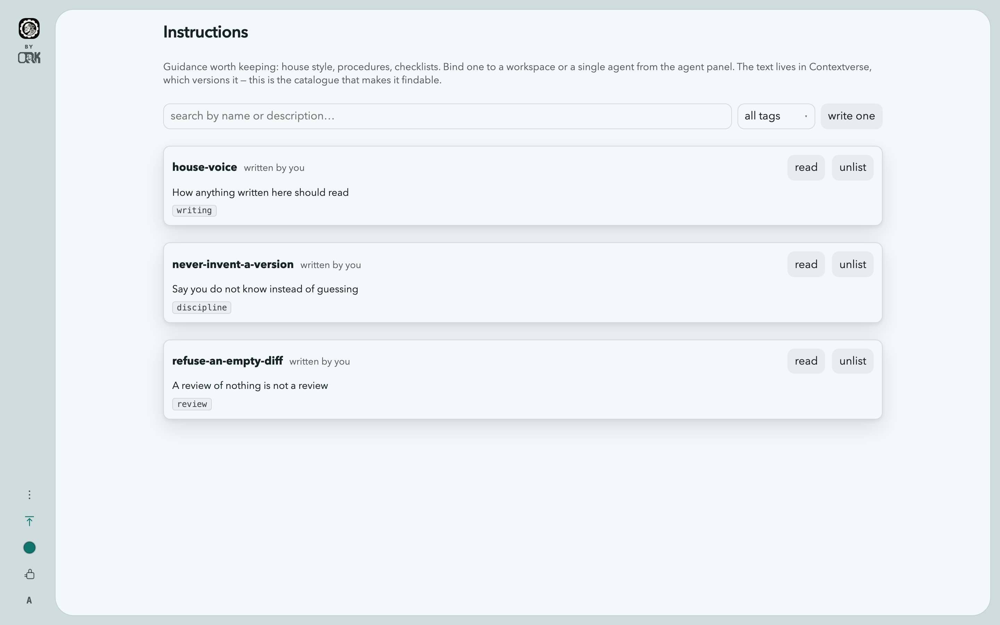

### Finding a memory

The space can be searched by what is INSIDE its files, not only by their names.
Before this the only way in was a path — list the space, open a file — so
nobody could ask which of two hundred documents mentions the retry policy.
Neither could an agent, since reading a memory takes a path and an agent that
was never handed the right one cannot reach a fact sitting in a space it is
entitled to read.

The Context screen has a search box whose hits open the file at the line. The
orchestrator has `context_search`, offered under exactly the two conditions it
is accepted under — the orchestrator's, and not on an unattended run. That
second condition is not tidiness: it returns the TEXT of files from the whole
space, line by line, and on a run started through a receiver that answer goes
back to whoever holds the key. Not a door into one workspace; a grep of the
company's memory.

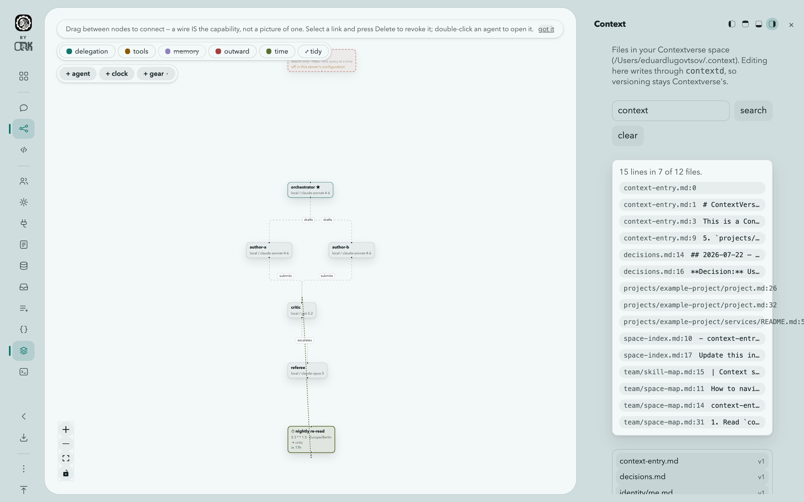

### A save that would overwrite somebody is refused

Two people open the same document, the first saves, the second saves, and the
first person's work is gone with nothing anywhere saying so. The editor carries
the version it opened and hands it back; a save whose version has moved is
refused, naming both versions, so you can reopen and reapply.

It is a real compare-and-swap: `contextd file put --if-version v4` is refused
by contextd itself, inside one call against its own storage, so there is no
window between the check and the write for a third party to slip into. This was
a read-to-write guard with exactly that window until the flag was added
upstream in Contextverse v1.0.0 — the hole was documented here for one release
rather than left to be discovered, and then closed rather than documented
forever.

### Forgetting

**Forget removes the document from the space.** No agent is told it again,
because it is not there to be read — which is the difference between forgetting
and hiding.

It is a **soft** delete, and the interface says so rather than promising an
erasure that did not happen: Contextverse keeps every version and
`contextd file undelete <path>` brings it back. Removing a version for good is
its own deliberate act, `contextd file destroy <path> -v N`.

A forget is refused if somebody has rewritten the document since you opened it,
for the same reason a save is: removing a document somebody just changed is
exactly as destructive as overwriting it.

**This used to be clearing, and the reason is worth keeping.** `contextd` had no
delete command at all — its storage layer had the operation and nothing reached
it, so `file undelete` could restore a soft-deleted file and nothing could
soft-delete one. Emptying a document was what was honestly available: an empty
document is skipped when a prompt is assembled, so the agent did stop being told
it, and the file stayed in the space. Rather than document that hole
indefinitely, the command was added upstream. **This needs Contextverse
v1.0.0 or newer**; against an older `contextd` the delete is refused with the
version's own error rather than silently going back to clearing.

---

## The interface

### A frame, and a hole in it

**Every control lives on the frame. The hole holds only the work.**

That one rule is the whole layout, and breaking it is what made every earlier
attempt read as a web page with rounded corners. Not stage tabs, not drawer
buttons, not the workspace name, not counts, not a status pill, not the
account. If it is a control, or a label about the work rather than part of it,
it belongs on the frame. What may be inside the hole is the transcript, the
canvas, the file, the terminal, the map — and nothing else.

Three pieces:

- the **bezel**, ground showing around everything;
- the **cavity**, the hole in it, with a 26px corner;
- the **rail**, standing on the bezel's left as four floating capsules with
  gaps between them, so the eye reads them as separate answers to separate
  questions.

What this replaced was a header row across the top of the work carrying the
brand, seven destinations, the theme, a documentation link and the account. It
read as a web page because it was one: chrome above, content below. The
instrument surrounds the window now instead of sitting on top of it.

The four capsules, in order down the rail:

| Capsule | What it answers |
|---|---|
| **Where am I** | the brand, and — inside a workspace — the way back out |
| **What is the cavity showing** | the stages: Chat, Blueprint, Editor |
| **What can crawl out over it** | the drawers: Agents, Gears, Instructions, Memory, Receivers, Queue, Variables, Terminal |
| **The rest** | More, Appearance, and the account |

Nothing is written on the rail. Each button is an icon that raises its name on
hover, and the on-state is a tint plus a bar in the bezel's margin, so the
column stays a column of controls rather than a list of words.


**More** holds what you configure rather than what you navigate: Models,
People, Context, this documentation, and sign out. The split is by frequency,
not by kind — what you move between all day is a button on the rail, what you
configure occasionally is one click further away, and nothing that was
reachable before is unreachable now.

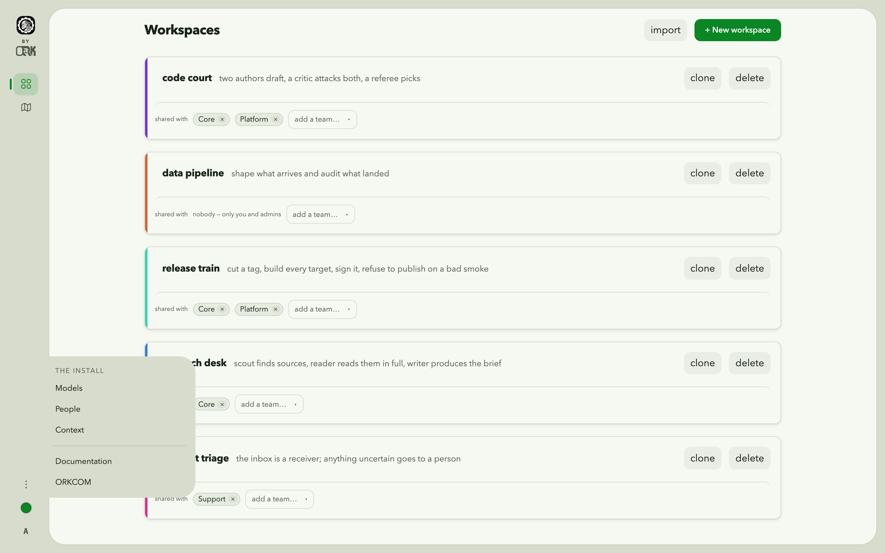

There are **no global keybindings** at all. `Escape` is deliberately left to
whichever dialog is open, because the egress approval owns it, scoped to
itself: one keypress must never both dismiss some chrome and silently refuse a
pending web search. The only keys bound anywhere are the editor's own, inside
the editor.

### Stages, and drawers

**A STAGE is a place you go.** Three of them — **Chat**, **Blueprint**,
**Editor** — sitting on a track that slides vertically, one on screen at a
time. Vertically because the control that moves it is a vertical rail: going
down the capsule sends the work down and brings the next stage up from below. A
horizontal slide driven by a vertical column reads as two unrelated motions.

Every stage stays mounted at full size for its whole life, including the ones
off screen. That is a correctness requirement rather than an animation trick: a
hidden terminal measures zero and loses its scrollback structure permanently, a
hidden canvas fits to `NaN`. So changing stage never destroys a shell session
or a graph you had positioned — the track moves, and nothing is added, removed
or reparented.

**A DRAWER is a thing you consult** — and it is the frame growing inward, not a
card flying in over the work. That distinction is most of why this reads as one
object: a drawer is made of the same material as the bezel, touches the window
edge exactly as the bezel does, and is rounded only on the side facing the
cavity. The cavity shrinks to make room rather than being covered, so nothing
you were working on ends up half underneath something.

Eight of them: **Agents**, **Gears**, **Instructions**, **Memory**,
**Receivers**, **Queue**, **Variables**, **Terminal**. One at a time. Each can
be docked to any of the four edges from the buttons in its own head — the
control beside the thing it moves, rather than in a settings screen — and
resized from the grip on the edge facing the work, which is the only edge that
can grow. Both are remembered per drawer, so the terminal can live along the
bottom while the roster lives on the right.

A drawer that is shut does not load and does not poll. Receivers cost two
queries and the queue runs a timer; a workspace using neither pays for neither.

The drawer's head names it, and the panel inside does not: the same word twice
within forty pixels is not emphasis, and a screen reader read it twice.

### The Editor stage

The one stage with parts, because editing genuinely is two things at once: the
**Files** tree and the **file**. The shell used to be its third part and is a
drawer now — something pulled out over whatever you are doing and pushed back —
because keeping both would be two terminals with one session between them.

The tree is flush to the cavity's edge, which means its left corners ARE the
cavity's, and it is rounded on the one side that faces the file. It is always
its width; the seam between them resizes it, and leaving the stage is how you
close it.

**Clicking a file moves the track to the Editor stage.** The chat does not stay
beside it — it slides off screen and stays alive, mounted and streaming, so a
turn you started is still running and still there when you slide back.

**The shell never starts by itself.** It is behind a button that says why: a
fresh shell is started per connection with no resume, so a stage that opened
one on mount would spawn a container on every page load and then show a shell
with none of the scrollback, working directory or running process the operator
expects. Four reloads, four containers — measured, not theorised. This is the
per-workspace shell, scoped to that workspace's directory and open to anyone
who can reach it; the server-wide Terminal under More is a different thing and
is an administrator's alone.

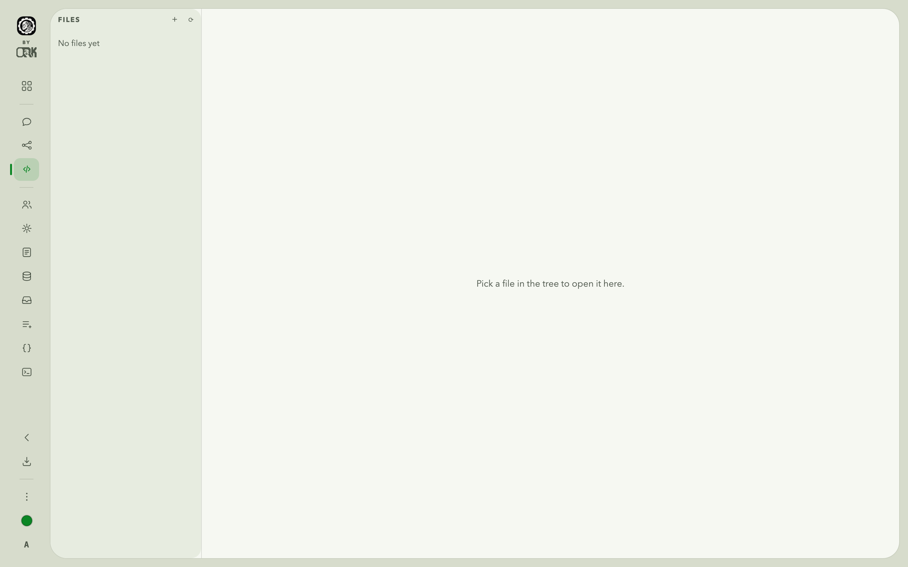

**Diffs.** With unsaved edits open, **changes** shows them against what is on
disk — two line-number columns, a sign column, and long runs of unchanged lines
collapsed with the break drawn rather than silently joined. A gear past its
first version offers the same view against the previous one, which is the
question that matters there: an approval covers exact content, so what you want
before approving v3 is what changed since the v2 you already read.

The editor highlights Go, TypeScript and JavaScript, Python, shell, SQL, JSON,
YAML, TOML, CSS, HTML and Markdown. It is a lexer rather than a parser: it will
not tell a generic from a comparison, and it does not try. `⌘S` saves, `Tab`
indents rather than leaving the field, and long lines wrap on request. Like
everything else here it is written in the product rather than installed — there
is no highlighter library and no editor component behind it.

### Giving an agent a tool by dropping one on it

On the blueprint, drag a gear or an instruction out of its drawer and let go.
**Where it lands is the sentence.** On an agent: that agent gets it. On empty
canvas: every agent in the workspace does, which is a real target rather than
the absence of one — and the same thing the `+ gear` control does, which is
still there because a drag is not reachable from a keyboard.

Three states are visible while you carry something: the canvas takes an accent
ring, the agent under the pointer takes a ring and a wash, and a pill at the
top says what dropping would do. Then a note says what happened, because a node
quietly appearing in a graph of twenty is not feedback.

**An unapproved gear still binds, and says so.** Binding is not what decides
whether code may run — an agent is only ever handed approved gears — so
refusing the drop would be enforcing a rule this action does not own. The link
is drawn, the note states plainly that nobody has approved it and no agent can
call it, and offers the way to finish: a button that opens that gear's source.
It opens the review; it approves nothing.

An instruction switches the memory layer on for itself, because landing
something on a layer that is switched off is a drop with no visible result.

### Appearance

Two choices, and nothing else: **light or dark**, and **a colour**.

What this replaced was eleven finished "looks" — each with its own ground,
accent, corner radii and shadow recipe, drawn in both modes. Twenty-two visual
worlds to keep working, and every screen had to be checked against all of them.
They went for two reasons. They were legacy: this interface has ONE geometry
now — a bezel, a rail, a cavity, a drawer — and eleven palettes hung on one
geometry are not eleven designs, they are one design in eleven paint jobs. And
they answered the wrong question. Nobody wants to choose between Nord and
Bloom; they want it dark at night, in a colour they like.

The colour is not decoration. **Every neutral in the palette is mixed towards
it** — the ground, the surfaces, the borders, the hover washes — which is what
stops a chosen accent looking pasted onto somebody else's design.

Eight colours are offered as a starting point and any hex can be typed. The
eight are not arbitrary: each has to survive two constraints at once, dark
enough to carry white text as a filled button on the light ground and light
enough to read as text on the dark one. Two of them were moved for this
release, because measured against white they came in at 4.23:1 where ordinary
text needs 4.5.

The mode is **system**, **light** or **dark**. `system` follows the operating
system and changes with it.


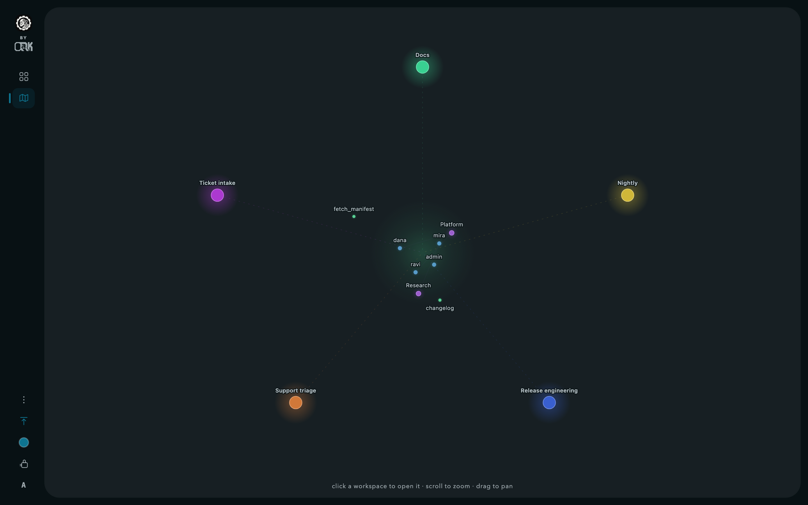

Every screen in both modes, under all eight colours — 96 screen loads — is
measured rather than looked at: at the time of writing, no text on any of them
falls below its WCAG minimum.

The choice is stored on the device, under `cogitorium.theme` in `localStorage`,
and **nothing is fetched**: the mode is `data-theme` on the root element and
the colour is one custom property, with everything else derived from it in the
stylesheet with `color-mix`. A stored theme carrying fields nothing reads any
more is fine, and a missing one lands on the default rather than on an unpainted
page. If the browser refuses to store the choice, the dialog says so instead of
losing it quietly. Nothing about your appearance settings leaves the machine.

---

## Teams and access

Three roles: `admin`, `team-lead`, `member`.

A workspace belongs to whoever created it and can be shared with **any number of
teams**. Sharing is additive — withdrawing one team leaves the others untouched.
A user sees a workspace if they are an admin, if they own it, or if they belong
to any team it is shared with.

**Clone** copies a workspace's agents, wiring and gear grants to you, leaving
the original's conversation behind. That is how two people run the same setup
without sharing one.

The **People** page is where users and teams are administered, and it draws the
access map beside them: users, teams, workspaces, and the owns / shared /
member relationships between them.

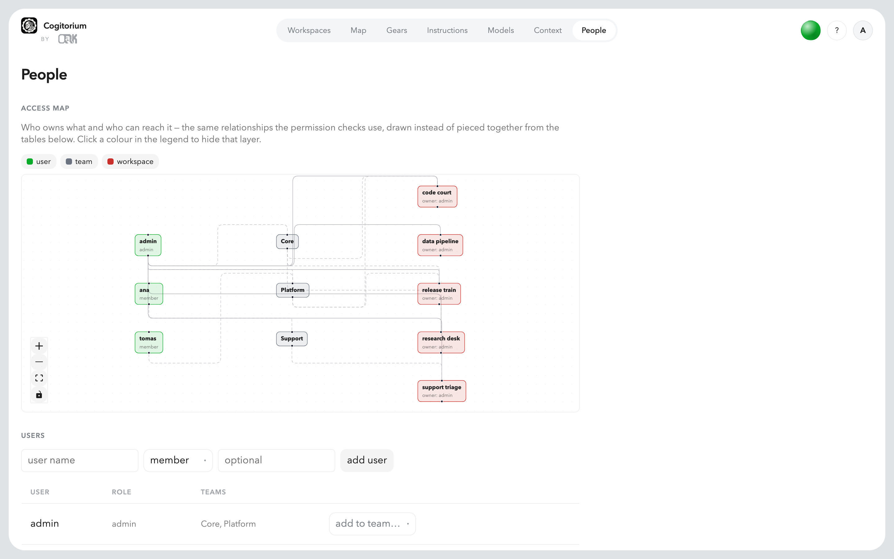

---

## The install map

`/map`, beside Workspaces at the top of the rail — where it belongs, because
seeing everything at once is the other half of the question that screen asks —
and open to every role.

One zoomable scene at three depths, because zooming should approach rather than
navigate:

1. **the organisation** at the centre — this install, its people, its teams and
   what it holds;
2. **the workspaces** on a ring around it, each in the angular sector of
   whatever it is related to, so a workspace granted to a team sits in that
   team's wedge and its grant line is a short radial stub instead of a chord
   across the canvas;
3. **inside one** — click a workspace and its agents and their memory grow out
   along its own bearing.

Position encodes relation, deliberately. Mush is not caused by having many
edges; it is caused by edges having to travel, which is a placement problem.
And the links inside the core are drawn only as you zoom in: at map scale they
are forty small things and the lines between them, which is a smudge, so they
fade in at the depth where they can be read. The layout is deterministic — the
same install draws the same map on every load, because an operator's memory of
where a thing sits is the only reason a spatial view beats a list.

Only kinds the server actually sends are drawn. `GET /api/v1/map` returns
users, teams and workspaces; a workspace's own graph returns agents, gears,
shared and private memory, documents and instructions. There are no skills,
gates or receivers on it: a lane that is permanently empty is not a neutral
omission, it is a positive claim that the install has no doors in.

**`GET /api/v1/map` is no longer admin-only, and the scope is enforced on the
server.** An administrator sees the install. Anybody else sees only what they
can already reach: their own teams, the people they share a team with, and the
workspaces visible to them. Filtering it in the browser would not be a smaller
version of the same thing — the payload would still name every workspace on
the server, and a member reading one HTTP response would learn the shape of
rooms they have no grant on. The test that matters greps the raw JSON for a
name, not the rendered graph.

After that filtering an edge may point at something no longer there — a
workspace owned by somebody the caller cannot see. Those edges are dropped
rather than left dangling, and such a workspace reads as `unowned`: an edge to
a missing node is worse than no edge, because it names the thing it points at.

Gears are fetched separately and are allowed to fail: a member cannot list
them, and a core with one shell fewer is honest where a map that refuses to
load because an optional shell answered 403 is not. People are **not** fetched
separately — they are already in the map payload, filtered server-side, and a
second endpoint would be a second answer to the same question, the one that is
not permission-scoped.

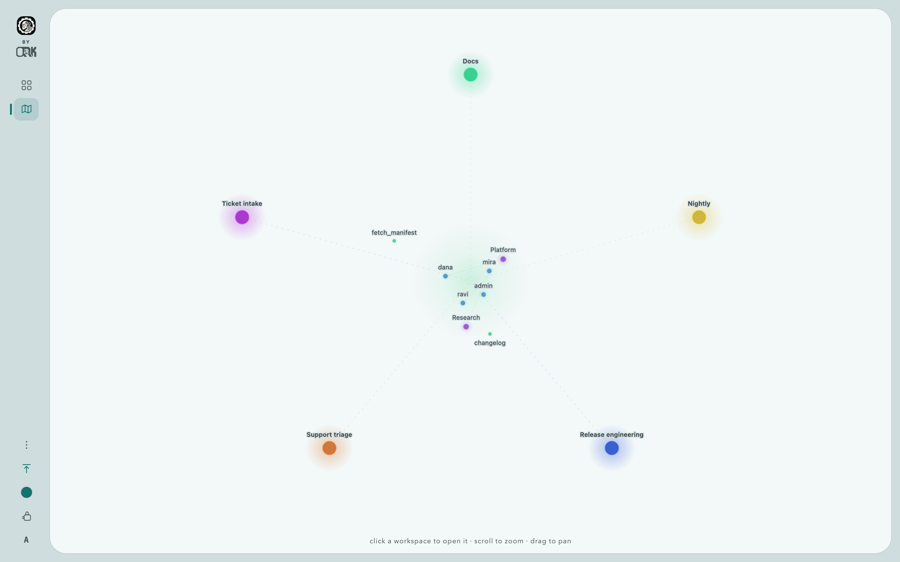

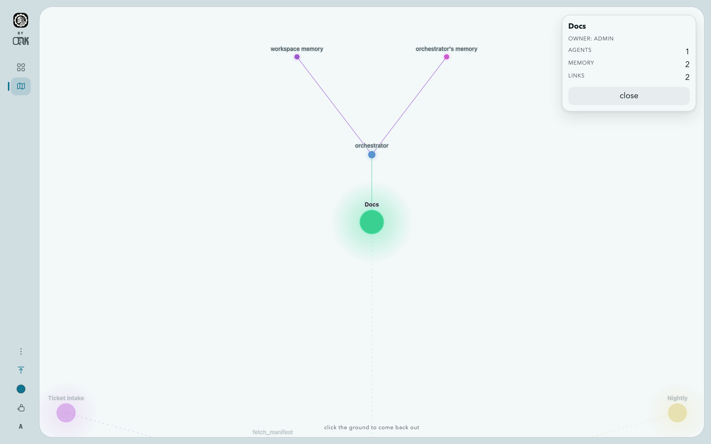

---

## Workspace colour

A workspace carries a **hue**, in degrees.

```
PATCH /api/v1/workspaces/{id}    {"hue": 210}   set it
PATCH /api/v1/workspaces/{id}    {"hue": null}  clear it
```

In the interface it is chosen from the coloured edge of the workspace's own
card, which is the thing the colour colours. **Anyone who can reach the
workspace may set it**, not only its owner: a colour is how a team refers to a
room out loud, and making it the owner's privilege would mean the person who
works in it every day cannot fix a shade they cannot tell from the one next to
it. Nothing here grants access, so there is nothing to escalate.

**An unset hue is derived from the id and never written back.** A workspace
nobody has coloured still gets a colour — walked by id through a ring of ten
hues, so it is stable and two neighbouring workspaces are never the same
shade — but
that colour is not persisted. The moment an unset hue is stored, "nobody chose
this" and "somebody chose exactly this" become the same state, and an install
can never again be told apart from one that was hand-tuned. Clearing a colour
returns it to derived, and the picker's clear button is disabled when there is
nothing to clear.

Saturation and lightness are not stored either. They are resolved in the
interface so they move with the look and the mode: a stored `#rrggbb` picked
under one look is unreadable under another, and there is no migration that can
repair a colour somebody chose under different rules.

The absent-versus-null distinction is carried in the route on purpose. An
absent `hue` means *do not touch the colour* and an explicit `null` means *take
it away*, and those must not collapse — otherwise every future field on this
route would erase somebody's colour as a side effect of editing something else.
Sending neither is refused with `send a hue to set one, or null to clear it`.

A colour is **not carried in an export bundle**. A bundle is a template handed
to somebody else, and which colour a room wears in their install is theirs.

---

## Letting agents reach the web

**Off by default.** Agents cannot reach the network at all until `egress: true`
is set in the configuration and the server restarted. There is no route and no
database row behind that switch, so nothing running inside Cogitorium has a code
path to enable it.

The switch alone grants nothing. Two more things must be true:

1. An agent needs a grant, drawn by a human on the blueprint by wiring it to the
   internet node. The grant is bound to a **fingerprint** of that agent — its
   role, its model and its bound documents. Change any of them and the grant
   lapses until a human reviews it again.
2. Every individual search stops the turn and asks you to approve **that exact
   query**. There is no "allow for this turn" and no "remember this agent".

Agents never choose a destination. They supply words; the destinations are
compiled into the binary. Searches go first to
[echopage](https://echo-page.com) and fall through to a general engine when it
has nothing.

Limits, all enforced in code: **3 searches per turn** across the whole
delegation tree, **256 characters** per query, **40 per agent per 24 hours**.
Once a search result enters a turn, tools that write durable state — the
instruction library, gear forging, context bindings, agent and wire changes —
are refused for the rest of that turn.

Every attempt is recorded before it is sent: the query verbatim, who approved
it, how they authenticated, and which service answered.

**Stated plainly:** this bounds and records outbound traffic. It does not
prevent exfiltration, because a query string is itself a channel and no
allowlist closes that. What it gives you is a hard cap, a full record, and a
human in the loop — a leak someone approved rather than a silent one.

---

## The terminal

Off by default. Set `terminal: true` and restart. It requires a sandbox: without
Docker the request is refused rather than served with the server's own file
access.

There are two of them, and only one is an administrator's.

- **A workspace's own shell** lives in the Editor view, is scoped to that
  workspace's directory, and is open to **anyone who can reach the workspace**.
  It starts only when you press the button, because a session is never
  restored.
- **The server-wide Terminal**, a drawer on the rail, is **admin-only**. It is
  not scoped to anything, which is the whole of the reason.

No agent can open either.

---

## Plugins

A plugin adds functionality *and* changes the interface. It can put a screen in
the rail, hang a panel inside a workspace, take over a template the core never
designated as extensible, and run code of its own. Restart-to-activate is the
model, and the plugins screen can perform the restart.

### Installing one

Three ways in, and all three land in the same place: **switched off and
unapproved.**

- **From the library** — the Plugins screen has a Library tab listing the
  shared catalog, searchable and sortable.
- **From a file** — drop a `.zip` on the Plugins screen, or
  `cogitorium plugins install <bundle.zip>`.
- **From a directory you are editing** — `cogitorium plugins dev .`, with no
  build step.

Nothing runs until somebody approves it, and **approval is bound to the
content, not the name**: the digest is read from what the machine holds, so a
decision can only ever be about bytes somebody could have looked at. Rebuild
the plugin and it drops back to pending on its own.

The approval card shows what it overrides, which hosts it wants, which secrets
it names, what API subjects it asks for — and a **preview** of each override,
rendered against an example through the composed stack. "It overrides
`cog.row.nav`" is not a thing anybody can evaluate; a picture of the row is.

### What an author writes

A directory with a `plugin.yaml`. Everything else is optional.

```yaml
schema: 1
id: myplugin
name: My Plugin
version: 0.1.0
needs: python          # or js, rust, go, node, an OCI image, native — or nothing
host:
  contract: 1
pages:
  - path: /p/myplugin/
    template: myplugin.page.home
    provider: home
```

**You declare a technology. The host decides the lane.** Which of the five
tiers it picked is never your problem — that is the whole point of declaring
what you wrote it in instead of shipping a runtime.

| Tier | You ship | Runs |
|---|---|---|
| **bundle** | templates, CSS, JS | everywhere, nothing fetched |
| **wasm** | one `.wasm` | everywhere, nothing fetched |
| **provisioned** | source | everywhere the data directory is executable; the interpreter is fetched once and shared |
| **image** | an OCI reference | where this install has a sandbox that starts containers |
| **native** | a binary per `{os, arch}` | where one matches. No isolation: it is your machine code as this server's user |

`cogitorium plugins names` lists every template you can override, what model it
renders against, and what the host's own body is today — offline, from the
binary you are actually running. `docs/registry.json` is the same thing as a
file, and `docs/plugin.schema.json` is the manifest schema, so an editor
completes the fields and underlines a typo.

### What a plugin may ask the host for

Nine calls, identical on every tier, so a plugin rewritten in another language
calls the same nine.

`log` · `now` · `rand` · `config` · `render` · `http` · `api` · `enqueue` ·
`kv`

Two of them are grants rather than capabilities. **`http` reaches only hosts
listed under `hosts:`**, through the same gate gears use — which writes a row
before the socket opens and refuses loopback and link-local regardless. **`api`
calls only subjects listed under `api:`**, in-process, as `plugin:<id>` and
never as whoever installed it, so a grant is not decorative.

`enqueue` puts work on the durable queue, so a background task survives a
restart instead of being a goroutine nothing recorded.

There is a [Python SDK](https://github.com/orkcom-tech/cogitorium/tree/main/sdk/python)
— one file, standard library only, copied in beside your code.

### The catalog

[`orkcom-tech/cogitorium-plugins`](https://github.com/orkcom-tech/cogitorium-plugins)
is an index and nothing else: five fields saying where a plugin lives. The
bundle stays in the author's own repository, in their releases, so listing
costs one small file no matter how many plugins there are.

**Adding your own entry merges on green CI.** You are not waiting for anybody.
Editing or removing an entry that is already listed does not, and that is the
one rule worth explaining: an edit can point an id people have already
installed at a *different repository*, and nothing in a public JSON file can
establish who owns an id.

Verification shows as three states rather than a badge — the team read the
version you have, they read a different one, or nobody has looked. The last is
the ordinary state and not an accusation. **Verified means somebody read that
version.** It is not a guarantee, not an audit, and not a substitute for the
approval step on your own install, which is where somebody who can actually see
your data decides.

Update discovery costs nothing in privacy: the catalog's own CI publishes an
index with versions filled in, and a client fetches the **whole file** and
compares locally. No query string, no install id, no list of what you have.

## Configuration reference

Configuration comes from, in order of precedence: command-line flags, then
`COGITORIUM_*` environment variables, then `config.yaml` in the data directory,
then defaults.

| Key (`config.yaml`) | Environment | Default | What it does |
|---|---|---|---|
| `listen` | `COGITORIUM_LISTEN` | `127.0.0.1:8688` | HTTP listen address. A loopback address marks this a local install: first-run setup does not ask for the admin token, and browsers are told to remember the session. |
| `data_dir` | `COGITORIUM_DATA_DIR` | `~/.cogitorium` | SQLite database and server-owned files. |
| `log_level` | `COGITORIUM_LOG_LEVEL` | `info` | `debug`, `info`, `warn`, `error`. |
| `contextd_path` | `COGITORIUM_CONTEXTD` | `contextd` | How to find the Contextverse CLI. |
| `browser_image` | `COGITORIUM_BROWSER_IMAGE` | `mcr.microsoft.com/playwright:v1.56.0-noble` | What the `browser` environment resolves to. Pinned rather than a moving tag: an image that changed under an approved gear would change what it runs inside without the approval changing. |
| `mcp_clients` | `COGITORIUM_MCP_CLIENTS` | `false` | Lets an operator install external MCP servers and grant their tools to an agent. It runs a command this install never saw the source of, on the host — read the section above before switching it on. |
| `sandbox_pool` | `COGITORIUM_SANDBOX_POOL` | `0` | Warm containers to keep per image instead of creating one per run. Zero is off. The one setting here that trades isolation for latency — see below. |
| `sandbox` | `COGITORIUM_SANDBOX` | `auto` | `auto`, `docker`, `kubernetes` or `subprocess`. `auto` uses Docker when it answers and says so when it cannot; it never selects `kubernetes`, which is a deliberate deployment. |
| `kube_claim` | `COGITORIUM_KUBE_CLAIM` | — | The claim the data directory is on. A gear Job mounts it at the run's own subPath. Required by `sandbox: kubernetes`; the chart sets it. |
| `kube_node` | `COGITORIUM_KUBE_NODE` | — | The node to pin gear Jobs to. The chart takes it from the downward API — a ReadWriteOnce volume attaches to one node. |
| `kube_namespace` | `COGITORIUM_KUBE_NAMESPACE` | the pod's own | Where gear Jobs are created. |
| `kube_cpu`, `kube_memory` | `COGITORIUM_KUBE_CPU`, `COGITORIUM_KUBE_MEMORY` | — | Limits on one gear Job. Empty means the cluster's own defaults. |
| `sandbox_image` | `COGITORIUM_SANDBOX_IMAGE` | `python:3.12-alpine` | The image gears run in. Fetched once at startup so the first gear does not pay for the pull inside its own timeout. |
| `sandbox_runtime` | `COGITORIUM_SANDBOX_RUNTIME` | — | The OCI runtime the daemon uses for gear containers: `runsc` for gVisor, `kata-runtime` for Kata. Empty means the daemon's own default. Checked against `docker info` at startup and **refused** if the daemon does not have it. |
| `terminal` | `COGITORIUM_TERMINAL` | off | Enables the in-UI shell. Requires a sandbox. |
| `metrics_listen` | `COGITORIUM_METRICS_LISTEN` | — | Where the Prometheus endpoint listens, e.g. `127.0.0.1:9090`. **Empty is off**, and off is the default. Its own port and never a route on the API: the API is authenticated and a scrape is not. |
| `log_format` | `COGITORIUM_LOG_FORMAT` | `text` | `text` for a person at a terminal, `json` for a collector — one object per line with stable field names. Cogitorium ships logs nowhere; this is the format it owes whatever does. |
| `update_check` | `COGITORIUM_UPDATE_CHECK` | `ask` | Whether this install may ask GitHub if a newer Cogitorium or Contextverse exists: `ask`, `on` or `off`. Under `ask` nothing leaves the machine until an operator answers the question the interface puts on the rail; the answer is remembered across restarts. `off` never asks and never checks — including for *check now* — and the interface cannot lift it. |
| `egress` | `COGITORIUM_EGRESS` | off | Master switch for agents reaching the web. |
| `egress_key` | `COGITORIUM_EGRESS_KEY` | — | Credential for the search service. Required when egress is on. |
| `variables_dir` | `COGITORIUM_VARIABLES_DIR` | — | A directory of files read as named variables, one file per name. The Kubernetes ConfigMap mount. |
| `secrets_dir` | `COGITORIUM_SECRETS_DIR` | — | The same, read as secrets: redacted everywhere they could surface. The Kubernetes Secret mount. |
| `gear_proxy_listen` | `COGITORIUM_GEAR_PROXY_LISTEN` | worked out from Docker | Where the gate for granted gears listens. Left empty, the server asks Docker which address a container reaches this machine on and binds there — the loopback works on Docker Desktop and is unreachable from a container on Linux. Naming an address here uses it exactly, and failing to bind it stops startup. |
| `queue_workers` | `COGITORIUM_QUEUE_WORKERS` | 4 | How many queued deliveries may run at once across workspaces. Not the ceiling that matters — one run per workspace already is. |
| `queue_max_per_workspace` | `COGITORIUM_QUEUE_MAX_PER_WORKSPACE` | 50 | How many deliveries may WAIT for one workspace. Past it a delivery is refused with 429 and told how many are ahead. |
| `callback_hosts` | — | none | Hostnames a task may notify when a run finishes. **Empty means callbacks are off**, not that every host is allowed. |
| `public_url` | — | — | How this install is reached from outside. Used only to put fetchable file links into a callback. |
| `budget_run_tokens` | — | 0 (off) | The most one run may spend before it is stopped. Bounds what a caller through an inlet can cost; there is no workspace-wide version on purpose. |
| — | `COGITORIUM_SECRET_KEY` | — | Encrypts secrets held in this install's database. Has no config-file key on purpose: on Kubernetes the config file is a ConfigMap, and a key beside its own ciphertext protects nothing. |
| — | `COGITORIUM_ADMIN_TOKEN` | — | Seeds the first admin's token instead of generating one and printing it. At least 24 characters, checked at startup rather than at first use. Environment-only for the same reason as the key above. |
| — | `COGITORIUM_ADMIN_PASSWORD` | — | Seeds the admin's password, so a deployment nobody is standing in front of comes up able to be signed in to. At least 8 characters. Applied only while the admin has none, so it can never overwrite a password that was chosen. Environment-only, same reason. |

**`COGITORIUM_ADMIN_TOKEN` exists for a cluster.** Without it the server
generates a token and prints it once, which is correct on a laptop and wrong in
a pod, where "printed once" means "in the log, for anyone who can read logs".
With it, nothing sensitive is ever written to the log. It has no `config.yaml`
key on purpose: the config file is a ConfigMap, a ConfigMap is not a secret,
and leaving the key out of the file means it cannot be put there by mistake. A
short one is refused at startup rather than accepted quietly — a seeded admin
token is the whole front door, and `admin` as a token would be worse than the
generated one it replaced.

**`COGITORIUM_ADMIN_PASSWORD` exists for the same reason, one door along.** The
token opens the API; the password is what a person types into the sign-in card.
Without one the admin has no password and the interface asks the first visitor
to choose it — which is right on a laptop, where that visitor is the owner, and
useless in a cluster, where the first-run screen demands the admin token anyway
so that a stranger cannot claim the install. Supplying a password means an
unattended deploy comes up ready to be signed in to.

It reaches the admin ONLY while the admin has none. That single rule covers both
directions: an install upgraded from a version that had no passwords is given
one on its next start rather than sitting unreachable, and an operator who has
since changed theirs keeps it through every restart, rollout and eviction. The
cost is that a forgotten password cannot be recovered by redeploying with a new
one — the same trade this product already makes for tokens, where only the hash
is kept. A supplied password that is ignored says so in the log rather than
looking applied.

Supplying it also stops the first start from generating an admin token and
printing it. That line exists because an install with no password would
otherwise have no way in at all; one with a password does, and a generated token
in a pod log is a permanent admin credential readable by anyone who can read
logs there. Mint tokens from the password with `cogitorium login` instead.

Two bounds, both refused at startup rather than at first use: at least 8
characters, and at most 72 bytes — the second is bcrypt's limit rather than a
policy, and it refuses instead of truncating, so a longer one would fail on
every start. A trailing newline is stripped, because
`kubectl create secret --from-file` puts one there and a password with an
invisible newline in it fails exactly like a typo.

The Helm chart generates one when you do not supply it; see
`deploy/helm/cogitorium/README.md`.

`--config` points at a config file; `--listen`, `--data` and `--log-level` are
the only flags. Booleans take `1` or `true`, case-insensitively, and nothing
else enables — so `COGITORIUM_EGRESS=0` is a working off-switch over a file
that says otherwise.

The server refuses to start if egress is enabled without a sandbox, without a
credential, or with any `*_PROXY` variable set — a proxy would make every
address check inspect the proxy instead of the real destination while reporting
itself enforced.

---

## Security model

What is actually true, without softening:

- **Gears run in a container** with no network, no capabilities, an unprivileged
  user and their own files only — and only after an admin approves them. Without
  Docker they run with the server's file access, and the interface says so.
- **A gear's credentials and its network are granted together, at approval,
  beside the source.** Neither is reachable by an agent, and a new version keeps
  neither. The values never enter a prompt, and they are redacted at one
  boundary in everything the software shows or stores.
- **A granted gear is not given its secrets at all** — it gets a stand-in, and
  the gate substitutes the real value at the edge. So the untrusted process
  never holds the credential, and what it could exfiltrate stops working when
  the run ends. To substitute inside HTTPS the gate terminates TLS for those
  runs with its own certificate, which means it reads their request bodies:
  that is the trade, and it is the operator's own proxy making it. What a
  granted gear chooses to *send* through the gate is still not redacted and
  cannot be — that is what granting a key and a network means together, and the
  approval screen is the whole of the control.
- **The terminal** is off by default, requires a sandbox, and is never reachable
  by an agent. A workspace's own shell is open to anyone who can reach that
  workspace and confined to its directory; the server-wide one, confined to
  nothing, is an administrator's alone.
- **Egress** is off by default and needs two human decisions plus a per-query
  approval. It bounds and records; it does not prevent exfiltration.
- **Provider credentials** can only be changed by an admin, and repointing a
  provider's URL requires supplying the key again — otherwise the server would
  deliver its own credential to an address its owner never named.
- **The global context browser** is admin-only, because it reaches every
  workspace's memory and every agent's private branch. Per-branch access for
  non-admins does not exist yet; until it does, an unrestricted reader would be
  a hole.
- **Sessions are remembered on a local install.** The browser holds an
  `HttpOnly`, `SameSite=Lax` cookie, which script on the page cannot read and
  another site cannot spend; on a local install it is given an expiry so the app
  does not ask again, and anything able to read that browser profile from disk
  can therefore act as you. Reaching a server over the network is not
  remembered: the cookie has no expiry and dies with the browser. API clients
  use `Authorization: Bearer` instead, which no web page can attach on your
  behalf.
  (Loopback trust — where an uncredentialed local request was simply served as
  the admin, so that any process on the machine could act as you — was removed.)
- **No telemetry.** There is no analytics and no crash reporting in this
  codebase. The binary talks to the providers you configured, the hosts you
  named, and — only once an operator has answered `yes` to the question the
  interface asks — GitHub's public releases API, once a day, carrying nothing
  about this install. `update_check: off` refuses even that, and cannot be
  lifted from a browser.

---

## Known issues

Open defects, stated rather than discovered. Each one is real, reproduced, and
has a fix that deserves its own thinking rather than a quick loosening.

**A shell does not survive a reload.** A fresh shell is started per connection
with no resume, so reopening the Editor view brings back the button, not the
session — the previous shell is gone along with its scrollback and working
directory. This is deliberate rather than broken, and it is why the shell is
behind a button that says so: starting one automatically would spawn a
container on every page load and then show an empty session as though it were
the one you left.

**The shell works on a copy, and nothing is carried back.** A workspace's files
are streamed into the container when the session opens; the shell can read and
write them, and everything it wrote is discarded when the session ends. Use the
file tree and the editor for changes meant to last. Syncing the two directions
is a design question — a session that overwrote a file you had edited in the UI
meanwhile would be a worse bug than this one — so it is deliberately not done
until it is designed.

---

## Licence

[Apache License 2.0](https://github.com/orkcom-tech/cogitorium/blob/main/LICENSE).
Use it as a tool, build a product on it, or run it inside a service you sell —
all permitted, without asking. The hosted-use restriction that stood here under
the Business Source Licence is gone; the conversion to Apache 2.0 that was set
for 2030 was simply brought forward.

The obligations are attribution ones: keep the copyright and licence notices,
carry the `NOTICE` file with anything you redistribute, state in a modified copy
that you changed it, and leave the names alone — "Cogitorium" and "ORKCOM" are
marks and are not part of the grant.
