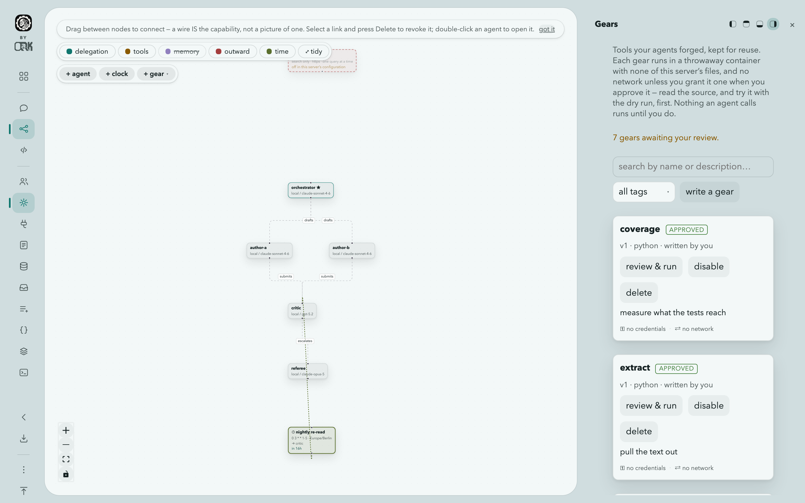
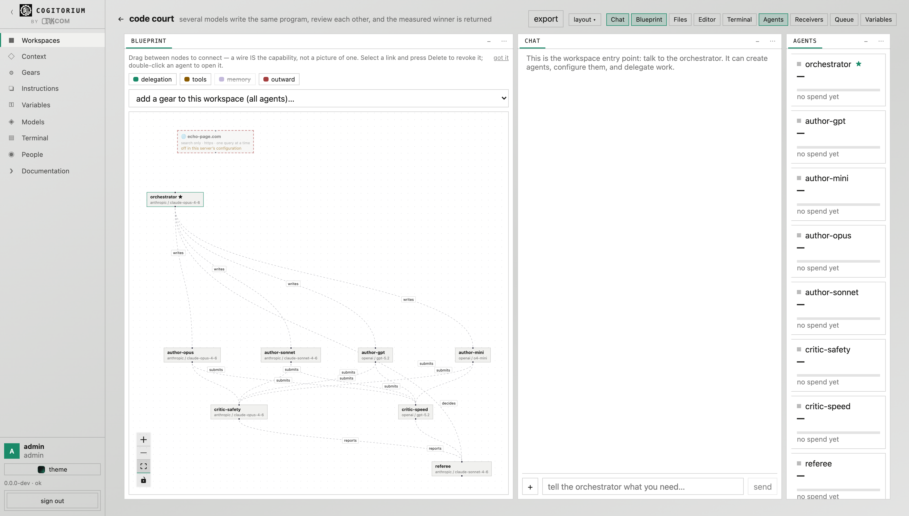

# Cogitorium

**A modular workbench for agentic development.** One binary, your models, your
machine. No telemetry.

**What it is for:** building workflows and pipelines that have models in them
and still behave like workflows — as deterministic as the parts allow, the same
from one run to the next, and flexible enough to be reshaped without being
rebuilt.

Every part of it is a part you can move — the agents, the wires between them,
the context each one carries, the tools they forge, the receivers your own
systems deliver through, the clock that starts work without you. And each is
configurable twice over: by hand on the bench, or by telling the orchestrator.
Both write to the same objects, so nothing has to be redone in the other place.

Everything below describes what the software does today. Where something is
absent or unfinished, it says so.

---

## Install

Every route installs the same binary — one Go program with the interface
embedded. What differs is who fetches it, and whether the channel can bring
Contextverse along.

**Contextverse is a real dependency.** Context and memory are stored and
versioned by its `contextd`. Without it the server starts, says so at
`GET /api/v1/context/status`, and memory does nothing. Homebrew, Scoop and the
container image bring it; the Linux packages recommend it and print the
command; an archive brings nothing and says as much.

| Route | Command | Brings contextd |
|---|---|---|
| Homebrew | `brew install orkcom-tech/tap/cogitorium` | yes |
| Scoop | `scoop bucket add contextverse https://github.com/orkcom-tech/scoop-bucket` then `scoop install cogitorium` | yes |
| Docker | `docker compose up --build` | yes, in the image |
| deb / rpm | from the [releases page](https://github.com/orkcom-tech/cogitorium/releases) | recommends it |
| winget | `winget install OrkcomTech.Cogitorium` | declared, not resolved |
| Desktop app | attached to each release | no — install contextd separately |
| Archive | download and unpack | no |
| Kubernetes | `helm install` from `deploy/helm/cogitorium`, with `--set image.repository` | yes, in the image |
| Source | `make build`, or `make desktop` for the window | no |

**Start here if you have never run it:** the [Guide](guide/) is a walkthrough
from an empty install to agents with tools, with every command and every error
message taken from a real run.

**Desktop application.** Attached to each release for macOS (Apple silicon and
Intel), Windows and Linux — the same server and the same interface in a native
window instead of a browser tab. It is not a second application: it imports the
same code, serves the same bundle and reads the same data directory, so there is
nothing in it that can drift out of step with the web shell.

It listens on a port the kernel picks rather than 8688, so a desktop window and
a `cogitorium serve` can run side by side without either one deciding whether
the other may start. Closing the window ends the session — a server still
running with no window is a process nobody asked to keep.

None of the builds are signed with a platform identity. There is no Apple
Developer account and no Windows code-signing certificate for this project, so
the first launch is refused by Gatekeeper on macOS and warned about by
SmartScreen on Windows. Saying so is better than a signature that is not one:

- **macOS** — the app is ad-hoc signed so it is not reported as damaged, but it
  is not notarised. Open it once with a right-click → **Open**, or run
  `xattr -dr com.apple.quarantine /Applications/Cogitorium.app`.
- **Windows** — SmartScreen shows **More info → Run anyway** on first launch.
  WebView2 supplies the window; it is part of Windows 11 and installed on most
  Windows 10 machines, and Microsoft's Evergreen installer covers the rest.
- **Linux** — unpack the tarball and run `./install.sh` for a per-user install
  under `~/.local`, or `./install.sh --system` for everyone. The window needs
  WebKitGTK (`libwebkit2gtk-4.1-0` on Debian and Ubuntu).

**Kubernetes.** A Helm chart is in `deploy/helm/cogitorium`. No container image
is published yet — the chart's default `image.repository` points at a registry
path nothing pushes to, so build the image and point the chart at wherever you
pushed it:

```sh
docker build -t <your-registry>/cogitorium:0.1.1 .
docker push <your-registry>/cogitorium:0.1.1

helm install cogitorium ./deploy/helm/cogitorium \
  --namespace cogitorium --create-namespace \
  --set image.repository=<your-registry>/cogitorium \
  --set image.tag=0.1.1 \
  --set auth.adminToken="$(openssl rand -hex 24)"
```

Two things about that deployment are consequences rather than preferences, and
the chart enforces both rather than documenting them. **One replica**: SQLite
has a single writer, so two pods on one volume corrupt it — there is no
`replicaCount` value and the strategy is `Recreate`. **Gears are not isolated
there**: there is no Docker inside a pod, so a gear runs as a subprocess with
the server's own file access, and approving one grants it everything the server
has. Because of that the chart refuses, at template time, to enable the in-UI
terminal or the outward gate. Gear execution as Kubernetes Jobs is the fix and
is not built. `deploy/helm/cogitorium/README.md` has the rest.

**From source.** Go 1.25 and Node (the UI is built by Vite 7). Docker is
optional but strongly recommended — without it, gears run with the server's own
file access and the terminal refuses to open at all.

```sh
git clone https://github.com/orkcom-tech/cogitorium
cd cogitorium
make build
./bin/cogitorium serve
```

**Verifying a download.** `checksums.txt` on each release is signed with cosign
keylessly, so what can be checked is not merely that the file is uncorrupted
but that it came from this repository's release workflow:

```sh
cosign verify-blob --signature checksums.txt.sig \
  --certificate checksums.txt.pem \
  --certificate-identity-regexp 'https://github.com/orkcom-tech/cogitorium/.*' \
  --certificate-oidc-issuer https://token.actions.githubusercontent.com \
  checksums.txt
```

The server listens on `127.0.0.1:8688` and keeps its data in `~/.cogitorium`.
Open <http://127.0.0.1:8688>.

On first start it creates an `admin` user and prints a token. On a loopback
listen address you are treated as that admin without signing in — that is what
makes a single-operator install feel accountless while running exactly the same
permission model as a team install. Change the listen address to anything other
than loopback and the token becomes required.

**Add a model first.** A workspace cannot exist without one, because its
orchestrator needs something to think with. Go to **Models**, add a provider,
then a model from it.


---

## The idea in five minutes

Four things make this different from a chat window with tools attached.

**A model per agent, not per workspace.** The agent that reasons about your
architecture can be an expensive frontier model while the one that writes
release notes is a free local one. The workbench records what each agent spent,
so the arrangement can be judged on its actual cost rather than on how it feels.

**Graph engineering — the edge is the capability.** What you build here is a
graph, and its edges are enforced rather than illustrated. Agents are nodes;
four kinds of edge share the canvas, on four layers you can show one at a time:

| Layer | An edge means |
|---|---|
| delegation | this agent may hand work to that one |
| tools | this agent may call that gear |
| memory | this is what the agent knows going in |
| outward | this agent may ask to reach the internet |

Remove an edge and the thing it allowed stops being possible — checked in the
runtime, not written down as a convention. It is the difference between
prompt engineering, which asks what to say to one model, and engineering the
graph, which asks what the parts may do to each other. The second is a
structure: you can look at it, change it, export it and hand it to somebody
else.

**Tools outlive the conversation.** An agent that needs a capability can forge
one, and it lands in a catalog rather than evaporating with the session. It runs
only after you approve it, and only inside a container.

**Two hands on the same controls.** Every arrangement here can be built by
telling the orchestrator or by working the panels yourself — a wire drawn on
the canvas is a capability the orchestrator now has, an agent it hired is a card
you can rebind to another model, a gear you wrote by hand is one it can call. It
is the same objects and the same rules underneath, so there is no conversion
between the two ways of working and no "advanced mode" holding the real
controls. The one gap, stated where it matters: **no button adds an agent to an
existing workspace** — hiring is the orchestrator's or the API's. A new
workspace still arrives with its orchestrator, and clone and import carry a
whole roster.

### What is done about the model being unpredictable

The point of the arrangement is a pipeline that behaves the same way twice. A
model is the least predictable part anyone puts in one, so each of these bounds
it somewhere specific:

| The bound | Where |
|---|---|
| A payload is validated against a schema **before any model is called** — a wrong request costs nothing | [Receivers](#receivers--a-door-from-the-rest-of-your-system) |
| An agent may delegate **only along a wire that exists**, enforced in the runtime | [The blueprint](#the-blueprint) |
| A task states what success is, and it is checked against the **record of what ran** — not against the answer | [`expect`](#receivers--a-door-from-the-rest-of-your-system) |
| The answer can be **the gear's own stdout**, so the model's retelling never reaches the caller | `answer_from: "gear"` |
| The answer itself can be required to fit a schema, and a run that misses it is refused | `expect.schema` |
| Prohibitions are the last thing in the prompt, and are inherited by agents an agent creates | [Prohibitions](#prohibitions) |
| One run at a time per workspace; the rest **queue** rather than racing or being dropped | [The queue](#the-queue-and-work-that-waits) |
| Every run is on the ledger with its record, whether it succeeded or not | [`did`](#did--what-happened) |
| A scheduled run gets no web search, because a search waits for a person to approve the query | [Schedules](#schedules--work-that-starts-because-a-clock-said-so) |

None of this makes a model deterministic. It makes the **workflow around it**
deterministic: the same input either produces work that meets the same stated
conditions or is refused with the reason, and either way there is a row saying
which.

---

## Workspaces, agents and the orchestrator

A **workspace** is a group of agents behind one chat. The agent you talk to is
the **orchestrator**; it is created with the workspace and cannot be deleted.

Talking to it is the only way in, by design. It can:

| It can | Tool |
|---|---|
| list the model catalog | `models_list` |
| list, create and reconfigure agents | `agent_list`, `agent_create`, `agent_update` |
| wire agents together | `wire_create` |
| hand work to an agent it is wired to | `delegate` |
| build a new tool | `forge_gear` |
| find and share existing tools | `list_gears`, `grant_gear` |
| read and write the instruction library | `list_instructions`, `read_instruction`, `save_instruction` |
| attach or detach context documents | `context_list`, `context_bind`, `context_unbind` |
| search the web, if you have granted it | `web_search` |

Worker agents get a smaller set: `delegate`, the gear tools, the instruction
tools, and `web_search` when granted. Workspace management belongs to the
orchestrator alone.

A turn runs at most **16 tool iterations**, and delegation nests at most **4
deep**. Both are compiled in.

Every step is on the timeline — the tool called, its arguments, its result, and
any error. You can delete an entry, and deleting it is genuinely forgetting:
the timeline is replayed into the model on every turn, so removing a line
removes it from what the agent knows.


---

## The blueprint

The workspace's graph, and the place graph engineering actually happens: the
nodes are agents and gears, the edges are permissions, and the drawing is the
program rather than a diagram of it. Nothing here is a note about what the
system is supposed to do.

The canvas holds four layers you can switch independently:

- **delegation** — who may hand work to whom
- **tools** — which gears each agent may call
- **memory** — the branches and documents each agent reads
- **outward** — which agents may ask to search the web

Drag between two agents to create a wire. Drag a gear onto an agent to grant it.
Select an edge and press Delete to revoke it. Double-click an agent to open its
inspector.

Nodes are coloured and captioned by kind, and the legend names every colour it
uses — a canvas where everything looks alike is a picture of connectivity, not
an explanation.


---

## Gears — tools your agents build

A **gear** is a small program with a name, a description and an argument
schema. Runtimes are `python`, `node` and `bash`. Gears can also be a binary you
upload.

The lifecycle is deliberate:

1. An agent forges a gear, or you write one yourself in the UI. It is created
   **pending**.
2. Pending gears can be dry-run. Nothing else can call them.
3. An **admin** approves it. Only then can agents invoke it.
4. It can be **disabled** later without being deleted.

Gears enter one global catalog tagged with which workspace produced them. Bind a
gear to a whole workspace or to individual agents; the agent that forged it is
bound automatically and can grant it to others.

**Isolation.** With Docker available, a gear runs in a container started with
`--network none`, `--cap-drop=ALL`, `--security-opt no-new-privileges`,
`--user 65534:65534`, `--pids-limit 256`, `--memory 512m` and `--cpus 1`. Its
files are copied in rather than bind-mounted, so the container sees only its own
code. Each gear has its own timeout, and every run records stdout, stderr, exit
code and duration.

This is not decoration. Before it existed, a gear could read the server's SQLite
file and print a provider API key; that was demonstrated, and the sandbox is the
fix. Without Docker the server says plainly that gears run unsandboxed rather
than implying otherwise.

**Running without Docker.** `sandbox: subprocess`, or `auto` on a machine where
the daemon does not answer, drops to a plain subprocess. What that costs, and
what still holds:

- The gear runs as the account the server runs as, with its file access. It can
  read the database and the provider keys in it. **Approval is then the only
  control**, which is why the server logs a warning at startup and the gear
  catalog says so on the page rather than in a footnote.
- **Dry runs are refused entirely.** Unapproved code never runs at all here —
  the one path that bypasses approval exists only because a container makes it
  cheap, so without a container it is closed.
- **The terminal is refused**, for the same reason: a shell would hold the
  server's own access.
- The environment is still minimal — `PATH`, `HOME` and the gear's name, never
  the server's own environment, which may hold credentials.
- A gear gets its own process group and the timeout kills the group, not just
  the process it started. Before that, a gear that backgrounded anything
  outlived its timeout *and* blocked the call forever, because the orphan held
  the output pipes open and the wait never ended. On Windows the equivalent is
  a Job Object with kill-on-close, which does the same job — with two caveats
  stated in the source: a microsecond-wide window between the process starting
  and being assigned to the job, and the fact that this path has been compiled
  for Windows but not run there.
- There are no memory, CPU or process-count ceilings. Docker supplies those;
  nothing else does.

**Watching a run.** A dry run reports its output as the gear produces it rather
than in one lump at the end, so a gear with a sixty-second timeout is a visible
process instead of a spinner. stdout and stderr are shown interleaved in the
order they actually arrived — splitting them puts an error above the line that
caused it. The recorded run is identical either way: whether anyone was watching
never changes what is stored.



---

## What a gear may hold, and where it may reach

Both are decided at approval, on the same screen as the source, and neither is
something an agent can arrange for itself.

### Named values

A gear declares the **names** it needs. The values are put into its environment
when it runs and are never part of any prompt. That is the whole point: an
agent's answer leaves the building — in an inlet response, in the chat — so a
credential a model can see is a credential that can be published.

There are two kinds:

- a **variable** is shown wherever it appears;
- a **secret** is shown once, when you set it, and never again.

The kind is sticky. Turning a secret back into a variable would silently
un-redact everything already stored under that name, so it is refused; delete it
and make a new one.

Values are resolved from three places, in this order, with a later one winning:

1. this install's own store, in the database, sealed with AES-256-GCM under
   `COGITORIUM_SECRET_KEY`;
2. `variables_dir` and `secrets_dir` — a directory per kind, one file per name,
   the file's contents being the value;
3. the workspace's own override.

The second is how this works on Kubernetes. The chart mounts a ConfigMap and a
Secret as directories and the server reads files out of them, so rotation is
whatever the cluster already does. It deliberately does **not** call the cluster
API: that would need a service account token in the pod where agent-authored
code runs, and the chart mounts none.

Redaction happens at one boundary rather than at each caller, so nothing can
forget it — the tool result, the stored run, the live output an operator is
watching, the log, the error, and the names of any files the gear itself wrote.

Two things it does not do, stated plainly. A value a gear **sends** somewhere is
not redacted and cannot be: granting a key and a network is granting the ability
to carry it out, and the approval screen is the whole of the control. And a **dry
run gets the names with empty values** — a dry run executes code nobody has
approved yet, so handing it this install's credentials would make the button that
exists for looking safely the easiest way to take them.

Without `COGITORIUM_SECRET_KEY` the install still works: variables work, and a
secret mounted from `secrets_dir` works. Only writing a secret into the database
is refused, and it says why.

### The network

A gear has no network unless it is granted one at approval, with the hosts it may
reach. Traffic goes through a gate in the server's own process which checks the
destination against that list and records every connection, so what a granted
gear reached is in the record next to what it printed.

A new version of a gear returns to pending and keeps neither grant. An approval
is of exact content, and code that has changed has not been approved.

---

## Prohibitions

An agent's role says what it is for; its prohibitions say what it must never
do. They are free text, one rule per line, edited in the agent inspector or
patched with `{"avoid": "…"}` on `PATCH /api/v1/agents/{id}`.

They are assembled as the **last** section of the system prompt, after the
gears and the library note, under the heading `## Never do this` and a preamble
that says the rules hold for the whole conversation and are not overridden by
anything asked later. An agent with none gets no section at all. What the
inspector's *show what this agent sees* renders is the same string the model
receives, including the delegation contract a worker gets — a preview that
omitted a paragraph would send an operator debugging a prompt nobody sent.

Two behaviours follow from what a prohibition is for:

- **A created agent inherits them.** When the orchestrator calls `agent_create`,
  the new agent is given its creator's prohibitions. Without that, a rule was
  one tool call from being routed around — create a worker with no rules, take
  the automatic wire, delegate the forbidden thing. The value is stored on the
  new agent, so it is visible and editable like any other.
- **They travel.** Clone copies them; so does an exported bundle.

Prohibitions are per agent. There is no workspace-wide setting.

---

## Export and import

A workspace exports as one JSON document in the format
`cogitorium.workspace/v1`: the workspace, its agents with roles, prohibitions
and canvas positions, and the wires between them. Gears bound to the workspace
and its context documents are separate opt-ins.

```
GET  /api/v1/workspaces/{id}/export?gears=1&context=1
POST /api/v1/workspaces/import
     {"name": "…", "bundle": {…}, "include_gears": true, "include_context": true}
```

Export needs the same access as reading the workspace. Import is open to any
signed-in caller and the new workspace belongs to them.

**The format's rules are the design, not details.**

*Everything references agents by name.* Wires and gear bindings name their
endpoints, because ids from another install mean nothing here.

*Models are named, not carried.* An entry is `provider_type` plus `model_name`,
resolved against the importing install's own catalog. A miss creates the agent
with no model and names it in the report under `unresolved_models` — it never
substitutes one.

*Nothing private is in the document.* There is no field for a provider key, a
token, a user, an owner, a team, or a chat message. A bundle is handed to
someone else; it is a template, not a dump.

*An imported gear is always `pending`.* Approval covers exact content on the
install that granted it, and does not travel. A name already taken is skipped
and reported rather than superseded — other workspaces depend on that gear, and
a bundle does not get to replace it, unapprove it, or bind itself to it. A
bundle also does not choose a gear's timeout: raising one is an
administrator's decision on the gear.

*Context is confined to the new workspace's branch.* Paths in a bundle are
relative, and anything absolute, containing `..`, or collapsing to nothing is
refused. The whole document is validated before anything is created, so a
refused bundle leaves no workspace behind — being refused halfway is worse than
being refused.

The import reply is a report: agents and wires created, gears imported, gears
skipped with the reason, context files written, and every model that could not
be resolved. It is worth reading rather than dismissing — an imported workspace
whose agents have no model looks fine on the blueprint and does nothing on the
first turn.

---

## Receivers — a door from the rest of your system

A receiver lets something outside this install hand work to an agent. It has an
address, its own key, and a list of tasks; a task says what it accepts, which
agent receives it, what to tell that agent, and what counts as success.

Called a receiver in the interface and an **inlet** in every string a caller
holds — the paths below, the config keys, the tables. The label changed; the
wire did not.

```
POST /i/{address}/{task}            delivery — the only path exempt from
                                    normal authentication, proving itself
                                    against an inlet key
GET/POST /api/v1/workspaces/{id}/inlets
GET/DELETE /api/v1/inlets/{id}
POST /api/v1/inlets/{id}/key        issued once, stored hashed
POST /api/v1/inlets/{id}/tasks
PUT/DELETE /api/v1/inlet-tasks/{id} PUT carries the whole task, not a patch
GET  /api/v1/workspaces/{id}/inlet-runs
```

**A task is editable in place.** `PUT` keeps its id, so the runs on record and
the schedules pointing at it survive a correction; the alternative was delete
and recreate, which answers 404 in between and comes back as a different task.
The body is the whole definition rather than the fields that changed, because an
absent `schema` would otherwise have to mean *accept anything* — and a door does
not widen because a field was left out of a request. Creation and edit go
through one validator, so a task cannot be edited into a state it could not have
been created in.

Management stays behind normal authentication with the workspace's own access
rule. The exemption above matches by prefix, so nothing but delivery is ever put
under `/i/`.

**A task accepts JSON against a schema, or a file of a given content type.** A
payload that does not match is refused with 400 **before any model is called**.
A file is written into the workspace and the agent is given its **path** — never
its bytes, which is what lets a gear open it and what stops a megabyte of base64
reaching a prompt.

**A delivery is not a conversation.** It writes nothing to the operator's
timeline: the timeline is replayed into every turn, so a pipeline posting to the
chat endpoint would make request two hundred carry the previous hundred and
ninety-nine. It is also treated as third-party from the first byte, so the agent
behind a receiver cannot write to the instruction library, the gear catalog or
the workspace graph, and is not offered `web_search` — which waits for a person
to approve a query, and there is nobody there. One run at a time per workspace;
a delivery that arrives meanwhile is `queued` and waits, and only a queue past
`queue_max_per_workspace` refuses with 429.

### `did` — what happened

Every response and every run carries the record: which tools ran and whether
they succeeded, which files exist afterwards with their sizes, how many model
calls and how many tokens. On success and on failure alike, and never behind a
flag.

It exists because the answer cannot be trusted on its own. A model asked to call
a gear once answered *"The … file was aligned and formatted using gear_format"*
having made no tool calls at all, and the delivery said 200. With the record
that run reads `"tools": [], "files": []`, and an empty tool list is the answer.

### `expect` — what the operator says success is

Optional, per task. `runs_gear` requires a named gear to have run and succeeded;
`produces_files` requires at least N files to exist afterwards; `schema`
requires the answer to fit a shape; `answer_from: "gear"` makes the last
successful gear's stdout the result and returns no prose at all — for a
deterministic job the agent is a router and its narration is not evidence.

The first two are checked against the **record**, never against the text, so a
run with a confident answer and an empty record fails. Two terminal states keep
the cases apart: `refused_expectation` when the work did not happen and
`refused_output_schema` when the answer did not fit — different news for
whoever is paged.

`produces_files` counts files, not writes: a run that wrote one file twice has
produced one file.

---

## The queue, and work that waits

A workspace runs one thing at a time. That has always been true; what changed is
what happens to the second thing.

It used to be destroyed. A delivery that met a running turn was written into the
ledger as `failed` with the engine's busy error and answered 429 — the same
terminal state a genuinely broken job gets, so a burst of two hundred tickets
was one job done and a hundred and ninety-nine losses a caller could only tell
from real failures by string-matching an error message.

Now it **waits**. A delivery is recorded as `queued`, takes its turn, and runs.
An operator's own chat turn takes the same lane rather than a second latch of
its own — two latches that could not see each other would let a turn and a
delivery run at once in one workspace, and they share an egress budget, two
anti-worm latches and one run record. The difference between them is what
happens when the lane is busy: a delivery queues, and a chat turn is refused
immediately, because a person is holding a stream and possibly an approval on
screen and cannot be parked in a line they cannot see.

**What is bounded is the waiting, not the running.** Past `queue_max_per_workspace`
a delivery is refused with 429 and told how many are ahead of it. That is
backpressure; the thing it replaced was data loss.

**Retry is opt-in and off.** `max_attempts` is 1: a re-run can repeat an agent
that already spent tokens, wrote files and sent something outward, so this queue
is at-least-once and never describes itself as retrying for you. A unit found
running at startup is marked dead rather than requeued, for the same reason —
nothing in the row says how far it got.

`GET /api/v1/workspaces/{id}/queue` shows depth, position and what is running.
`DELETE /api/v1/queue/{id}` stops a unit whether it is waiting or already
running: it marks the row **and** interrupts the work, because a cancel that
only relabelled the row would leave the model answering and the tokens being
spent for a job somebody had already stopped. Cancelling something finished is a
409, so a stale button cannot rewrite a decision.

---

## Schedules — work that starts because a clock said so

A schedule points at an inlet task rather than carrying its own agent and
instruction. The task already says which agent, what to tell it, what it accepts
and what success means; a firing is that same job with nobody on the other end.

Two spec forms:

```
every 15m
0 7 * * 1-5
```

`every <duration>`, with a one-minute floor, and a five-field cron subset —
minute, hour, day of month, month, day of week, with `*`, `n`, `a-b`, `*/n` and
comma lists. No seconds, no `@yearly`, no `L`/`W`/`#`: each is something an
operator can write, believe, and be wrong about. Day-of-month and day-of-week
are OR'd when both are restricted, which is how every cron has behaved since the
original.

A timezone is an IANA name and the binary carries its own copy of the database,
so a schedule means the same thing on a laptop and in a container that has no
zoneinfo — otherwise every zone silently resolves to UTC, in production only.

**Everything checkable is checked when the schedule is saved**: the spec, the
zone, the payload against the task's own schema, that the agent exists. That is
the only moment the person who typed it is still looking at it.

**A scheduled run never gets web search.** Every search stops the turn and waits
for a person to approve that exact query, and on a schedule there is nobody to
ask — so the tool is not offered at all. An agent may hold a grant and still
never use it on this job, so this is not a reason to refuse the schedule; it is
a reason to know before you write one that depends on it.

**A firing whose previous run has not finished is skipped**, and recorded as a
skip rather than a failure. A job slower than its own interval never catches up,
and queueing every missed tick turns that into a backlog outliving the reason
for it. `on_miss: run` is there for the operator who genuinely wants each tick
attempted.

---

## Handing a job off, and being told when it is done

**`Prefer: respond-async`** answers 202 with a run number and a `Location`
instead of holding the connection. The default stays synchronous, because every
caller written against a door so far expects the answer in the response.

**An inlet key can read its own runs.** `GET /i/{address}/runs/{id}` returns the
same body a synchronous delivery would have. The key reads the runs that arrived
through *its own* inlet and nothing else — two doors into one workspace are two
callers. There is no scope column on tokens and no policy system: the
requirement is one sentence, and a general mechanism built to serve one sentence
is one every future route has to be audited against.

**`GET /i/{address}/runs/{id}/file?path=`** serves a file the run produced, or
the payload it was given. Any size, any bytes, streamed. Authorisation is the
run's own record: the path must be its payload or a file the engine recorded it
making — narrower than "anywhere in the workspace", because a delivery's key
would otherwise read every file every other job there had left.

**Callbacks.** A task may name a URL to be told when its run finishes, and the
body is the same shape reading the run back gives, so a pipeline that polls and
one that listens parse the same thing. The callback is a queued unit like any
other, with backoff, so it survives a restart and is visible to an operator. The
URL is a field on the task — `callback_url` on the route, *tell somebody when it
finishes* on the form.

`callback_hosts` is **empty by default, and empty means off** — not "everything
allowed". A callback URL arrives in a task, and a task is editable by anyone who
can reach the workspace, so an open default would turn editing a task into
making this server call an address of somebody else's choosing.

---

## What a run cost, and stopping it

Every durable row a run writes — its model calls, its gear runs, the hosts a
granted gear reached — now names the queued unit it belonged to. Before that the
only link was a timestamp, which happens to work today because runs are
serialised per workspace and stops working the moment anything else is true.

`GET /api/v1/workspaces/{id}/spend` answers what a workspace used over a window,
by agent and model, defaulting to the last seven days. The aggregates that
existed before were lifetime sums, so "what did last week cost" could not be
asked at all.

**A budget refuses.** `budget_run_tokens` is off by default; set it and a run
that reaches it is stopped before the next model call rather than after, and
settles as `refused_budget` rather than `failed`.

It exists **for the door, not for you**. An inlet is an entrance for somebody
else's system, and whoever holds the key can drive deliveries — so this bounds
what a third party can cost. There is deliberately no daily or workspace-wide
version: nothing but your own schedules and your own typing drives a workspace's
total, and capping that would be a knob whose only use is stopping your own
work.

The separate state is the point. A caller outside has to tell "your job hit the
ceiling" from "we broke" without reading prose, because retrying a run that was
deliberately stopped is how a ceiling turns into a bill.

Tokens, not money. There is no price data in this schema and there is not going
to be.

---

## Files, for gears and agents

A gear run that is handed files executes in a directory holding `in/` — the
files, read-only — and an empty `out/`. It opens `in/photo.jpg` and writes
`out/result.json` the way any program does, and what it leaves in `out/` is
copied back into the workspace and reported. A gear given no files sees neither
directory and its input is byte-identical to what it was.

Read-only there is ownership rather than a flag: the sandbox user owns `out/`
and nothing else, and a directory you do not own is one you cannot add to or
delete from.

Agents have `list_files`, `read_file` and `write_file` over their own workspace.
`read_file` refuses a binary rather than base64-ing it into a prompt.

**What a model can be shown is text, images and PDFs.** Anything else — a zip,
a spreadsheet, a video — is refused in the model layer with a message naming the
gear route, because no model can look inside it. Whether a particular model
accepts images is declared on the model in the catalog: it is never probed and
never guessed from a name, since a wrong guess fails at the provider with an
error nobody can act on.

---

## Context and memory

Context is stored and versioned by
[Contextverse](https://github.com/orkcom-tech/contextverse), driven through its
`contextd` CLI. Cogitorium owns the bindings — which document feeds which agent
— and never owns the content.

Each workspace gets a branch, and each agent a sub-branch beneath it, frozen at
creation:

```
workspaces/<slug>-<id>/shared
workspaces/<slug>-<id>/agents/<slug>-<id>
```

An agent reads its own branch and the workspace's shared branch implicitly.
Anything else is an explicit binding, made to the whole workspace or to one
agent.

The agent inspector shows **everything that reaches the model on every turn**,
in order, with each item marked as its role, its own memory, shared memory, a
bound document or an instruction. Items can be edited or removed. That last part
exists for a specific failure: an agent that remembered something you never
wanted it to keep, and kept bringing it up.

The **instruction library** is a catalog of reusable instruction texts, so a
prompt you have refined once can be attached again rather than retyped. Names
are validated (lowercase letters, digits, dashes and underscores) *before*
anything is written, so a rejected save leaves nothing behind.

---

## The interface

Panels on a grid, not tabs. Six slots — left, top, centre, beside-centre, bottom
and right — hold chat, blueprint, files, editor, terminal, the agent roster and
the agent inspector.

- **Place** a panel at any edge from its `⋯` menu.
- **Slide out**: a dock can push the centre aside or float over it.
- **Float** a panel into a window you can move, resize, roll up, expand and
  close.
- **Collapse** any dock to a rail; the panel stays alive behind it.
- **Maximize** with `⌘↵`, toggle the sidebar with `⌘B`, the bottom dock with
  `⌘J`.

**Opening a file clears the bench for it.** The tree and the editor are two
panels, not two halves of one — a tree is a narrow thing and a file is a wide
one, and sharing a width meant the file got whatever the tree left over.
Clicking a file puts the blueprint and the rosters away and hands the room to
the editor; the conversation and the shell stay, because watching a turn while
editing what it produced is why both are on screen. Nothing is destroyed —
every panel put away is one chip away in the top bar, and the editor floats out
into its own window like any other panel.


**Diffs.** With unsaved edits open, **changes** shows them against what is on
disk — two line-number columns, a sign column, and long runs of unchanged lines
collapsed with the break drawn rather than silently joined. A gear past its
first version offers the same view against the previous one, which is the
question that matters there: an approval covers exact content, so what you want
before approving v3 is what changed since the v2 you already read.

The editor highlights Go, TypeScript and JavaScript, Python, shell, SQL, JSON,
YAML, TOML, CSS, HTML and Markdown. It is a lexer rather than a parser: it will
not tell a generic from a comparison, and it does not try. `⌘S` saves, `Tab`
indents rather than leaving the field, and long lines wrap on request. Like
everything else here it is written in the product rather than installed — there
is no highlighter library and no editor component behind it.

Layouts persist per browser tab, with a seed for new tabs. Five arrangements
ship ready-made — Converse, Build, Wire up, Canvas-first, Watch one agent — and
you can save your own. `?layout=reset` in the URL recovers from anything.


### Looks

The interface has three, and they are whole designs rather than a density
switch: each carries its own ground, accent, surface treatment and arrangement.
Every screenshot in this document is Sketch unless its caption names another
look.

**Sketch** — the default, and what a fresh install opens on. Drawn: paper ground
with the grain multiplied into it as tooth, ink outlines whose corners disagree,
and handwriting on the chrome — panel names, buttons, the nav, headings. What it
deliberately leaves alone is content. Code, logs, schemas, token counts and the
transcript stay in the type they were already in, because a workbench whose
stack traces are in a handwriting face is one nobody can read a stack trace in.

It lands in light mode, since paper is light, and it does not pin it: every
colour in it is a light/dark pair, so switching to dark gives the same drawing
in chalk on slate. The handwriting is whatever the operating system already
has — Bradley Hand, Segoe Print, Comic Sans in that order — because this
interface downloads nothing at runtime and a webfont would be the first thing it
ever fetched. Where none of them exists the chrome falls back to the UI face and
the drawing carries the look on its own.

**Instrument** — a bench instrument. No light at all, hairlines carrying every
boundary, nothing rounded, panel names stencilled in monospace, and every figure
monospaced so a column of token spends lines up down the panel. The conversation
stays in the centre.



**Canvas-first** — the wiring graph becomes the application. The menu shrinks to
a rail of glyphs, the ground becomes a drafting grid, and panels float over it on
shadows instead of dividing it. This deliberately contradicts the rule that the
orchestrator chat is the way in, which is why it is a choice and not the default.


Choosing a look applies its arrangement too — picking Canvas-first and then
hunting for a matching layout preset would be two decisions for one intention.
A plain reload never overwrites an arrangement you built by hand, and neither
does an upgrade: moving the default moved it for FRESH installs only.

### Palette

Independent of the look, so either one can wear any of it.

One to three colours make the background gradient, and when there is a third it
becomes the accent. Dials control grain and tint; the light has a strength dial
whose left end is **off**, and while there is any it can be placed by hand or
set drifting slowly around the screen. Turning it off hides the position pad and
the drift with it — where the light falls is not a question worth asking when
there is none. Panels are frosted glass or solid
fill — solid genuinely switches the compositing off rather than blurring by
zero — with the blur and the fill darkness on their own sliders. Five palettes
ship ready-made: Graphite, Lime, Cobalt, Ember, Moss.


You can put your own picture or looping clip behind everything, with a scrim
dial so text stays readable over whatever you chose.


Light and dark both work and follow the system unless you pin one. In light mode
the palette becomes a tint carried into a light ground rather than the ground
itself, so your colours choose the character of the room without deciding
whether it is lit.

Everything here is stored on your device, and the interface fetches nothing at
runtime: the grain texture, the maker's mark and your own backdrop are all
carried inside the page. Nothing about your appearance settings leaves the
machine.

---

## Teams and access

Three roles: `admin`, `team-lead`, `member`.

A workspace belongs to whoever created it and can be shared with **any number of
teams**. Sharing is additive — withdrawing one team leaves the others untouched.
A user sees a workspace if they are an admin, if they own it, or if they belong
to any team it is shared with.

**Clone** copies a workspace's agents, wiring and gear grants to you, leaving
the original's conversation behind. That is how two people run the same setup
without sharing one.

Admins get a map of the whole thing: users, teams, workspaces, and the owns /
shared / member relationships between them.


---

## Letting agents reach the web

**Off by default.** Agents cannot reach the network at all until `egress: true`
is set in the configuration and the server restarted. There is no route and no
database row behind that switch, so nothing running inside Cogitorium has a code
path to enable it.

The switch alone grants nothing. Two more things must be true:

1. An agent needs a grant, drawn by a human on the blueprint by wiring it to the
   internet node. The grant is bound to a **fingerprint** of that agent — its
   role, its model and its bound documents. Change any of them and the grant
   lapses until a human reviews it again.
2. Every individual search stops the turn and asks you to approve **that exact
   query**. There is no "allow for this turn" and no "remember this agent".

Agents never choose a destination. They supply words; the destinations are
compiled into the binary. Searches go first to
[echopage](https://echo-page.com) and fall through to a general engine when it
has nothing.

Limits, all enforced in code: **3 searches per turn** across the whole
delegation tree, **256 characters** per query, **40 per agent per 24 hours**.
Once a search result enters a turn, tools that write durable state — the
instruction library, gear forging, context bindings, agent and wire changes —
are refused for the rest of that turn.

Every attempt is recorded before it is sent: the query verbatim, who approved
it, how they authenticated, and which service answered.

**Stated plainly:** this bounds and records outbound traffic. It does not
prevent exfiltration, because a query string is itself a channel and no
allowlist closes that. What it gives you is a hard cap, a full record, and a
human in the loop — a leak someone approved rather than a silent one.

---

## The terminal

Off by default. Set `terminal: true` and restart. It requires a sandbox: without
Docker the request is refused rather than served with the server's own file
access.

A workspace terminal is scoped to that workspace's directory and open to its
members. A server-wide terminal is admin-only. No agent can open either.

---

## Configuration reference

Configuration comes from, in order of precedence: command-line flags, then
`COGITORIUM_*` environment variables, then `config.yaml` in the data directory,
then defaults.

| Key (`config.yaml`) | Environment | Default | What it does |
|---|---|---|---|
| `listen` | `COGITORIUM_LISTEN` | `127.0.0.1:8688` | HTTP listen address. A non-loopback address turns off implicit-admin. |
| `data_dir` | `COGITORIUM_DATA_DIR` | `~/.cogitorium` | SQLite database and server-owned files. |
| `log_level` | `COGITORIUM_LOG_LEVEL` | `info` | `debug`, `info`, `warn`, `error`. |
| `contextd_path` | `COGITORIUM_CONTEXTD` | `contextd` | How to find the Contextverse CLI. |
| `sandbox` | `COGITORIUM_SANDBOX` | `auto` | `auto`, `docker` or `subprocess`. `auto` uses Docker when it answers and says so when it cannot. |
| `sandbox_image` | `COGITORIUM_SANDBOX_IMAGE` | `python:3.12-alpine` | The image gears run in. |
| `terminal` | `COGITORIUM_TERMINAL` | off | Enables the in-UI shell. Requires a sandbox. |
| `egress` | `COGITORIUM_EGRESS` | off | Master switch for agents reaching the web. |
| `egress_key` | `COGITORIUM_EGRESS_KEY` | — | Credential for the search service. Required when egress is on. |
| `egress_approval_bearer` | `COGITORIUM_EGRESS_APPROVAL_BEARER` | off | Requires a real signed-in token to grant or approve egress, refusing implicit loopback admin. |
| `variables_dir` | `COGITORIUM_VARIABLES_DIR` | — | A directory of files read as named variables, one file per name. The Kubernetes ConfigMap mount. |
| `secrets_dir` | `COGITORIUM_SECRETS_DIR` | — | The same, read as secrets: redacted everywhere they could surface. The Kubernetes Secret mount. |
| `gear_proxy_listen` | `COGITORIUM_GEAR_PROXY_LISTEN` | worked out from Docker | Where the gate for granted gears listens. Left empty, the server asks Docker which address a container reaches this machine on and binds there — the loopback works on Docker Desktop and is unreachable from a container on Linux. Naming an address here uses it exactly, and failing to bind it stops startup. |
| `queue_workers` | `COGITORIUM_QUEUE_WORKERS` | 4 | How many queued deliveries may run at once across workspaces. Not the ceiling that matters — one run per workspace already is. |
| `queue_max_per_workspace` | `COGITORIUM_QUEUE_MAX_PER_WORKSPACE` | 50 | How many deliveries may WAIT for one workspace. Past it a delivery is refused with 429 and told how many are ahead. |
| `callback_hosts` | — | none | Hostnames a task may notify when a run finishes. **Empty means callbacks are off**, not that every host is allowed. |
| `public_url` | — | — | How this install is reached from outside. Used only to put fetchable file links into a callback. |
| `budget_run_tokens` | — | 0 (off) | The most one run may spend before it is stopped. Bounds what a caller through an inlet can cost; there is no workspace-wide version on purpose. |
| — | `COGITORIUM_SECRET_KEY` | — | Encrypts secrets held in this install's database. Has no config-file key on purpose: on Kubernetes the config file is a ConfigMap, and a key beside its own ciphertext protects nothing. |

`--config` points at a config file; `--listen`, `--data` and `--log-level` are
the only flags. Booleans are strict: only `1` and `true` enable, so
`COGITORIUM_EGRESS=0` is a working off-switch over a file that says otherwise.

The server refuses to start if egress is enabled without a sandbox, without a
credential, or with any `*_PROXY` variable set — a proxy would make every
address check inspect the proxy instead of the real destination while reporting
itself enforced.

---

## Security model

What is actually true, without softening:

- **Gears run in a container** with no network, no capabilities, an unprivileged
  user and their own files only — and only after an admin approves them. Without
  Docker they run with the server's file access, and the interface says so.
- **A gear's credentials and its network are granted together, at approval,
  beside the source.** Neither is reachable by an agent, and a new version keeps
  neither. The values never enter a prompt, and they are redacted at one
  boundary in everything the software shows or stores. What a granted gear
  chooses to send is not redacted and cannot be — that is what granting both
  means, and the approval screen is the whole of the control.
- **The terminal** is off by default, requires a sandbox, and is never reachable
  by an agent.
- **Egress** is off by default and needs two human decisions plus a per-query
  approval. It bounds and records; it does not prevent exfiltration.
- **Provider credentials** can only be changed by an admin, and repointing a
  provider's URL requires supplying the key again — otherwise the server would
  deliver its own credential to an address its owner never named.
- **The global context browser** is admin-only, because it reaches every
  workspace's memory and every agent's private branch. Per-branch access for
  non-admins does not exist yet; until it does, an unrestricted reader would be
  a hole.
- **Loopback trust**: on a loopback listen address, an uncredentialed local
  request is treated as the admin. Anything on your machine that can open a
  socket to the port can therefore act as you. Set a non-loopback listen address,
  or `egress_approval_bearer: true`, to require a real token for the decisions
  that matter most.
- **No telemetry.** There is no analytics, crash reporting or update check in
  this codebase. The binary talks to the providers you configured and nothing
  else.

---

## Known issues

Open defects, stated rather than discovered. Each one is real, reproduced, and
has a fix that deserves its own thinking rather than a quick loosening.

**A shell does not survive a reload.** Restoring a layout brings the terminal
panel back, not the session — the previous shell is gone along with its
scrollback and working directory. This is deliberate rather than broken, and it
is stated here because the panel coming back empty looks like a fault.

**The shell works on a copy, and nothing is carried back.** A workspace's files
are streamed into the container when the session opens; the shell can read and
write them, and everything it wrote is discarded when the session ends. Use the
file tree and the editor for changes meant to last. Syncing the two directions
is a design question — a session that overwrote a file you had edited in the UI
meanwhile would be a worse bug than this one — so it is deliberately not done
until it is designed.

---

## Licence

[Apache License 2.0](https://github.com/orkcom-tech/cogitorium/blob/main/LICENSE).
Use it as a tool, build a product on it, or run it inside a service you sell —
all permitted, without asking. The hosted-use restriction that stood here under
the Business Source Licence is gone; the conversion to Apache 2.0 that was set
for 2030 was simply brought forward.

The obligations are attribution ones: keep the copyright and licence notices,
carry the `NOTICE` file with anything you redistribute, state in a modified copy
that you changed it, and leave the names alone — "Cogitorium" and "ORKCOM" are
marks and are not part of the grant.
